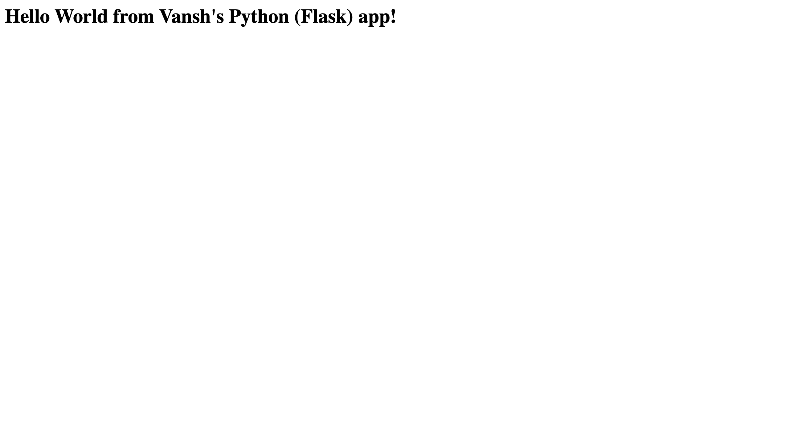

# Docker Fundamentals - Vansh's Hello World Applications

**Author:** Vansh

My Docker Fundamentals homework. I built six simple "Hello World" web applications, one per
technology, and containerized each of them with its own Dockerfile. Every app prints a
personalised greeting ("Hello World from Vansh's ... app!") so I can confirm in the browser
that it is really my container responding.

## What I built
| App | Technology | What it does |
|---|---|---|
| nodejs-app | Node.js 20 (built-in `http` module) | Tiny HTTP server that returns my greeting |
| python-app | Python 3.12 + Flask | Flask route `/` that returns my greeting |
| java-app | Java 21 (built-in `HttpServer`) | Compiled inside the image, serves my greeting |
| Apache-app | Apache HTTP Server 2.4 | Serves a static `index.html` |
| React-app | React 18, multi-stage build, served by Nginx | Builds the production bundle, then Nginx serves it |
| nginx-app | Nginx (alpine) | Serves a static `index.html` |

## Folder structure
```
Docker Fundamentals/
├── nodejs-app/     Node.js (built-in http server)
├── python-app/     Python (Flask)
├── java-app/       Java (built-in HttpServer)
├── Apache-app/     Apache HTTP Server (static page)
├── React-app/      React (built + served by Nginx)
├── nginx-app/      Nginx (static page)
└── screenshots/    Browser screenshots of each app
```

## Ports summary
I tagged every image with a `vansh-` prefix so my images are easy to spot in `docker images`.
Python is mapped to host port 5001 because macOS AirPlay Receiver already listens on port 5000 on my Mac.

| App | Container port | Host port I used | Run command |
|---|---|---|---|
| nodejs-app | 3000 | 3000 | `docker run -d -p 3000:3000 vansh-nodejs-app` |
| python-app | 5000 | 5001 | `docker run -d -p 5001:5000 vansh-python-app` |
| java-app | 8080 | 8080 | `docker run -d -p 8080:8080 vansh-java-app` |
| Apache-app | 80 | 8081 | `docker run -d -p 8081:80 vansh-apache-app` |
| React-app | 80 | 8082 | `docker run -d -p 8082:80 vansh-react-app` |
| nginx-app | 80 | 8083 | `docker run -d -p 8083:80 vansh-nginx-app` |

## How I built and ran each app
All commands are run from inside the `Docker Fundamentals` folder.

### 1. Node.js
```bash
cd nodejs-app
docker build -t vansh-nodejs-app .
docker run -d --name vansh-nodejs -p 3000:3000 vansh-nodejs-app
# open http://localhost:3000  ->  "Hello World from Vansh's Node.js app!"
```

### 2. Python (Flask)
```bash
cd python-app
docker build -t vansh-python-app .
docker run -d --name vansh-python -p 5001:5000 vansh-python-app
# open http://localhost:5001  ->  "Hello World from Vansh's Python (Flask) app!"
```

### 3. Java
```bash
cd java-app
docker build -t vansh-java-app .
docker run -d --name vansh-java -p 8080:8080 vansh-java-app
# open http://localhost:8080  ->  "Hello World from Vansh's Java app!"
```

### 4. Apache HTTP Server
```bash
cd Apache-app
docker build -t vansh-apache-app .
docker run -d --name vansh-apache -p 8081:80 vansh-apache-app
# open http://localhost:8081  ->  "Hello World from Vansh's Apache HTTP Server!"
```

### 5. React (multi-stage build + Nginx)
```bash
cd React-app
docker build -t vansh-react-app .
docker run -d --name vansh-react -p 8082:80 vansh-react-app
# open http://localhost:8082  ->  "Hello World from Vansh's React app!"
```

### 6. Nginx
```bash
cd nginx-app
docker build -t vansh-nginx-app .
docker run -d --name vansh-nginx -p 8083:80 vansh-nginx-app
# open http://localhost:8083  ->  "Hello World from Vansh's Nginx server!"
```

## Verifying from the terminal
```bash
docker images | grep vansh          # all six of my images
docker ps                             # all six containers running
curl http://localhost:3000            # Node.js greeting
curl http://localhost:5001            # Python greeting
curl http://localhost:8080            # Java greeting
curl http://localhost:8081            # Apache greeting
curl http://localhost:8082            # React greeting (text is rendered by the JS bundle)
curl http://localhost:8083            # Nginx greeting
```

## Cleaning up
```bash
docker stop vansh-nodejs vansh-python vansh-java vansh-apache vansh-react vansh-nginx
docker rm   vansh-nodejs vansh-python vansh-java vansh-apache vansh-react vansh-nginx
docker rmi  vansh-nodejs-app vansh-python-app vansh-java-app vansh-apache-app vansh-react-app vansh-nginx-app
```

## Useful Docker commands I used
```bash
docker images            # list built images
docker ps -a             # list all containers (running and stopped)
docker logs <container>  # view container logs
docker exec -it <container> sh   # open a shell inside a running container
docker stop <container>  # stop a container
docker rm <container>    # remove a container
docker rmi <image>       # remove an image
```

## What I learned
- A Dockerfile is a recipe: `FROM` picks a base image, `COPY` adds my code, `RUN` executes build
  steps, `EXPOSE` documents the port, and `CMD` says what to start.
- Container port vs host port: `-p 8081:80` maps host 8081 to the container's 80, which is how
  Apache, React and Nginx can all run at the same time even though they all listen on 80 inside.
- Multi-stage builds (React app) keep the final image small: Node is only needed to build,
  so the final stage is just Nginx plus the static files.
- `.dockerignore` stops `node_modules` from being copied into the image and slowing the build.

## Screenshots
Each screenshot shows the app running in my container with my personalised greeting.

- Node.js: 
- Python: 
- Java: 
- Apache: 
- React: 
- Nginx: 
