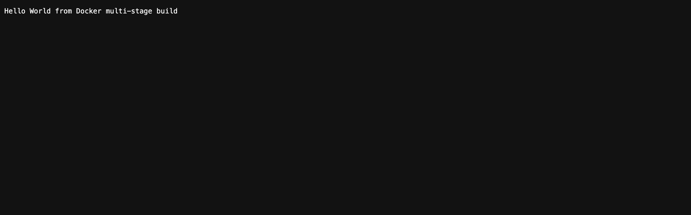
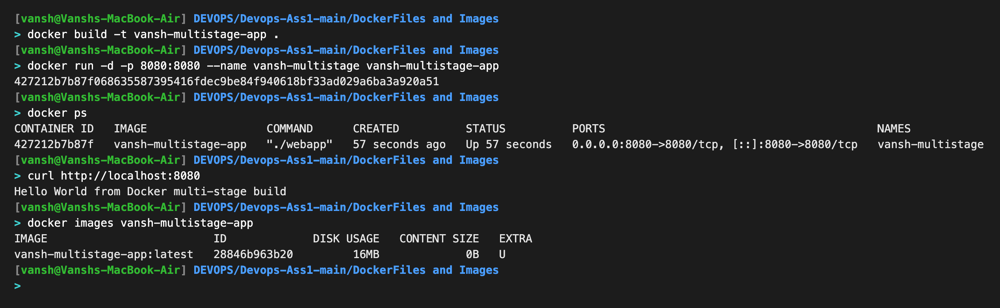

# Docker Multi-Stage Build - Homework

**Name:** Vansh
**Enrollment Number:** vansh.24bcs10015

## Task 1: Multi-Stage Dockerfile

A multi-stage build uses more than one `FROM` stage in a single Dockerfile. An early stage
compiles the application, and the final stage copies only the finished binary into a small
base image. This keeps the final image tiny because the build tools (here, the whole Go
toolchain) are left behind.

### The application (main.go)
```go
package main

import (
	"fmt"
	"net/http"
)

func main() {
	http.HandleFunc("/", func(res http.ResponseWriter, req *http.Request) {
		fmt.Fprintln(res, "Hello World from Docker multi-stage build")
	})

	fmt.Println("Server listening on port 8080")
	http.ListenAndServe(":8080", nil)
}
```

### The multi-stage Dockerfile
```dockerfile
# ---- Stage 1: Build ----
FROM golang:1.23-alpine AS build
WORKDIR /app
COPY main.go ./
RUN CGO_ENABLED=0 go build -o webapp main.go

# ---- Stage 2: Run ----
FROM alpine:3.20
WORKDIR /app
COPY --from=build /app/webapp ./
EXPOSE 8080
CMD ["./webapp"]
```

### Build and run
```bash
docker build -t vansh-multistage-app .
docker run -d -p 8080:8080 --name vansh-multistage vansh-multistage-app
```

### Verify the application
```bash
$ curl http://localhost:8080
Hello World from Docker multi-stage build
```

### Verify the running container (docker ps)
```bash
$ docker ps
CONTAINER ID   IMAGE                  COMMAND      CREATED          STATUS          PORTS                                         NAMES
427212b7b87f   vansh-multistage-app   "./webapp"   35 minutes ago   Up 35 minutes   0.0.0.0:8080->8080/tcp, [::]:8080->8080/tcp   vansh-multistage
```
The application is confirmed running on **port 8080**.

### Result of multi-stage build
The final image is only about **16 MB**, because the Go compiler and source code stay in
the build stage and only the compiled binary is copied into the final Alpine image.

## Task 2: Screenshots

Application running successfully in the browser:



`docker ps` showing the running container on port 8080:



## Task 3: Docker Application Deployment

Three different types of applications were deployed using Docker (see the
`Docker Fundamentals` folder for the full code and Dockerfiles):

| Application | Language / Stack | Host port | Output |
|---|---|---|---|
| Node.js | Node.js 20 (built-in `http`) | 3000 | Hello World from Vansh's Node.js app! |
| Python | Python 3.12 + Flask | 5001 | Hello World from Vansh's Python (Flask) app! |
| Java | Java 21 (built-in `HttpServer`) | 8080 | Hello World from Vansh's Java app! |

Build and run example (Node.js):
```bash
cd nodejs-app
docker build -t vansh-nodejs-app .
docker run -d -p 3000:3000 vansh-nodejs-app
# open http://localhost:3000
```

Screenshots of all three running applications:


