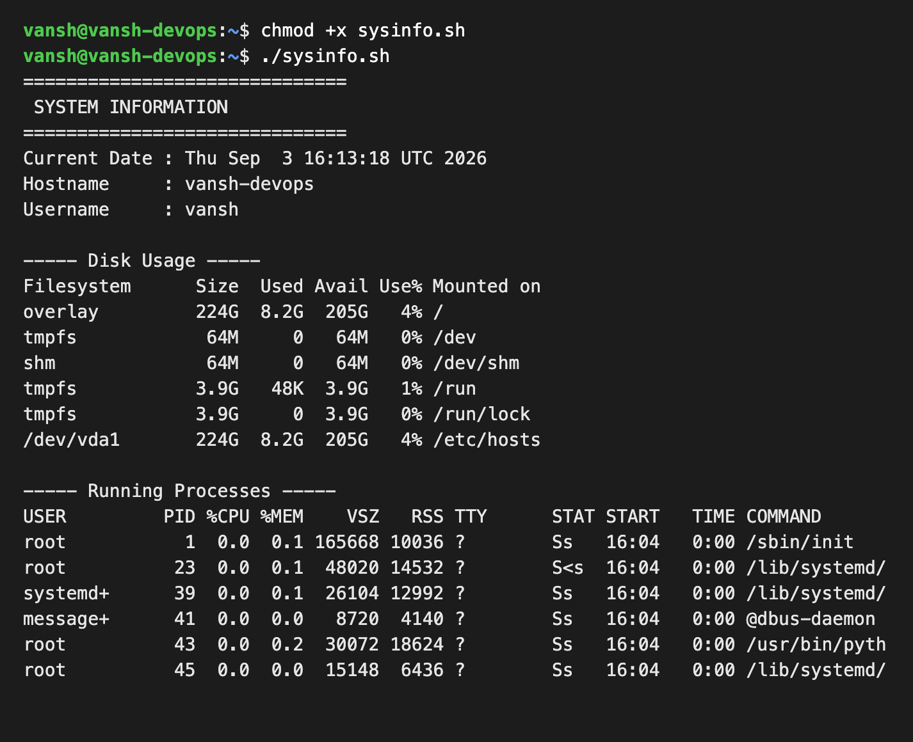

# System Information Script

A shell script that prints basic system information, takes input from the user, creates a directory and file, and saves the running processes into that file using output redirection.

## What the script does
- Prints the current date
- Prints the hostname
- Prints the username
- Prints the disk usage
- Prints the running processes
- Uses variables to store and reuse data
- Takes user input using `read -p`
- Creates a directory using `mkdir`
- Creates a file using `touch`
- Saves the running processes into the file using `>` output redirection

## Commands used
`mkdir`, `touch`, `echo`, `df`, `ps`, `read -p`, variables, `>` output redirection

## The script (sysinfo.sh)
```bash
#!/bin/bash
# System Information Script

# Store data in variables
RUN_STAMP=$(date)
MACHINE_ID=$(hostname)
ACTIVE_USER=$(whoami)

echo "=============================="
echo " SYSTEM INFORMATION"
echo "=============================="

echo "Current Date : $RUN_STAMP"
echo "Hostname     : $MACHINE_ID"
echo "Username     : $ACTIVE_USER"

echo ""
echo "----- Disk Usage -----"
df -h

echo ""
echo "----- Running Processes -----"
ps aux

# Take input from the user
echo ""
read -p "Enter a name for the report directory: " REPORT_DIR
read -p "Enter a name for the report file: " REPORT_FILE

# Create directory and file
mkdir -p "$REPORT_DIR"
touch "$REPORT_DIR/$REPORT_FILE"

# Store running processes in the file using output redirection
ps aux > "$REPORT_DIR/$REPORT_FILE"

echo ""
echo "Running processes saved to: $REPORT_DIR/$REPORT_FILE"
```

## How to run
```bash
chmod +x sysinfo.sh
./sysinfo.sh
```

## Sample output
Run as user `vansh` on an Ubuntu 22.04 box (hostname `vansh-devops`):
```
==============================
 SYSTEM INFORMATION
==============================
Current Date : Thu Sep  3 16:13:18 UTC 2026
Hostname     : vansh-devops
Username     : vansh

----- Disk Usage -----
Filesystem      Size  Used Avail Use% Mounted on
overlay         224G  8.2G  205G   4% /
tmpfs            64M     0   64M   0% /dev
shm              64M     0   64M   0% /dev/shm
tmpfs           3.9G   48K  3.9G   1% /run
tmpfs           3.9G     0  3.9G   0% /run/lock
/dev/vda1       224G  8.2G  205G   4% /etc/hosts

----- Running Processes -----
USER         PID %CPU %MEM    VSZ   RSS TTY      STAT START   TIME COMMAND
root           1  0.0  0.1 165668 10036 ?        Ss   16:04   0:00 /sbin/init
root          23  0.0  0.1  48020 14532 ?        S<s  16:04   0:00 /lib/systemd/
systemd+      39  0.0  0.1  26104 12992 ?        Ss   16:04   0:00 /lib/systemd/
message+      41  0.0  0.0   8720  4140 ?        Ss   16:04   0:00 @dbus-daemon 
...


Enter a name for the report directory: reports
Enter a name for the report file: processes.txt

Running processes saved to: reports/processes.txt
```

## Result
After running, a `reports/` directory is created containing `processes.txt`, which holds the full `ps aux` output captured with `>` redirection.

## Screenshots

Script run showing the current date, hostname, username, disk usage, and running processes:



End of the process list, the `read -p` input prompts, and the confirmation that the file was saved:


Contents of the created file, confirming the running processes were saved with `>` redirection:


