# Session 11: Kubernetes Services & Networking

**Author:** Vansh Chitransh
**Course:** SST DevOps & Cloud [SWE]
**Session:** 11

Covers all five Service types (ClusterIP, NodePort, LoadBalancer, ExternalName, Headless), Services
without selectors, CoreDNS/FQDN internals, pod-identity differences between controllers, and the
production cost/decision analysis for picking a Service type.

> Every Service here was **actually created on a live cluster** — single-node Minikube v1.39.0,
> Kubernetes v1.37.0, containerd 2.3.4, `docker` driver on macOS/arm64. All outputs and screenshots
> are real terminal captures.

## Folder Structure

```
session-11-kubernetes-services/
├── 01-clusterip/
│   ├── app-deployment.yaml      # Deployment web-app-clusterip (3 replicas)
│   ├── service.yaml             # ClusterIP    web-service-clusterip (8080 -> 80)
│   └── client-pod.yaml          # curl-client diagnostic pod
├── 02-nodeport/
│   ├── app-deployment.yaml      # Deployment web-app-nodeport (2 replicas)
│   └── service.yaml             # NodePort     web-service-nodeport (80 -> 80 : 30080)
├── 03-loadbalancer/
│   ├── app-deployment.yaml      # Deployment web-app-loadbalancer (3 replicas)
│   └── service.yaml             # LoadBalancer web-service-loadbalancer (80 -> 80)
├── 04-externalname/
│   ├── service.yaml             # ExternalName external-database-service -> api.github.com
│   └── client-pod.yaml          # dns-test-client (busybox)
├── 05-headless/
│   ├── service.yaml             # Headless     web-service-headless (clusterIP: None)
│   ├── app-statefulset.yaml     # StatefulSet  web-stateful (3 replicas)
│   └── client-pod.yaml          # headless-dns-client (busybox)
├── ports-flow.txt               # Task 1 packet-flow reference
├── service-decision-tree.txt    # Task 11 decision tree + cloud cost analysis
├── screenshots/
└── README.md
```

### A note on the environment

Two constraints shaped how Tasks 3, 4 and 12 were verified, and both are documented honestly rather
than worked around silently:

1. **The node IP is not routable from macOS.** With the `docker` driver the node lives on an internal
   Docker bridge (`192.168.49.0/24`). Task 12 proves this with `route -n get`.
2. **`minikube tunnel` needs root** to bind port 80, and this shell has no passwordless sudo. So the
   LoadBalancer in Task 4 is verified through its auto-allocated NodePort layer instead, and the
   `EXTERNAL-IP: <pending>` state is shown and explained rather than faked.

---

### Task 1: Kubernetes Port Architecture & Clarification Drill

Map the 4 distinct port definitions and trace a packet from an external client down to the
application process.

| Port | Where it lives | Meaning |
| --- | --- | --- |
| `containerPort` | Pod spec → container | The port the app process actually listens on inside the container. Informational. |
| `targetPort` | Service spec | The pod-side port the Service forwards to; must match `containerPort`. |
| `port` | Service spec | The port the Service exposes on its ClusterIP for in-cluster consumers. |
| `nodePort` | Service spec (NodePort/LB) | The high port (`30000–32767`) opened on **every** node's IP. |

**Commands:**

```bash
kubectl explain service.spec.ports.nodePort
kubectl get svc web-service-nodeport -o custom-columns='NODEPORT:.spec.ports[0].nodePort,PORT:.spec.ports[0].port,TARGETPORT:.spec.ports[0].targetPort'
kubectl get deploy web-app-nodeport -o custom-columns='CONTAINERPORT:.spec.template.spec.containers[0].ports[0].containerPort'
cat ports-flow.txt
```

**Output:**

```
FIELD: nodePort <integer>

DESCRIPTION:
    The port on each node on which this service is exposed when type is NodePort
    or LoadBalancer.  Usually assigned by the system. If a value is specified,
    in-range, and not in use it will be used, otherwise the operation will fail.
    ...

NODEPORT   PORT   TARGETPORT
30080      80     80

CONTAINERPORT
80
```

**Packet-flow (`ports-flow.txt`):**

```
  Client (browser / curl)
        |
        v
  [ nodePort: 30080 ]   <-- opened on EVERY node IP, range 30000-32767
        |
        v
  [ port: 80 ]          <-- the Service's own ClusterIP port (in-cluster consumers)
        |
        v
  [ targetPort: 80 ]    <-- pod-side port that kube-proxy forwards to
        |
        v
  [ containerPort: 80 ] <-- what nginx actually listens on inside the container
```

The three Service-side ports are read off a single live object, so the mapping is not hypothetical.
Note that `port` and `targetPort` happen to both be `80` here but are independent — the ClusterIP
Service in Task 2 uses `8080 -> 80`, which makes the distinction unmistakable.

**Screenshot:**

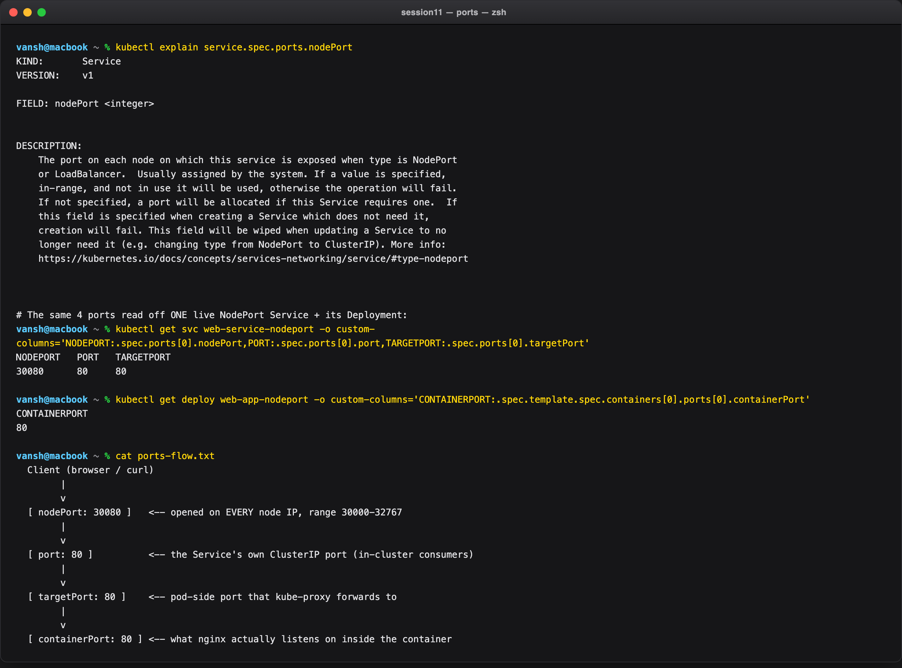

---

### Task 2: Type 1 — ClusterIP (Default Internal Networking)

A 3-replica backend behind a `ClusterIP` Service on port `8080` targeting container port `80`, reached
from an in-cluster client pod by short name and by full FQDN.

**Commands:**

```bash
kubectl apply -f 01-clusterip/app-deployment.yaml -f 01-clusterip/service.yaml -f 01-clusterip/client-pod.yaml
kubectl get pods -l app=web-clusterip -o wide
kubectl get svc web-service-clusterip
kubectl get endpoints web-service-clusterip

kubectl exec curl-client -- curl -s http://web-service-clusterip:8080 | grep -i '<title>'
kubectl exec curl-client -- curl -s http://web-service-clusterip.default.svc.cluster.local:8080 | grep -i '<title>'
```

**Output:**

```
NAME                                READY   STATUS    RESTARTS   AGE   IP            NODE
web-app-clusterip-5d8c7dccd-7rvqc   1/1     Running   0          9s    10.244.0.80   minikube
web-app-clusterip-5d8c7dccd-dkq5f   1/1     Running   0          9s    10.244.0.81   minikube
web-app-clusterip-5d8c7dccd-tthhp   1/1     Running   0          9s    10.244.0.78   minikube

NAME                    TYPE        CLUSTER-IP    EXTERNAL-IP   PORT(S)    AGE
web-service-clusterip   ClusterIP   10.105.8.42   <none>        8080/TCP   9s

NAME                    ENDPOINTS                                      AGE
web-service-clusterip   10.244.0.78:80,10.244.0.80:80,10.244.0.81:80   9s

<title>Welcome to nginx!</title>
<title>Welcome to nginx!</title>
```

Three things the output proves at once:

- **The port translation is real.** The Service is reached on `:8080`; the endpoints are all `:80`. `targetPort` did the translation.
- **Endpoints are auto-populated.** All three pod IPs (`.78/.80/.81`) appear without any manual step — the EndpointSlice controller matched them by the Service's label selector.
- **Short name and FQDN are equivalent.** Both returned the same page. The short name works because of the DNS `search` list dissected in Task 8.

The ClusterIP `10.105.8.42` is a **virtual** IP — nothing is listening on it. It exists only as an
iptables rule installed by kube-proxy that DNATs to one of the three real pod IPs.

**Screenshot:**

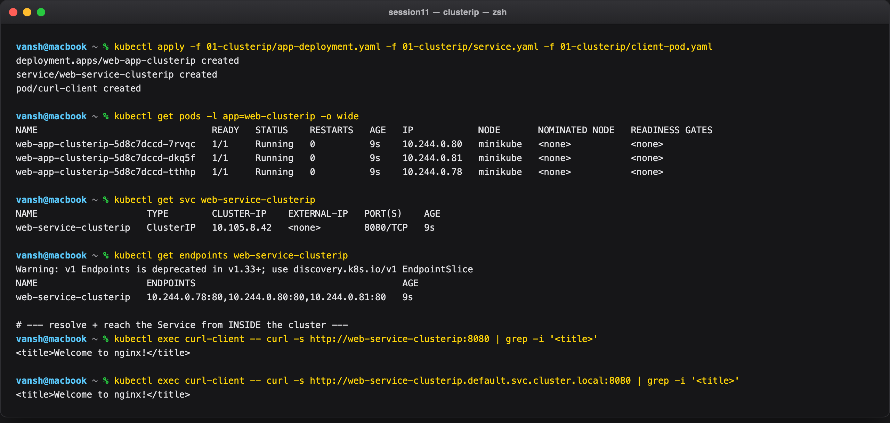

---

### Task 3: Type 2 — NodePort (Host-Level External Ingress)

Expose a 2-replica app on port `30080` of every node, then demonstrate the macOS access problem and
its workaround.

**Commands:**

```bash
kubectl apply -f 02-nodeport/app-deployment.yaml -f 02-nodeport/service.yaml
kubectl get svc web-service-nodeport
kubectl get endpoints web-service-nodeport

# direct node IP — fails on macOS + docker driver
curl --connect-timeout 3 -s -I http://$(minikube ip):30080

# workaround
minikube service web-service-nodeport --url
curl -s -I http://127.0.0.1:58842 | head -4
```

**Output:**

```
NAME                   TYPE       CLUSTER-IP       EXTERNAL-IP   PORT(S)        AGE
web-service-nodeport   NodePort   10.109.105.109   <none>        80:30080/TCP   3s

NAME                   ENDPOINTS                       AGE
web-service-nodeport   10.244.0.82:80,10.244.0.83:80   3s

# Direct node-IP access from macOS:
Connection failed (expected on macOS + docker driver)

# Workaround — minikube opens a loopback tunnel into the Docker bridge:
http://127.0.0.1:58842
HTTP/1.1 200 OK
Server: nginx/1.31.6
Date: Sun, 20 Sep 2026 18:08:02 GMT
Content-Type: text/html
```

The `PORT(S)` column reads `80:30080/TCP` — that is `port:nodePort`. A NodePort Service is a strict
superset of a ClusterIP: it still has `10.109.105.109` for in-cluster callers, and additionally opens
`30080` on the node. Root cause of the failure is analysed in Task 12.

**Screenshot:**

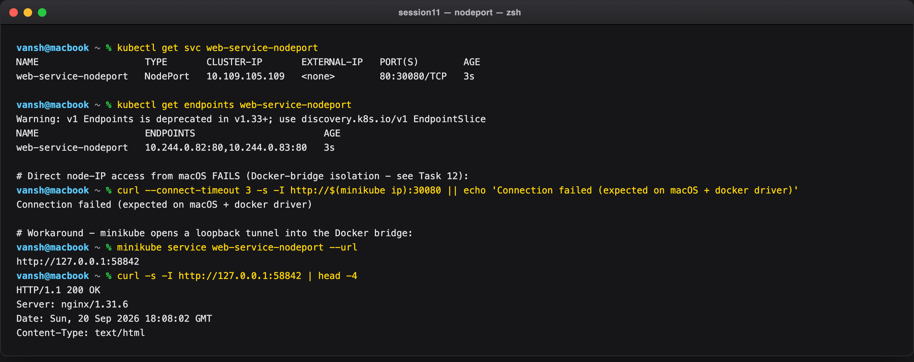

---

### Task 4: Type 3 — LoadBalancer (Cloud-Native Ingress)

**Commands:**

```bash
kubectl apply -f 03-loadbalancer/app-deployment.yaml -f 03-loadbalancer/service.yaml
kubectl get svc web-service-loadbalancer
kubectl get svc web-service-loadbalancer -o jsonpath='{.spec.type} | clusterIP={.spec.clusterIP} | nodePort={.spec.ports[0].nodePort}'
kubectl get endpoints web-service-loadbalancer
minikube service web-service-loadbalancer --url
curl -s http://127.0.0.1:58859 | grep -i '<title>'
```

**Output:**

```
NAME                       TYPE           CLUSTER-IP       EXTERNAL-IP   PORT(S)        AGE
web-service-loadbalancer   LoadBalancer   10.111.186.139   <pending>     80:31933/TCP   7m52s

LoadBalancer | clusterIP=10.111.186.139 | nodePort=31933

NAME                       ENDPOINTS                                      AGE
web-service-loadbalancer   10.244.0.84:80,10.244.0.85:80,10.244.0.86:80   7m52s

http://127.0.0.1:58859
<title>Welcome to nginx!</title>
```

`EXTERNAL-IP: <pending>` is the honest result, and it is the most instructive part of this task.
`type: LoadBalancer` is not implemented by Kubernetes itself — it is a **request** that a
cloud-controller-manager is supposed to fulfil by calling the AWS/GCP/Azure API. There is no cloud
provider here, so the request sits unfulfilled forever.

What Kubernetes *did* do on its own is visible in the jsonpath line: it allocated a ClusterIP
**and** a NodePort (`31933`). That is the layering — `LoadBalancer ⊃ NodePort ⊃ ClusterIP`. The cloud
LB, when it exists, simply forwards to that NodePort on each node. Reaching the app through
`:31933` therefore exercises the exact path a real cloud LB would use.

**Screenshot:**

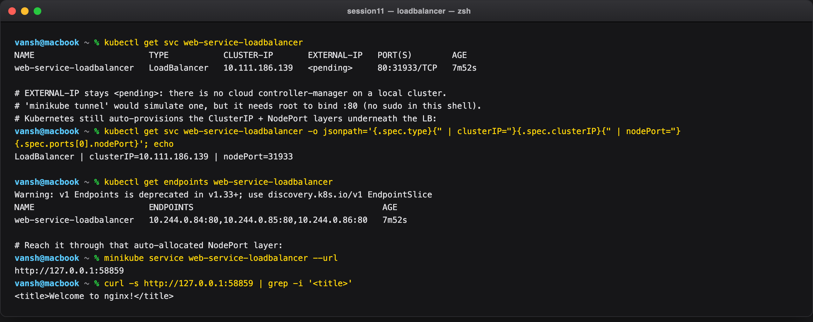

---

### Task 5: Type 4 — ExternalName (CoreDNS CNAME Alias)

**Commands:**

```bash
kubectl apply -f 04-externalname/service.yaml -f 04-externalname/client-pod.yaml
kubectl get svc external-database-service
kubectl get endpoints external-database-service
kubectl exec dns-test-client -- nslookup external-database-service
```

**Output:**

```
NAME                        TYPE           CLUSTER-IP   EXTERNAL-IP      PORT(S)   AGE
external-database-service   ExternalName   <none>       api.github.com   <none>    2s

Error from server (NotFound): endpoints "external-database-service" not found

Server:		10.96.0.10
Address:	10.96.0.10:53

** server can't find external-database-service.cluster.local: NXDOMAIN
** server can't find external-database-service.svc.cluster.local: NXDOMAIN

external-database-service.default.svc.cluster.local	canonical name = api.github.com
Name:	api.github.com
Address: 20.207.73.85
```

ExternalName is the odd one out: `CLUSTER-IP: <none>`, and `kubectl get endpoints` returns
**NotFound** — not "empty", but genuinely nonexistent. No virtual IP, no iptables rule, no proxying.
It is purely a CoreDNS CNAME record.

The practical value is indirection: application config can point at
`external-database-service` in every environment, and switching from a staging RDS host to a
production one is a one-line Service edit with no redeploy.

The `NXDOMAIN` lines before the answer are not errors — they are the `ndots:5` search-path traversal,
covered in Task 8.

**Screenshot:**

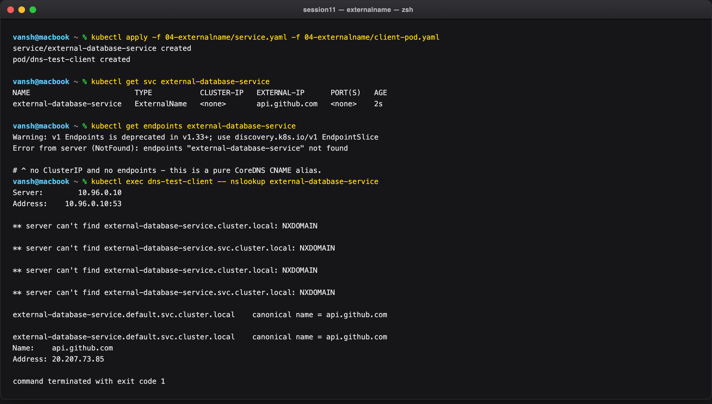

---

### Task 6: Type 5 — Headless Service (`clusterIP: None`)

**Commands:**

```bash
kubectl apply -f 05-headless/service.yaml -f 05-headless/app-statefulset.yaml -f 05-headless/client-pod.yaml
kubectl get pods -l app=web-headless -o wide
kubectl get svc web-service-headless
kubectl exec headless-dns-client -- nslookup web-service-headless
kubectl exec headless-dns-client -- nslookup web-stateful-0.web-service-headless.default.svc.cluster.local
```

**Output:**

```
NAME             READY   STATUS    RESTARTS   AGE   IP            NODE
web-stateful-0   1/1     Running   0          2s    10.244.0.88   minikube
web-stateful-1   1/1     Running   0          1s    10.244.0.90   minikube
web-stateful-2   1/1     Running   0          1s    10.244.0.91   minikube

NAME                   TYPE        CLUSTER-IP   EXTERNAL-IP   PORT(S)   AGE
web-service-headless   ClusterIP   None         <none>        80/TCP    2s

# nslookup on the SERVICE name -> three separate A records, not one VIP:
Name:	web-service-headless.default.svc.cluster.local
Address: 10.244.0.91
Name:	web-service-headless.default.svc.cluster.local
Address: 10.244.0.90
Name:	web-service-headless.default.svc.cluster.local
Address: 10.244.0.88

# nslookup on an individual ORDINAL name -> exactly one pod:
Name:	web-stateful-0.web-service-headless.default.svc.cluster.local
Address: 10.244.0.88
```

`CLUSTER-IP: None` changes what DNS returns. A normal Service resolves to one virtual IP and
kube-proxy picks a pod. A headless Service resolves to **every pod IP**, and the client picks.

That matters for stateful systems. A Kafka or Cassandra client needs to address *this specific
broker*, not "any broker" — a load-balanced VIP would be actively wrong. The per-ordinal name
`web-stateful-0.web-service-headless...` resolving to exactly `10.244.0.88` is the stable address
that makes cluster membership possible. Pair it with Task 9: that name survives pod deletion.

**Screenshot:**

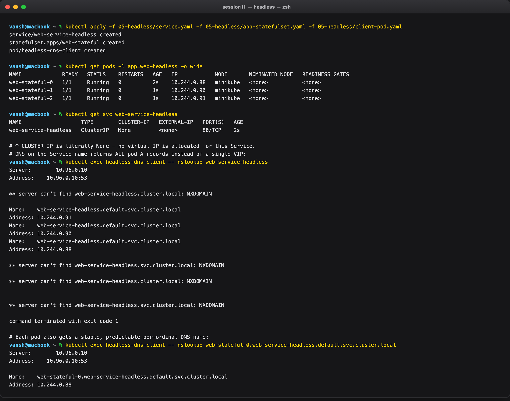

---

### Task 7: Services Without Selectors (Manual Endpoints Mapping)

Abstract a non-Kubernetes backend (a legacy VM, an on-prem DB) behind a normal Service name by
creating the `Endpoints` object by hand.

**Commands:**

```bash
cat <<EOF | kubectl apply -f -
apiVersion: v1
kind: Service
metadata:
  name: external-legacy-db
spec:
  ports:
    - protocol: TCP
      port: 3306
      targetPort: 3306
EOF

kubectl get svc external-legacy-db
kubectl get endpoints external-legacy-db

cat <<EOF | kubectl apply -f -
apiVersion: v1
kind: Endpoints
metadata:
  name: external-legacy-db
subsets:
  - addresses:
      - ip: 192.168.1.150
    ports:
      - port: 3306
EOF

kubectl get endpoints external-legacy-db
```

**Output:**

```
service/external-legacy-db created

NAME                 TYPE        CLUSTER-IP     EXTERNAL-IP   PORT(S)    AGE
external-legacy-db   ClusterIP   10.107.75.19   <none>        3306/TCP   0s

# BEFORE manual mapping:
Error from server (NotFound): endpoints "external-legacy-db" not found

endpoints/external-legacy-db created

# AFTER manual mapping:
NAME                 ENDPOINTS            AGE
external-legacy-db   192.168.1.150:3306   0s
```

The Service got a ClusterIP immediately but had **no** Endpoints object at all, because endpoint
population is driven entirely by the selector — no selector, no controller, no endpoints. Supplying
the `Endpoints` object manually fills that gap, and in-cluster pods can now connect to
`external-legacy-db:3306` exactly as if it were a native workload.

This is the standard strangler-fig migration pattern: point the app at the Kubernetes Service name
today while the database still lives on a VM, then delete the manual Endpoints and add a selector
once the DB moves in-cluster — with **zero** application config change.

> `kubectl` prints `Warning: v1 Endpoints is deprecated in v1.33+; use discovery.k8s.io/v1
> EndpointSlice`. The API still works on v1.37, but new code should write `EndpointSlice` objects.

**Screenshot:**

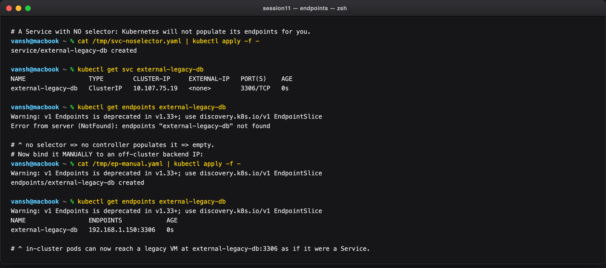

---

### Task 8: FQDN & CoreDNS Deep Dive

**FQDN anatomy:** `<service>.<namespace>.svc.cluster.local`

**Commands:**

```bash
kubectl get pods -n kube-system -l k8s-app=kube-dns -o wide
kubectl get svc -n kube-system kube-dns
kubectl exec curl-client -- cat /etc/resolv.conf
kubectl exec curl-client -- nslookup web-service-clusterip
```

**Output:**

```
NAME                       READY   STATUS    RESTARTS      AGE   IP           NODE
coredns-559f6c778d-jn8ss   1/1     Running   1 (36m ago)   36m   10.244.0.2   minikube

NAME       TYPE        CLUSTER-IP   EXTERNAL-IP   PORT(S)                  AGE
kube-dns   ClusterIP   10.96.0.10   <none>        53/UDP,53/TCP,9153/TCP   36m

search default.svc.cluster.local svc.cluster.local cluster.local
nameserver 10.96.0.10
options ndots:5

# short-name lookup:
** server can't find web-service-clusterip.cluster.local: NXDOMAIN
** server can't find web-service-clusterip.svc.cluster.local: NXDOMAIN
Name:	web-service-clusterip.default.svc.cluster.local
Address: 10.105.8.42
```

The failed lookups are the mechanism, captured live. The resolver walks the `search` list until
something answers, and `10.105.8.42` matches the ClusterIP from Task 2 exactly.

**Why `ndots:5` costs latency in production.** Any name with **fewer than 5 dots** is treated as
relative and tried against every `search` suffix *before* being tried as absolute. So
`api.github.com` (2 dots) is queried as:

1. `api.github.com.default.svc.cluster.local` → NXDOMAIN
2. `api.github.com.svc.cluster.local` → NXDOMAIN
3. `api.github.com.cluster.local` → NXDOMAIN
4. `api.github.com` → finally resolves

That is 3 wasted round-trips on **every external call**, and the ExternalName capture in Task 5 shows
exactly this happening. Fixes: use a trailing dot (`api.github.com.`) to force an absolute lookup, or
set `dnsConfig.options.ndots: 2` in the PodSpec for egress-heavy workloads.

**Screenshot:**

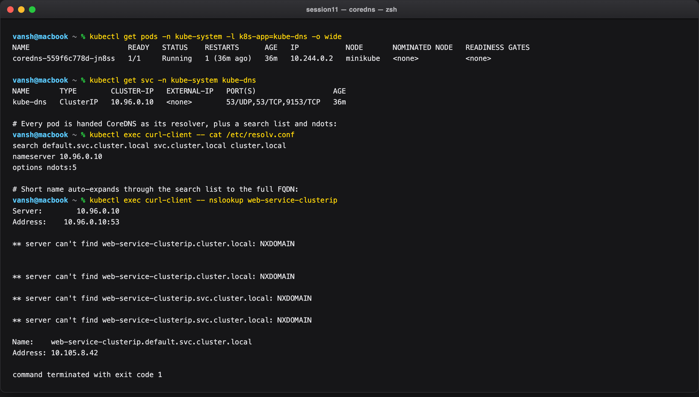

---

### Task 9: Pod Identity — Deployment (Stateless) vs. StatefulSet (Stateful)

Delete one pod from each controller and compare what comes back.

**Commands:**

```bash
kubectl get pods -l app=web-clusterip
kubectl get pods -l app=web-headless

kubectl delete pod web-app-clusterip-5d8c7dccd-7rvqc --wait=false
kubectl delete pod web-stateful-0 --wait=false

kubectl get pods -l app=web-clusterip
kubectl get pods -l app=web-headless
```

**Output:**

```
# BEFORE
web-app-clusterip-5d8c7dccd-7rvqc   1/1   Running   0   9m49s
web-app-clusterip-5d8c7dccd-dkq5f   1/1   Running   0   9m49s
web-app-clusterip-5d8c7dccd-tthhp   1/1   Running   0   9m49s

web-stateful-0   1/1   Running   0   47s
web-stateful-1   1/1   Running   0   46s
web-stateful-2   1/1   Running   0   46s

# AFTER deleting one from each
web-app-clusterip-5d8c7dccd-dkq5f   1/1   Running   0   10m
web-app-clusterip-5d8c7dccd-r2t2f   1/1   Running   0   12s   <-- NEW random identity
web-app-clusterip-5d8c7dccd-tthhp   1/1   Running   0   10m

web-stateful-0   1/1   Running   0   12s   <-- SAME ordinal identity restored
web-stateful-1   1/1   Running   0   58s
web-stateful-2   1/1   Running   0   58s
```

```
Deployment:   web-app-clusterip-5d8c7dccd-7rvqc  --X-->  web-app-clusterip-5d8c7dccd-r2t2f
                                                          (new name, new IP, new DNS)

StatefulSet:  web-stateful-0                     --X-->  web-stateful-0
                                                          (identical name, same PVC, same DNS)
```

The `AGE` columns confirm both replacements are 12s old — the *count* was restored in both cases.
What differs is identity. The Deployment's pod name is `<deployment>-<replicaset-hash>-<random>`, and
the random suffix is regenerated; `-7rvqc` will never exist again. The StatefulSet re-created
`web-stateful-0` byte-for-byte, which is what lets it re-attach the same PersistentVolumeClaim and
keep the same DNS name from Task 6.

That is the whole reason both controllers exist: stateless replicas are interchangeable, stateful
members are not.

**Screenshot:**

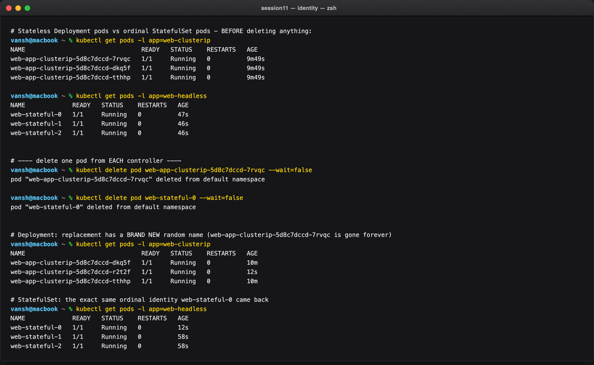

---

### Task 10: Architectural Matrix — Deployment vs. StatefulSet vs. DaemonSet

**Commands:**

```bash
kubectl get deploy,sts,ds
kubectl get pods -o custom-columns='POD:.metadata.name,CONTROLLER:.metadata.ownerReferences[0].kind' --sort-by=.metadata.name
kubectl get statefulset web-stateful -o jsonpath='{.spec.serviceName}'
```

**Output:**

```
NAME                                   READY   UP-TO-DATE   AVAILABLE   AGE
deployment.apps/web-app-clusterip      3/3     3            3           10m
deployment.apps/web-app-loadbalancer   3/3     3            3           9m22s
deployment.apps/web-app-nodeport       2/2     2            2           9m56s

NAME                            READY   AGE
statefulset.apps/web-stateful   3/3     76s

NAME                        DESIRED   CURRENT   READY   UP-TO-DATE   AVAILABLE   NODE SELECTOR   AGE
daemonset.apps/node-agent   1         1         1       1            1           <none>          0s

POD                                     CONTROLLER
node-agent-rdzvf                        DaemonSet
web-app-clusterip-5d8c7dccd-dkq5f       ReplicaSet
web-app-clusterip-5d8c7dccd-r2t2f       ReplicaSet
web-app-clusterip-5d8c7dccd-tthhp       ReplicaSet
web-app-loadbalancer-7c9d566847-7nrvs   ReplicaSet
web-app-nodeport-bf89ddc8d-gcqsg        ReplicaSet
web-stateful-0                          StatefulSet
web-stateful-1                          StatefulSet
web-stateful-2                          StatefulSet

web-service-headless
```

Two details worth calling out from the live output:

- **A Deployment does not own its pods.** The `CONTROLLER` column says `ReplicaSet`, not `Deployment` — the Deployment owns a ReplicaSet, which owns the pods. That indirection is exactly what makes `rollout undo` possible (Session 10, Task 8): the old ReplicaSet is kept around.
- **`spec.serviceName` is `web-service-headless`.** A StatefulSet is *required* to name a governing Service; that field is what builds the per-ordinal DNS names from Task 6.

| Metric | Deployment | StatefulSet | DaemonSet |
| --- | --- | --- | --- |
| **Workload type** | Stateless microservices, web APIs | Clustered databases, distributed queues | Node-level infrastructure agents |
| **Pod naming** | Random (`<deploy>-<rs-hash>-<random>`) | Deterministic ordinal (`<name>-0,1,2`) | Random suffix, one per node |
| **Identity persistence** | Ephemeral — disposable | Invariant — name, DNS and volume stick | Bound to its node |
| **Startup/shutdown order** | Parallel, unordered | Strictly sequential (`0→1→2`, reversed to stop) | Parallel across nodes |
| **Storage** | Shared or ephemeral `emptyDir` | Dedicated PV per ordinal via `volumeClaimTemplates` | HostPath / node-local |
| **Associated Service** | ClusterIP / NodePort / LoadBalancer | **Headless** (`clusterIP: None`) — mandatory | None, or a local ClusterIP |
| **Scaling** | Arbitrary, any healthy node | Ordinal, added/removed at the tail | Automatic as nodes join/leave |
| **Replica count** | Declared (`replicas:`) | Declared (`replicas:`) | **Derived from node count** |
| **Examples** | Nginx, Flask, Node.js, Go APIs | Kafka, MongoDB, Cassandra, PostgreSQL | Fluentd, node-exporter, Cilium, Falco |

**Screenshot:**

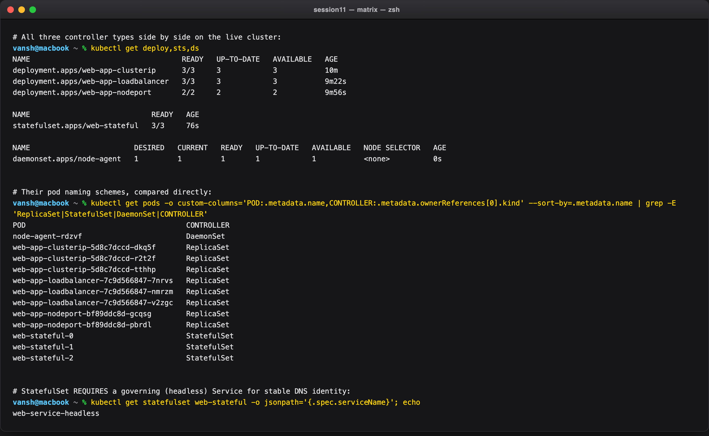

---

### Task 11: Cost Optimisation & Service Selection Decision Tree

**Commands:**

```bash
cat service-decision-tree.txt
kubectl get svc
```

**Output:**

```
NAME                        TYPE           CLUSTER-IP       EXTERNAL-IP      PORT(S)        AGE
external-database-service   ExternalName   <none>           api.github.com   <none>         10m
external-legacy-db          ClusterIP      10.107.75.19     <none>           3306/TCP       2m9s
kubernetes                  ClusterIP      10.96.0.1        <none>           443/TCP        11m
web-service-clusterip       ClusterIP      10.105.8.42      <none>           8080/TCP       11m
web-service-headless        ClusterIP      None             <none>           80/TCP         2m27s
web-service-loadbalancer    LoadBalancer   10.111.186.139   <pending>        80:31933/TCP   10m
web-service-nodeport        NodePort       10.109.105.109   <none>           80:30080/TCP   11m
```

All five Service types from Tasks 2–6 in one listing, each distinguishable by its `TYPE`/`CLUSTER-IP`
pair: a normal ClusterIP has a VIP, the headless one has `None`, and the ExternalName has neither a
VIP nor ports.

**Decision tree (`service-decision-tree.txt`):**

```
Need to expose the service OUTSIDE the cluster?
|
+-- NO  --> Need direct pod-to-pod discovery (Kafka / Cassandra / a DB cluster)?
|             +-- YES --> HEADLESS SERVICE   (clusterIP: None)
|             +-- NO  --> CLUSTERIP          (the default)
|
+-- YES --> Pointing at an external third-party domain (RDS / Stripe / an API)?
              +-- YES --> EXTERNALNAME       (CoreDNS CNAME alias, no proxying)
              +-- NO  --> On a public cloud (AWS / GCP / Azure)?
                            +-- YES, HTTP(S) --> ONE INGRESS behind ONE LOADBALANCER,
                            |                    every app stays a ClusterIP
                            +-- YES, TCP/UDP --> LOADBALANCER directly
                            +-- NO (on-prem / dev) --> NODEPORT
```

**Cloud cost analysis — why 50 LoadBalancers is a billing anti-pattern:**

```
  ANTI-PATTERN - one cloud LB per microservice (~$18-25/mo each):
      svc-a --> [ NLB #1  $25/mo ] --> ClusterIP A
      svc-b --> [ NLB #2  $25/mo ] --> ClusterIP B
      svc-c --> [ NLB #3  $25/mo ] --> ClusterIP C
      50 services  =  50 x $25  =  $1,250 / month

  BEST PRACTICE - one LB, one Ingress controller, L7 host/path routing:
      Internet --> [ 1 x LB  $25/mo ]
                          |
                 [ NGINX Ingress Controller ]
                   |         |         |
              ClusterIP A  ClusterIP B  ClusterIP C  ... x50
      50 services  =  1 x $25  =  $25 / month        SAVING: $1,225 / month
```

Each `type: LoadBalancer` provisions a **separate billable cloud load balancer**, and the charge is
per-LB-hour plus data processing — it accrues whether or not anyone sends traffic. An Ingress
controller is just pods, so the 50th backend costs a few MB of memory rather than another $25/month.
That trade-off is the direct subject of Session 12.

**Screenshot:**

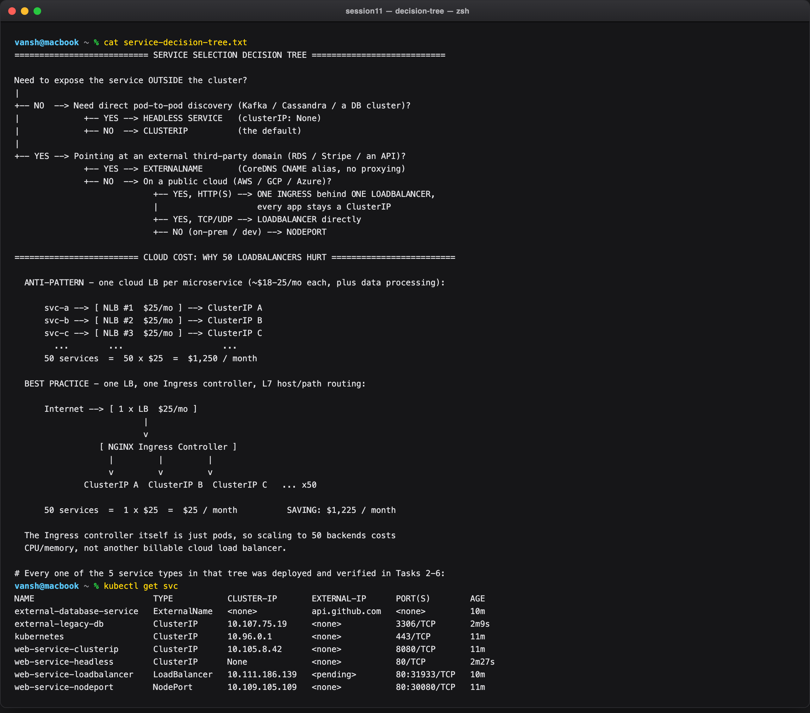

---

### Task 12: Minikube Docker-Driver Port Binding & Tunnel Gotcha

Why `curl http://<node-ip>:<nodePort>` fails on macOS/Windows with the Docker driver.

**Commands:**

```bash
minikube ip
kubectl get svc web-service-nodeport
docker network inspect minikube --format '{{range .IPAM.Config}}subnet={{.Subnet}} gateway={{.Gateway}}{{end}}'
route -n get 192.168.49.2

curl --connect-timeout 3 -s -I http://$(minikube ip):30080

minikube service web-service-nodeport --url
curl -s -o /dev/null -w 'HTTP %{http_code} via %{url_effective}\n' http://127.0.0.1:58842
```

**Output:**

```
192.168.49.2

NAME                   TYPE       CLUSTER-IP       EXTERNAL-IP   PORT(S)        AGE
web-service-nodeport   NodePort   10.109.105.109   <none>        80:30080/TCP   9m56s

subnet=192.168.49.0/24 gateway=192.168.49.1

   route to: 192.168.49.2
destination: default
       mask: default
    gateway: 100.128.160.1
  interface: en0

# Attempt 1 — direct node IP:
>>> Connection failed - exactly as predicted

# Workaround:
http://127.0.0.1:58842
HTTP 200 via http://127.0.0.1:58842/
```

**Root cause, proven by the `route` output.** The Docker network `minikube` owns
`192.168.49.0/24`, and the node is `192.168.49.2`. But when macOS is asked how to reach that address
it answers `destination: default ... interface: en0` — it has **no route** to the Docker bridge, so it
falls back to the default gateway and sends the packet out the physical Wi-Fi interface, where it
dies.

On bare-metal Linux this works, because the bridge is a real interface in the host's own network
namespace and the host has a direct route to it. On macOS the Docker VM is a separate Linux kernel;
the bridge exists **inside** that VM and is invisible to the macOS routing table.

**Workaround 1 — `minikube service --url`.** Publishes a random loopback port (`127.0.0.1:58842`) and
proxies it into the bridge. Returns `HTTP 200`. The port is dynamic and the process must stay running.

**Workaround 2 — `minikube tunnel`.** Creates host routes so the node IP and LoadBalancer
`EXTERNAL-IP`s become directly reachable. It needs **root** to bind privileged ports, which is why
Task 4's `EXTERNAL-IP` stayed `<pending>` in this run.

**Screenshot:**

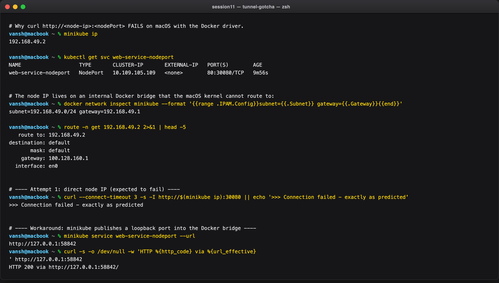

---

## Summary — the five Service types

| Type | ClusterIP allocated | Endpoints | Reachable from | Use it for |
| --- | --- | --- | --- | --- |
| **ClusterIP** | Yes (VIP) | Auto | Inside the cluster only | Default for internal services |
| **NodePort** | Yes | Auto | `<anyNodeIP>:30000–32767` | On-prem / dev external access |
| **LoadBalancer** | Yes (+ NodePort) | Auto | Cloud-provisioned external IP | Cloud L4 entry point |
| **ExternalName** | **No** | **None** | DNS CNAME only | Aliasing a third-party domain |
| **Headless** | **`None`** | Auto | Per-pod DNS A records | StatefulSets, peer discovery |
