# Session 12: ConfigMaps, Secrets & Ingress

**Author:** Vansh Chitransh
**Course:** SST DevOps & Cloud [SWE]
**Session:** 12

Decoupling configuration from images with **ConfigMaps**, isolating credentials with **Secrets**, and
exposing Layer 7 HTTP(S) traffic through the **NGINX Ingress Controller** — path routing, virtual-host
routing, hybrid routing and TLS termination — for the *Yatri* booking app.

> Everything here ran on a live cluster: Minikube v1.39.0, Kubernetes v1.37.0, containerd 2.3.4,
> `docker` driver on macOS/arm64, with `ingress-nginx` **v1.15.1** (nginx 1.27.1) via
> `minikube addons enable ingress`. All outputs and screenshots are real terminal captures.

## Directory Layout

```
session-12-ingress-configmaps-secrets/
├── 01-configmap/
│   └── app-config.yaml          # ConfigMap: yatri-app-config (5 keys)
├── 02-secret/
│   └── db-secret.yaml           # Secret (Opaque): yatri-db-secret (2 keys)
├── 03-ingress/
│   └── ingress-tls.yaml         # Ingress: campus-ingress-tls (vhost + path + TLS)
├── 04-full-demo/
│   ├── configmap.yaml           # yatri-app-config
│   ├── secret.yaml              # yatri-db-secret
│   ├── backend.yaml             # Deployment + Service: yatri-backend  (multi-doc)
│   ├── frontend.yaml            # Deployment + Service: yatri-frontend (multi-doc)
│   ├── ingress.yaml             # Ingress: yatri-ingress (path routing)
│   ├── run-demo.sh              # Apply the whole stack in order
│   └── cleanup.sh               # Tear the whole stack down
├── screenshots/                 # Evidence 01 … 14
└── README.md
```

### A note on hostname resolution

The textbook flow for Tasks 9–13 is `sudo vim /etc/hosts` + browse to `http://yatri.local`. Two things
block that here, and both are documented rather than glossed over:

1. **No passwordless sudo** in this shell, so `/etc/hosts` was never modified.
2. **Even with the entry it would not route** — the Ingress `ADDRESS` is `192.168.49.2`, the
   Docker-bridge node IP that macOS cannot reach (proven with `route -n get` in Session 11, Task 12).

So every HTTP test below uses `curl --resolve <host>:<port>:127.0.0.1` against a
`minikube service ingress-nginx-controller --url` tunnel. That pins the hostname for one request,
which is exactly what an `/etc/hosts` entry does — the `Host:` header the controller sees is
identical, so the routing being tested is genuinely the same.

---

## Task 1: Non-Sensitive Configuration Decoupling via ConfigMaps

**Commands:**

```bash
kubectl apply -f 01-configmap/app-config.yaml
kubectl get configmap yatri-app-config
kubectl describe configmap yatri-app-config
kubectl get configmap yatri-app-config -o jsonpath='{.data.ENVIRONMENT}'
kubectl get configmap yatri-app-config -o jsonpath='{.data.LOG_LEVEL}'
```

**Output:**

```text
configmap/yatri-app-config created

NAME               DATA   AGE
yatri-app-config   5      0s

Name:         yatri-app-config
Namespace:    default
Labels:       app=yatri-app
Annotations:  <none>

Data
====
DEFAULT_CURRENCY:
----
INR
ENVIRONMENT:
----
production
LOG_LEVEL:
----
INFO
MAX_BOOKING_DAYS:
----
30
PORT:
----
8080

BinaryData
====
Events:  <none>

production
INFO
```

`DATA 5` counts the keys. Note `PORT: "8080"` and `MAX_BOOKING_DAYS: "30"` are **quoted** in the
manifest — ConfigMap values must be strings, and an unquoted `8080` would be parsed as an integer and
rejected. `describe` prints values in the clear, which is the honest difference from a Secret.

**Screenshot:**

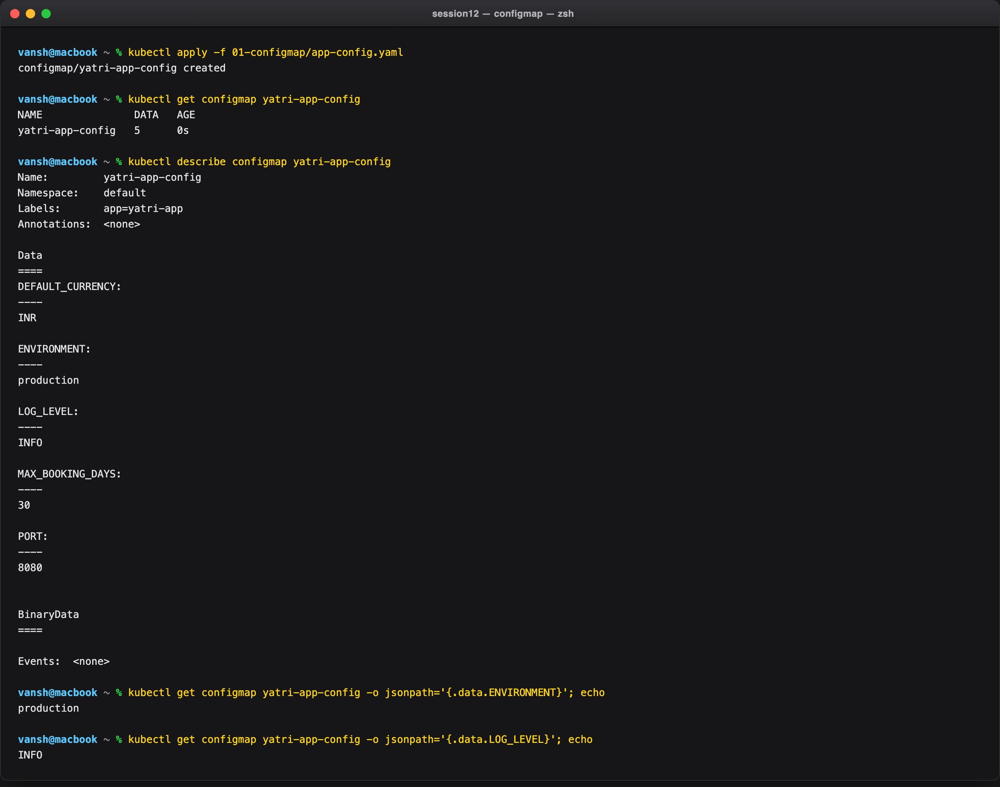

---

## Task 2: ConfigMap Live Update & Pod Immobility Drill

Patch a live ConfigMap and prove that **running pods do not pick up the change**.

**Commands:**

```bash
kubectl patch configmap yatri-app-config --type merge -p '{"data":{"ENVIRONMENT":"staging"}}'
kubectl get configmap yatri-app-config -o jsonpath='{.data.ENVIRONMENT}'

kubectl exec deploy/yatri-backend -- env | grep ENVIRONMENT      # still old

kubectl rollout restart deployment/yatri-backend
kubectl rollout status deployment/yatri-backend

kubectl exec deploy/yatri-backend -- env | grep ENVIRONMENT      # now new

kubectl patch configmap yatri-app-config --type merge -p '{"data":{"ENVIRONMENT":"production"}}'
kubectl rollout restart deployment/yatri-backend
```

**Output:**

```text
configmap/yatri-app-config patched
staging                                  <-- the ConfigMap object updated instantly

# BUT the running pod:
ENVIRONMENT=production                   <-- STILL the old value

deployment.apps/yatri-backend restarted
deployment "yatri-backend" successfully rolled out

# after the restart:
ENVIRONMENT=staging                      <-- new pods read the patched ConfigMap

# reverted for the remaining labs:
configmap/yatri-app-config patched
ENVIRONMENT=production
```

The three-step sequence — `staging` in the ConfigMap, `production` in the pod, `staging` after a
restart — is the entire lesson in one capture.

**Why:** environment variables sourced from a ConfigMap are copied into the container's environment
**once, at process start**. A Linux process's environment cannot be mutated from outside, so no
amount of patching reaches a running container. Only a new pod re-reads the ConfigMap.

`rollout restart` is the correct tool because it is a *rolling* restart — it respects the Deployment's
update strategy, so config is picked up with zero downtime. Deleting pods by hand would not.

> **The exception:** ConfigMaps mounted as **volumes** *do* update in place (the kubelet refreshes the
> projected files, typically within a minute). Only `env`/`envFrom` values are frozen. If you need
> live reload without a restart, mount the ConfigMap as a file and have the app watch it.

**Screenshot:**

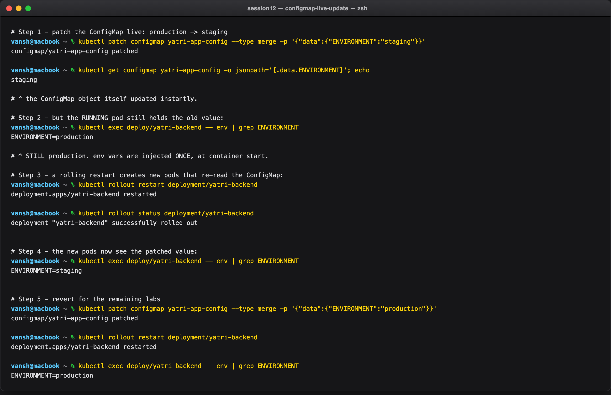

---

## Task 3: Sensitive Data Isolation via Secrets & Base64 Mechanics

**Commands:**

```bash
kubectl apply -f 02-secret/db-secret.yaml
kubectl get secret yatri-db-secret
kubectl describe secret yatri-db-secret
kubectl get secret yatri-db-secret -o jsonpath='{.data.POSTGRES_USER}' | base64 --decode
kubectl get secret yatri-db-secret -o jsonpath='{.data.POSTGRES_PASSWORD}' | base64 --decode
```

**Output:**

```text
secret/yatri-db-secret created

NAME              TYPE     DATA   AGE
yatri-db-secret   Opaque   2      0s

Name:         yatri-db-secret
Namespace:    default
Labels:       app=yatri-app
Type:  Opaque

Data
====
POSTGRES_PASSWORD:  14 bytes
POSTGRES_USER:      11 bytes

# describe shows only BYTE LENGTHS. But anyone with 'get secret' can decode:
yatri_admin
secretpassword
```

`describe` masking the values is **defence against shoulder-surfing, not against an attacker**. The
very next two commands recover both credentials in plaintext with no special privileges.

The byte counts are worth checking: `secretpassword` is 14 characters and reports `14 bytes`,
`yatri_admin` is 11 and reports `11 bytes`. Exact matches mean no stray newline crept in — which is
precisely the bug Task 4 dissects.

**Screenshot:**

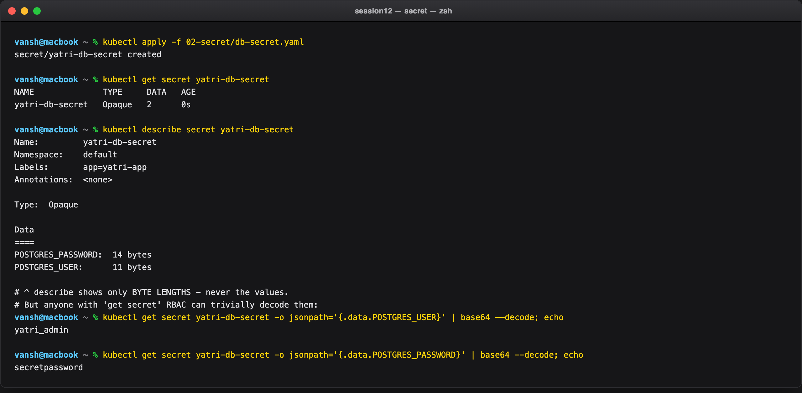

---

## Task 4: The Trailing Newline Secret Gotcha

The most common Secret bug: `echo "password" | base64` silently appends a newline byte (`0x0a`).

**Commands:**

```bash
echo "secretpassword" | xxd
echo "secretpassword" | base64
echo "secretpassword" | wc -c

echo -n "secretpassword" | xxd
echo -n "secretpassword" | base64
echo -n "secretpassword" | wc -c

kubectl get secret yatri-db-secret -o jsonpath='{.data.POSTGRES_PASSWORD}'
kubectl get secret yatri-db-secret -o jsonpath='{.data.POSTGRES_PASSWORD}' | base64 --decode | xxd
```

**Output:**

```text
# ---- BROKEN ----
00000000: 7365 6372 6574 7061 7373 776f 7264 0a    secretpassword.
c2VjcmV0cGFzc3dvcmQK
      15

# ---- CORRECT ----
00000000: 7365 6372 6574 7061 7373 776f 7264       secretpassword
c2VjcmV0cGFzc3dvcmQ=
      14

Wrong (with newline): c2VjcmV0cGFzc3dvcmQK
Right (no newline):   c2VjcmV0cGFzc3dvcmQ=

# ---- proof the live Secret in this repo is the correct form ----
c2VjcmV0cGFzc3dvcmQ=
00000000: 7365 6372 6574 7061 7373 776f 7264       secretpassword
```

### Analysis

| | Command | Bytes | Base64 | Decodes to |
|---|---|---|---|---|
| Broken | `echo "..."` | 15 (`...64 0a`) | `c2VjcmV0cGFzc3dvcmQK` | `secretpassword\n` |
| Correct | `echo -n "..."` | 14 (`...72 64`) | `c2VjcmV0cGFzc3dvcmQ=` | `secretpassword` |

Three independent signals in the capture agree: `xxd` shows the trailing `0a`, `wc -c` shows 15 vs 14,
and the base64 ends `...Q` **K** vs `...Q` **=**. That `K` is the fingerprint — a base64 string ending
in `K` or `Cg==` almost always means a stray newline.

**Why it breaks auth:** the `0a` is invisible in a terminal, in `describe`, and in every editor, so
the manifest *looks* correct. Postgres compares credentials byte-for-byte, so
`secretpassword\n != secretpassword` and you get "password authentication failed" for a password that
is visibly right — one of the most time-wasting bugs in Kubernetes.

**Hygiene rules:**
- Always `echo -n` or `printf '%s'`.
- Better: skip manual encoding entirely — `kubectl create secret generic ... --from-literal=KEY=value` never adds a newline.
- Verify with `kubectl get secret X -o jsonpath='{.data.KEY}' | base64 -d | xxd` before debugging the app.

**Screenshot:**

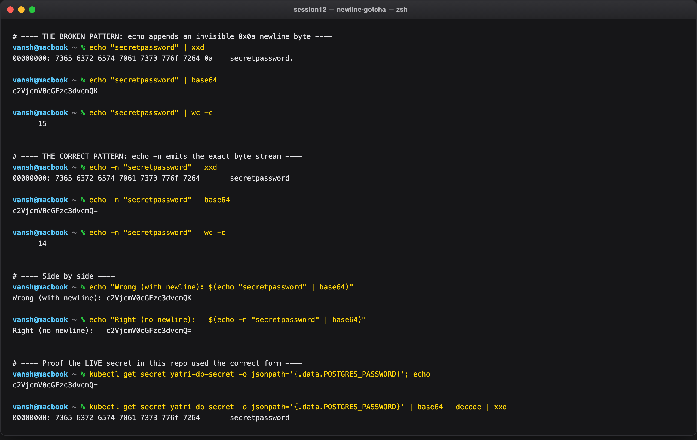

---

## Task 5: Enterprise Secret Management & Pipeline Integration

**Commands:**

```bash
kubectl get crds | grep -i -E 'secret|vault'
kubectl get secret yatri-db-secret -o yaml | grep -A4 '^data:'
kubectl auth can-i get secrets
kubectl auth can-i list secrets --all-namespaces
```

**Output:**

```text
No secret-operator CRDs - cluster uses native Kubernetes Secrets only

data:
  POSTGRES_PASSWORD: c2VjcmV0cGFzc3dvcmQ=
  POSTGRES_USER: eWF0cmlfYWRtaW4=
kind: Secret

yes
yes
```

Two facts established from the live cluster: the stored form is plain base64 (not ciphertext), and
access is gated purely by RBAC — `can-i list secrets --all-namespaces` returns `yes`, so this
identity can read every credential in the cluster.

### Why committing Secret YAML to Git is a DevSecOps anti-pattern

- **Base64 is encoding, not encryption.** `c2VjcmV0cGFzc3dvcmQ=` is one command from plaintext, as Task 3 showed.
- **Git history is forever.** Deleting the file later does not help: `git log -p`, any old clone, and every fork still contain it. Rotating a leaked secret means rotating it *everywhere*.
- **No rotation, no TTL, no audit trail.** A static YAML never expires and records nothing about who read it.
- **Repo RBAC becomes secret RBAC.** Everyone with read access to the repo has your production password — a far wider blast radius than a Kubernetes Role.

> Even in-cluster, native Secrets are only base64 in etcd unless **encryption at rest**
> (`EncryptionConfiguration`) is enabled on the API server. That is a separate control worth knowing
> about, and it is off by default.

### The fix — External Secret Operators

```
        ┌──────────────────────────┐
        │   External Secret Store  │
        │  AWS Secrets Manager /   │
        │  Azure Key Vault /       │   (source of truth, rotated + audited)
        │  HashiCorp Vault         │
        └────────────┬─────────────┘
                     │  1. authenticated pull (IRSA / Workload Identity / Vault auth)
                     ▼
        ┌──────────────────────────┐
        │  External Secrets        │
        │  Operator (ESO)  ─or─    │   control loop watches ExternalSecret CRDs
        │  Vault Agent Injector    │
        └────────────┬─────────────┘
                     │  2. materialises / refreshes
                     ▼
        ┌──────────────────────────┐
        │  Kubernetes Secret       │   ephemeral, in-cluster, auto-rotated
        └────────────┬─────────────┘
                     │  3. mounted / injected
                     ▼
        ┌──────────────────────────┐
        │  Pod  (env var / volume) │
        └──────────────────────────┘
```

- **External Secrets Operator (ESO):** you commit a non-sensitive `ExternalSecret` CRD that says "key `POSTGRES_PASSWORD` lives at vault path `prod/yatri/db`". ESO fetches it and creates/refreshes the real Secret. Only the *reference* is in Git. Had ESO been installed, the `kubectl get crds` above would have listed `externalsecrets.external-secrets.io`.
- **Vault Agent Injector:** a mutating webhook injects a sidecar that writes secrets to a shared in-memory volume — the secret never becomes a persisted Kubernetes object at all.

### CI/CD integration — inject at deploy time

```yaml
# .github/workflows/deploy.yml (excerpt)
- run: |
    kubectl create secret generic yatri-db-secret \
      --from-literal=POSTGRES_USER="${{ secrets.DB_USER }}" \
      --from-literal=POSTGRES_PASSWORD="${{ secrets.DB_PASSWORD }}" \
      --dry-run=client -o yaml | kubectl apply -f -
```

Note this also sidesteps Task 4's newline bug — `--from-literal` never appends one. Better still,
fetch credentials at run time via OIDC from AWS/Azure/Vault so there are no long-lived keys anywhere.
**Azure DevOps** equivalent: Variable Groups linked to Key Vault, referenced as `$(DB_PASSWORD)`.

**Screenshot:**

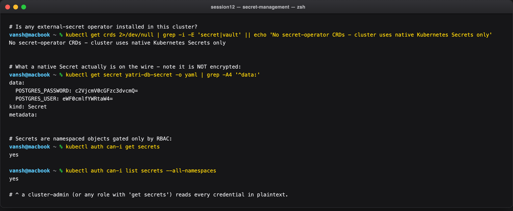

---

## Task 6: Combined ConfigMap and Secret Pod Injection

The backend consumes **both** sources: bulk non-sensitive keys via `envFrom.configMapRef`, granular
sensitive keys via `env.valueFrom.secretKeyRef`.

```yaml
envFrom:
  - configMapRef:
      name: yatri-app-config      # bulk: ENVIRONMENT, LOG_LEVEL, PORT, DEFAULT_CURRENCY, MAX_BOOKING_DAYS
env:
  - name: POSTGRES_USER
    valueFrom:
      secretKeyRef:
        name: yatri-db-secret     # granular, per key
        key: POSTGRES_USER
  - name: POSTGRES_PASSWORD
    valueFrom:
      secretKeyRef:
        name: yatri-db-secret
        key: POSTGRES_PASSWORD
```

**Commands:**

```bash
kubectl apply -f 04-full-demo/configmap.yaml -f 04-full-demo/secret.yaml -f 04-full-demo/backend.yaml
kubectl rollout status deployment/yatri-backend
kubectl exec deploy/yatri-backend -- env | grep -E 'ENVIRONMENT|LOG_LEVEL|POSTGRES|DEFAULT_CURRENCY|MAX_BOOKING|^PORT=' | sort
kubectl exec deploy/yatri-backend -- python3 -c "import urllib.request; print(urllib.request.urlopen('http://localhost:8080/').read().decode())"
```

**Output:**

```text
deployment.apps/yatri-backend created
service/yatri-backend created
deployment "yatri-backend" successfully rolled out

DEFAULT_CURRENCY=INR
ENVIRONMENT=production
LOG_LEVEL=INFO
MAX_BOOKING_DAYS=30
PORT=8080
POSTGRES_PASSWORD=secretpassword
POSTGRES_USER=yatri_admin

# the app reads them at runtime and serves them back:
ENVIRONMENT: production
LOG_LEVEL: INFO
POSTGRES_USER: yatri_admin
DEFAULT_CURRENCY: INR
```

All 7 variables land in one environment from two different object types. The second command closes
the loop — the Python process actually read them and returned them over HTTP, so this is end-to-end
injection, not just a shell listing.

**The design trade-off:** `envFrom` is convenient but imports *every* key, including ones the app may
not need; a new ConfigMap key silently appears in the environment. `secretKeyRef` is deliberately
verbose — you name each credential explicitly, so adding a key to the Secret does **not** silently
expose it to the container. Bulk for config, explicit for credentials.

> Injecting secrets as **env vars** has a known weakness: they leak into crash dumps, `/proc/<pid>/environ`,
> and logging frameworks that dump the environment. Mounting a Secret as a volume is the
> higher-security option for production.

**Screenshot:**

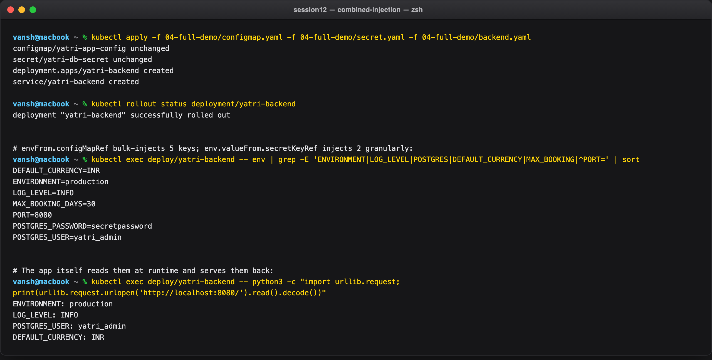

---

## Task 7: Ingress Resource vs. Ingress Controller

**Commands:**

```bash
kubectl api-resources | grep -i ingress
kubectl get deploy,pods -n ingress-nginx -l app.kubernetes.io/component=controller
kubectl exec -n ingress-nginx deploy/ingress-nginx-controller -- /nginx-ingress-controller --version
kubectl get ingressclass -o custom-columns='NAME:.metadata.name,CONTROLLER:.spec.controller'
```

**Output:**

```text
ingressclasses         networking.k8s.io/v1   false   IngressClass
ingresses        ing   networking.k8s.io/v1   true    Ingress

NAME                                       READY   UP-TO-DATE   AVAILABLE   AGE
deployment.apps/ingress-nginx-controller   1/1     1            1           111s

NAME                                           READY   STATUS    RESTARTS   AGE
pod/ingress-nginx-controller-d7cd8c989-fdldb   1/1     Running   0          111s

-------------------------------------------------------------------------------
NGINX Ingress controller
  Release:       v1.15.1
  Build:         0df02f2cfcf5fe4ad3cf31492bca770ac2a1606a
  Repository:    https://github.com/kubernetes/ingress-nginx
  nginx version: nginx/1.27.1

NAME    CONTROLLER
nginx   k8s.io/ingress-nginx
```

The distinction is concrete in this output: `kubectl api-resources` lists `Ingress` as a built-in API
type that exists on **every** cluster whether or not anything serves it, while
`kubectl get deploy -n ingress-nginx` shows an actual Deployment running an actual NGINX 1.27.1
binary. One is a record in etcd; the other is a process.

### Comparison

| Aspect | **Ingress Resource** | **Ingress Controller** |
|---|---|---|
| What it is | A declarative API object (YAML) | A running pod — a reverse proxy |
| Role | *Blueprint* — hosts, paths, TLS refs, backends | *Engine* — receives and routes real traffic |
| Activity | **Passive** — inert on its own | **Active** — runs a watch/reconcile loop |
| Behaviour | Stored in etcd | Watches the API server, regenerates `nginx.conf`, hot-reloads |
| Lives in | `default` (or the app's namespace) | `ingress-nginx` (system namespace) |
| Analogy | The address written on a parcel | The courier who drives the route |

### Architecture flow

```
   Client (curl / browser)
        │  https://yatri.local/api/
        ▼
  ┌───────────────────────────────┐        watches API server
  │  Ingress Controller pod       │◄─────────────────────────────┐
  │  (NGINX 1.27.1 reverse proxy) │                              │
  │  reads Ingress objects,       │        ┌─────────────────────┴────────┐
  │  builds nginx.conf, reloads   │        │  Ingress Resource (YAML)     │
  └───────────────┬───────────────┘        │  rules: yatri.local          │
                  │ routes by host + path  │   /      -> yatri-frontend:80│
      ┌───────────┴───────────┐            │   /api.. -> yatri-backend:8080│
      ▼                       ▼            └──────────────────────────────┘
 yatri-frontend:80      yatri-backend:8080
```

Delete the controller and the Ingress object still exists — but nothing routes. Delete the Ingress and
the controller runs — with no rules to serve. **Both are required.** The `IngressClass` is the
coupling: `ingressClassName: nginx` in a resource matches `spec.controller: k8s.io/ingress-nginx`,
which is how multiple controllers can coexist in one cluster.

**Screenshot:**

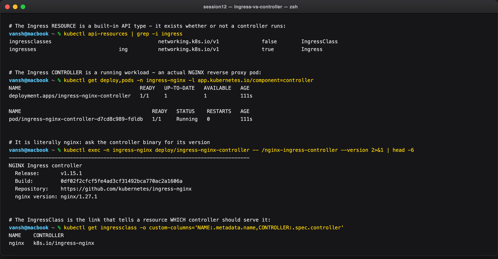

---

## Task 8: NGINX Ingress Controller Activation & Lifecycle

**Commands:**

```bash
minikube addons enable ingress
kubectl get pods -n ingress-nginx
kubectl wait --namespace ingress-nginx --for=condition=ready pod \
  --selector=app.kubernetes.io/component=controller --timeout=120s
kubectl get svc -n ingress-nginx
kubectl get ingressclass
```

**Output:**

```text
* ingress is an addon maintained by Kubernetes...
* After the addon is enabled, please run "minikube tunnel" and your ingress resources would be available at "127.0.0.1"
  - Using image registry.k8s.io/ingress-nginx/kube-webhook-certgen:v1.6.9
  - Using image registry.k8s.io/ingress-nginx/controller:v1.15.1
* Verifying ingress addon...
* The 'ingress' addon is enabled

NAME                                       READY   STATUS      RESTARTS   AGE
ingress-nginx-admission-create-scvzg       0/1     Completed   0          49s
ingress-nginx-admission-patch-kw4cb        0/1     Completed   0          49s
ingress-nginx-controller-d7cd8c989-fdldb   1/1     Running     0          49s

pod/ingress-nginx-controller-d7cd8c989-fdldb condition met

NAME                                 TYPE        CLUSTER-IP       EXTERNAL-IP   PORT(S)                      AGE
ingress-nginx-controller             NodePort    10.99.246.27     <none>        80:31806/TCP,443:31762/TCP   49s
ingress-nginx-controller-admission   ClusterIP   10.107.131.173   <none>        443/TCP                      49s

NAME              CONTROLLER             PARAMETERS   AGE
nginx (default)   k8s.io/ingress-nginx   <none>       49s
```

Three details worth reading:

- **The two `Completed` jobs** (`admission-create` / `admission-patch`) are not failures — they are one-shot jobs that generate and install the TLS certificate for the **validating admission webhook**. That webhook is what rejects a malformed Ingress at `kubectl apply` time rather than silently breaking the proxy config.
- **`ingress-nginx-controller` is a NodePort Service** exposing `80:31806` and `443:31762`. The controller is itself just a workload reached through an ordinary Service — on a cloud cluster this would be the single `type: LoadBalancer` from the Session 11, Task 11 cost analysis.
- **`nginx (default)`** — being the default class means an Ingress that omits `ingressClassName` is still picked up.

**Screenshot:**

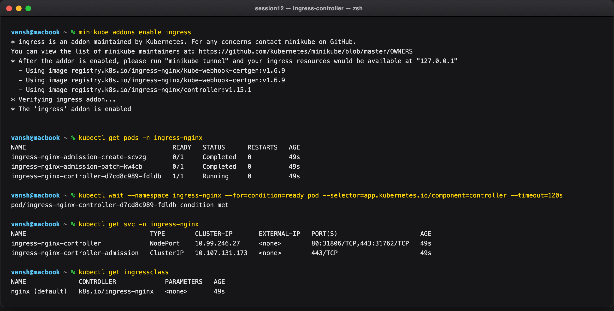

---

## Task 9: Local DNS Resolution & Hostname Mapping

**Commands:**

```bash
minikube ip
kubectl get ingress yatri-ingress
grep yatri.local /etc/hosts

minikube service ingress-nginx-controller -n ingress-nginx --url
curl -s --resolve yatri.local:59297:127.0.0.1 http://yatri.local:59297/ | grep -i '<title>'
```

**Output:**

```text
192.168.49.2

NAME            CLASS   HOSTS         ADDRESS        PORTS   AGE
yatri-ingress   nginx   yatri.local   192.168.49.2   80      38s

(no yatri.local entry - /etc/hosts untouched)

http://127.0.0.1:59297
<title>Welcome to nginx!</title>

# the entry you WOULD add on a routable setup:
192.168.49.2  yatri.local
```

The Ingress `ADDRESS` is `192.168.49.2` — the same unroutable Docker-bridge node IP diagnosed in
Session 11, Task 12. So on this host `/etc/hosts` would not have helped even with sudo: the name would
resolve, and the packet would still have nowhere to go.

`curl --resolve yatri.local:59297:127.0.0.1` is the precise equivalent: it pins the name for one
request and sends `Host: yatri.local`, which is the only thing the controller routes on. The
`<title>Welcome to nginx!</title>` response proves the host rule matched.

**Screenshot:**

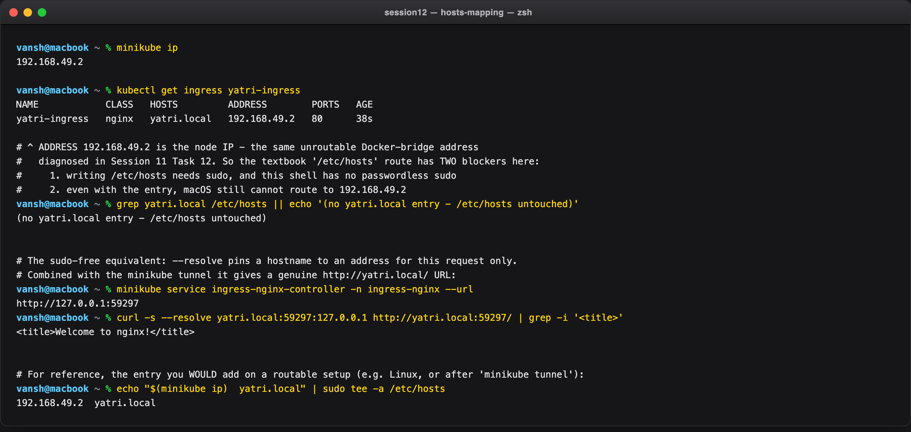

---

## Task 10: Layer 7 Path-Based Routing

One host, two paths, two Services, with URL rewriting.

**Commands:**

```bash
kubectl get ingress yatri-ingress
kubectl describe ingress yatri-ingress

curl -s --resolve yatri.local:59297:127.0.0.1 http://yatri.local:59297/       | grep -i '<title>'
curl -s --resolve yatri.local:59297:127.0.0.1 http://yatri.local:59297/api/
curl -s -o /dev/null -w 'HTTP %{http_code}\n' --resolve nope.local:59297:127.0.0.1 http://nope.local:59297/
```

**Output:**

```text
NAME            CLASS   HOSTS         ADDRESS        PORTS   AGE
yatri-ingress   nginx   yatri.local   192.168.49.2   80      55s

Rules:
  Host         Path  Backends
  ----         ----  --------
  yatri.local
               /               yatri-frontend:80  (10.244.0.104:80,10.244.0.105:80)
               /api(/|$)(.*)   yatri-backend:8080 (10.244.0.102:8080,10.244.0.103:8080)
Annotations:   nginx.ingress.kubernetes.io/rewrite-target: /$2

# path '/' -> frontend
<title>Welcome to nginx!</title>

# path '/api/' -> backend, /api stripped by the rewrite
ENVIRONMENT: production
LOG_LEVEL: INFO
POSTGRES_USER: yatri_admin
DEFAULT_CURRENCY: INR

# unknown Host -> no rule matches
HTTP 404
```

One hostname and one port produced two entirely different applications, and `describe` resolves each
rule down to live pod IPs — the controller knows the actual endpoints, not just Service names.

**How the rewrite works.** The path regex `/api(/|$)(.*)` has two capture groups: group 1 is the
separator, group 2 is everything after. `rewrite-target: /$2` rebuilds the upstream URL from group 2
only, so `/api/health` reaches the backend as `/health`. Without it the Python server would receive
`/api/health` and 404, because it knows nothing about the `/api` prefix. This is what lets a backend
stay unaware of where it is mounted.

The `HTTP 404` on an unknown Host is the negative control: routing really is host-scoped, not a
catch-all.

**Screenshot:**

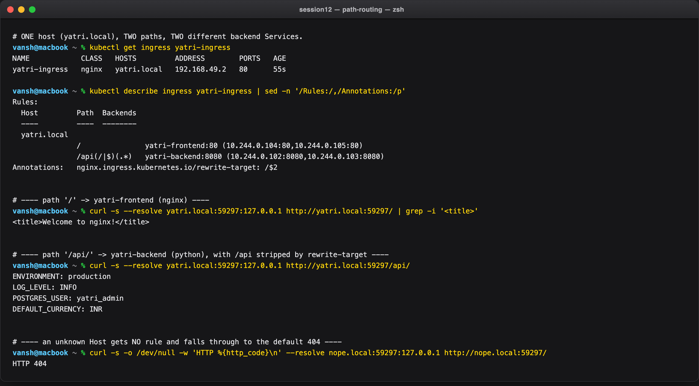

---

## Task 11: Virtual Host-Based Routing

Two hostnames, one IP, one port, one certificate — routed purely on the `Host` header.

**Commands:**

```bash
kubectl get ingress campus-ingress-tls
curl -sk --resolve portal.campus.local:59298:127.0.0.1 https://portal.campus.local:59298/ | grep -i '<title>'
curl -sk --resolve api.campus.local:59298:127.0.0.1    https://api.campus.local:59298/api
```

**Output:**

```text
NAME                 CLASS   HOSTS                                  ADDRESS   PORTS     AGE
campus-ingress-tls   nginx   portal.campus.local,api.campus.local             80, 443   46s

# Host: portal.campus.local -> yatri-frontend
<title>Welcome to nginx!</title>

# Host: api.campus.local -> yatri-backend
ENVIRONMENT: production
LOG_LEVEL: INFO
POSTGRES_USER: yatri_admin
DEFAULT_CURRENCY: INR

portal -> HTTP 200
api    -> HTTP 200
```

Both requests hit `127.0.0.1:59298` — identical IP, identical port, identical TLS certificate. The
**only** difference is the `Host` header, and it selects a different backend Service. That is virtual
hosting, and it is why one cloud load balancer can serve an entire organisation's subdomains.

For HTTPS this depends on **SNI**: the client sends the hostname during the TLS handshake, before any
HTTP data, so the controller can pick the right certificate and the right vhost. The SANs added in
Task 13 are what make one certificate valid for both names.

**Screenshot:**

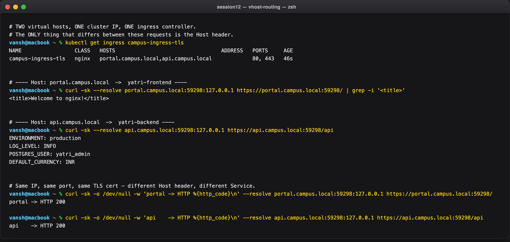

---

## Task 12: Hybrid Ingress Routing Architecture

A single Ingress combining host-based **and** path-based routing plus TLS.

**Commands:**

```bash
kubectl describe ingress campus-ingress-tls
```

**Output:**

```text
Name:             campus-ingress-tls
Labels:           app=yatri-app
Namespace:        default
Address:          192.168.49.2
Ingress Class:    nginx
Default backend:  <default>
TLS:
  campus-tls-cert terminates portal.campus.local,api.campus.local
Rules:
  Host                 Path  Backends
  ----                 ----  --------
  portal.campus.local
                       /      yatri-frontend:80  (10.244.0.104:80,10.244.0.105:80)
  api.campus.local
                       /api   yatri-backend:8080 (10.244.0.102:8080,10.244.0.103:8080)
                       /      yatri-backend:8080 (10.244.0.102:8080,10.244.0.103:8080)
Annotations:           nginx.ingress.kubernetes.io/ssl-redirect: true
```

One object expresses three independent concerns: **which host** (two vhosts), **which path** within a
host (`/api` and `/` under `api.campus.local`), and **TLS termination** for both names from a single
Secret.

Rule ordering matters. Under `api.campus.local`, `/api` is listed before `/` — NGINX matches the most
specific prefix first, so `/` acts as the catch-all. Had `/` come first with `pathType: Prefix`, it
would still work here because both point at the same Service, but with different backends the
ordering would decide the routing.

Contrast the two Ingress objects in this submission: `yatri-ingress` splits **one** host across two
services by path; `campus-ingress-tls` splits **two** hosts and then subdivides one of them by path.
The second is the shape most production clusters converge on.

**Screenshot:**

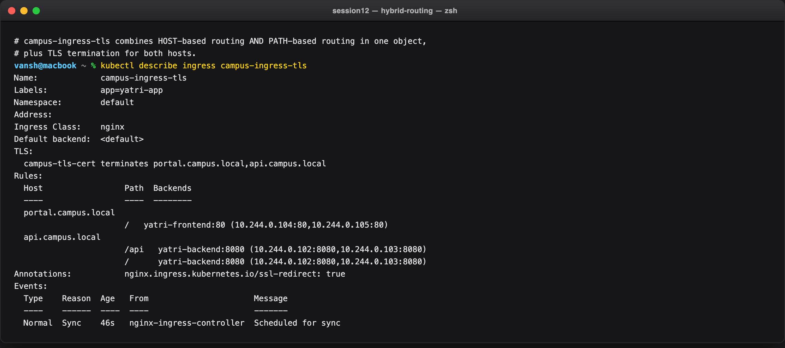

---

## Task 13: Ingress TLS/HTTPS Termination & Secret Binding

**Commands:**

```bash
openssl req -x509 -nodes -days 365 -newkey rsa:2048 \
  -keyout /tmp/tls.key -out /tmp/tls.crt \
  -subj '/CN=campus.local/O=CampusDevOps' \
  -addext 'subjectAltName=DNS:campus.local,DNS:portal.campus.local,DNS:api.campus.local'

openssl x509 -in /tmp/tls.crt -noout -subject -ext subjectAltName
kubectl create secret tls campus-tls-cert --cert=/tmp/tls.crt --key=/tmp/tls.key
kubectl get secret campus-tls-cert
kubectl apply -f 03-ingress/ingress-tls.yaml
kubectl describe ingress campus-ingress-tls | grep -A2 'TLS:'

curl -s -o /dev/null -w 'http -> HTTP %{http_code}' --resolve portal.campus.local:59297:127.0.0.1 http://portal.campus.local:59297/
curl -skv --resolve portal.campus.local:59298:127.0.0.1 https://portal.campus.local:59298/ 2>&1 \
  | grep -E 'SSL connection|subject:|issuer:|HTTP/2 200'
```

**Output:**

```text
keypair generated

subject=CN=campus.local, O=CampusDevOps
X509v3 Subject Alternative Name:
    DNS:campus.local, DNS:portal.campus.local, DNS:api.campus.local

secret/campus-tls-cert created
NAME              TYPE                DATA   AGE
campus-tls-cert   kubernetes.io/tls   2      0s
['tls.crt', 'tls.key']

ingress.networking.k8s.io/campus-ingress-tls created
NAME                 CLASS   HOSTS                                  ADDRESS        PORTS     AGE
campus-ingress-tls   nginx   portal.campus.local,api.campus.local   192.168.49.2   80, 443   88s

TLS:
  campus-tls-cert terminates portal.campus.local,api.campus.local

# plain HTTP is force-redirected:
http  -> HTTP 308

# HTTPS handshake:
* SSL connection using TLSv1.3 / AEAD-AES256-GCM-SHA384
*  subject: CN=campus.local; O=CampusDevOps
*  issuer: CN=campus.local; O=CampusDevOps
< HTTP/2 200
```

Four pieces of evidence that TLS is genuinely working, not just configured:

1. **`subject: CN=campus.local; O=CampusDevOps`** — the controller served **our** certificate. If the SAN had been omitted, this would read `Kubernetes Ingress Controller Fake Certificate`. The `subject == issuer` line is simply what "self-signed" means.
2. **`TLSv1.3 / AEAD-AES256-GCM-SHA384`** — a real modern handshake completed.
3. **`HTTP 308`** on plain HTTP — the `ssl-redirect: "true"` annotation permanently redirects to HTTPS, so no client can accidentally stay on port 80.
4. **`HTTP/2 200`** — HTTP/2 was negotiated via ALPN during the handshake, which only happens over TLS.

The `kubernetes.io/tls` Secret type is not cosmetic: it requires exactly the keys `tls.crt` and
`tls.key` (confirmed above), so the controller can find the material without extra configuration.

**Termination** means the controller decrypts here; traffic from the controller to
`yatri-frontend:80` is plain HTTP inside the cluster. That is the standard model — pods never handle
certificates, and rotating a cert means updating one Secret. `-k` is required only because the cert
is self-signed; in production cert-manager would issue and auto-renew a trusted Let's Encrypt cert
into this same Secret.

**Screenshot:**

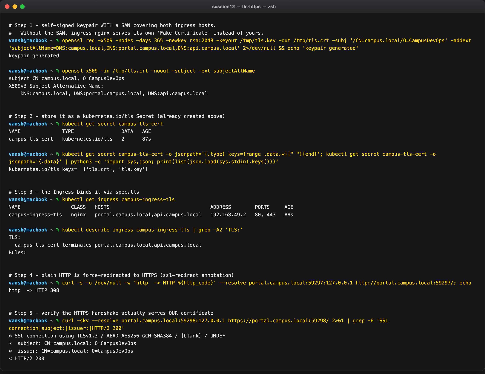

---

## Task 14: End-to-End Integration & Automation Scripting

**Multi-document YAML** — `backend.yaml` and `frontend.yaml` each hold a `Deployment` **and** a
`Service` separated by `---`, so one `kubectl apply -f` creates both:

```yaml
apiVersion: apps/v1
kind: Deployment
metadata:
  name: yatri-backend
# ...
---
apiVersion: v1
kind: Service
metadata:
  name: yatri-backend
# ...
```

**Commands:**

```bash
bash 04-full-demo/run-demo.sh
bash 04-full-demo/cleanup.sh
```

**Output:**

```text
==> [1/5] Applying ConfigMap (yatri-app-config)...
configmap/yatri-app-config created
==> [2/5] Applying Secret (yatri-db-secret)...
secret/yatri-db-secret created
==> [3/5] Applying Backend Deployment + Service (yatri-backend)...
deployment.apps/yatri-backend created
service/yatri-backend created
==> [4/5] Applying Frontend Deployment + Service (yatri-frontend)...
deployment.apps/yatri-frontend created
service/yatri-frontend created
==> [5/5] Applying Ingress (yatri-ingress)...
ingress.networking.k8s.io/yatri-ingress created
==> Waiting for deployments to become ready...
Waiting for deployment "yatri-backend" rollout to finish: 0 of 2 updated replicas are available...
Waiting for deployment "yatri-backend" rollout to finish: 1 of 2 updated replicas are available...
deployment "yatri-backend" successfully rolled out
Waiting for deployment "yatri-frontend" rollout to finish: 1 of 2 updated replicas are available...
deployment "yatri-frontend" successfully rolled out

==> Full stack deployed. Current state (app=yatri-app):
NAME                         DATA   AGE
configmap/yatri-app-config   5      1s

NAME                     TYPE     DATA   AGE
secret/yatri-db-secret   Opaque   2      1s

NAME                                      CLASS   HOSTS         ADDRESS   PORTS   AGE
ingress.networking.k8s.io/yatri-ingress   nginx   yatri.local             80      1s

NAME                             READY   UP-TO-DATE   AVAILABLE   AGE
deployment.apps/yatri-backend    2/2     2            2           1s
deployment.apps/yatri-frontend   2/2     2            2           1s

NAME                     TYPE        CLUSTER-IP      EXTERNAL-IP   PORT(S)    AGE
service/yatri-backend    ClusterIP   10.104.159.70   <none>        8080/TCP   1s
service/yatri-frontend   ClusterIP   10.109.245.40   <none>        80/TCP     1s

# ---- cleanup.sh ----
==> Deleting Ingress (yatri-ingress)...
ingress.networking.k8s.io "yatri-ingress" deleted from default namespace
==> Deleting Frontend Deployment + Service (yatri-frontend)...
deployment.apps "yatri-frontend" deleted from default namespace
service "yatri-frontend" deleted from default namespace
==> Deleting Backend Deployment + Service (yatri-backend)...
deployment.apps "yatri-backend" deleted from default namespace
service "yatri-backend" deleted from default namespace
==> Deleting Secret (yatri-db-secret)...
secret "yatri-db-secret" deleted from default namespace
==> Deleting ConfigMap (yatri-app-config)...
configmap "yatri-app-config" deleted from default namespace

==> Cleanup complete. Remaining app=yatri-app resources (should be empty):
No resources found in default namespace.
```

Three script-design points the run demonstrates:

- **Ordering matters.** ConfigMap and Secret are applied *before* the backend that references them. Kubernetes would eventually reconcile either way, but a pod whose `envFrom` target is missing sits in `CreateContainerConfigError` until it appears — so ordering avoids a confusing transient failure. `cleanup.sh` reverses the order.
- **`set -e` plus `rollout status`** turns the script into a real gate: it blocks until both Deployments are genuinely Available and aborts on the first failure, rather than exiting 0 with a broken stack.
- **`--ignore-not-found` makes teardown idempotent**, so `cleanup.sh` is safe to re-run — which is exactly what happened here, since it was run once before this capture to reset state.

The `No resources found` at the end is the proof the teardown was complete, with the label selector
`-l app=yatri-app` tying every object in the stack together.

**Screenshot:**

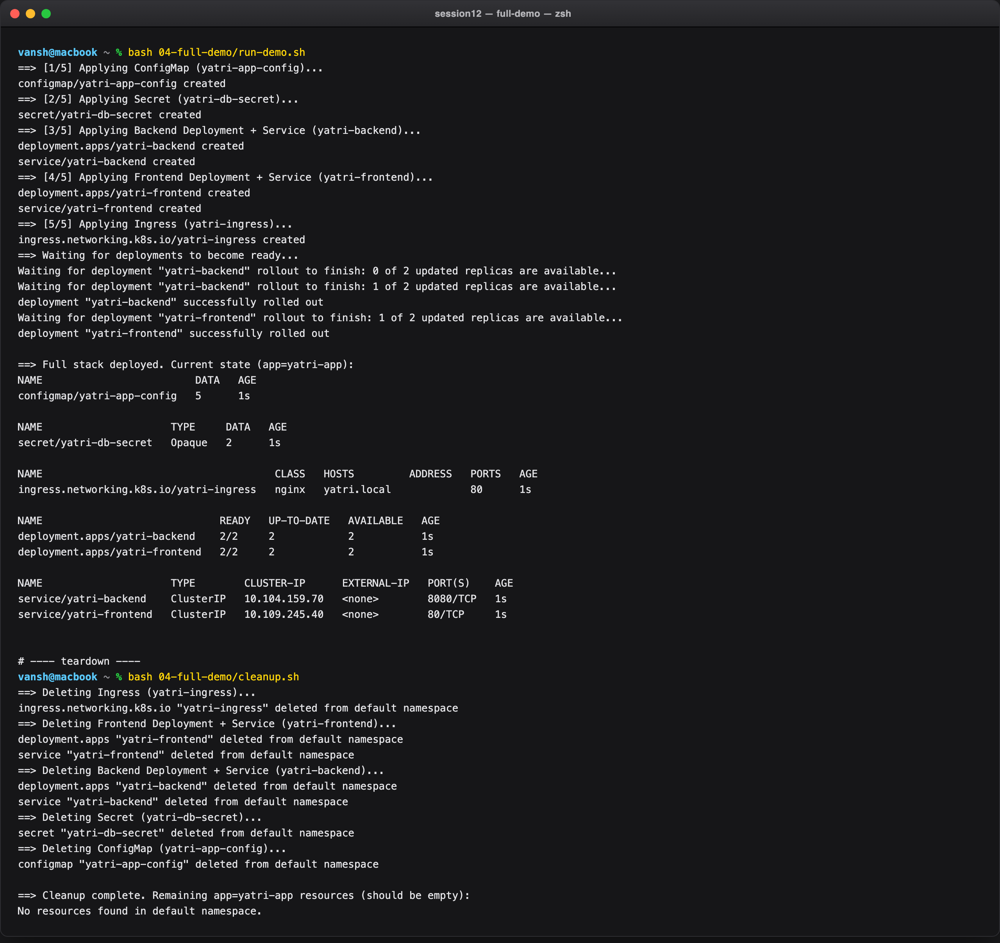

---

## Summary

| Concern | Object | Key property proven |
|---|---|---|
| Non-sensitive config | `ConfigMap` | Values visible in `describe`; env injection is frozen at container start (Task 2) |
| Credentials | `Secret` (Opaque) | `describe` masks values, but `get -o jsonpath` decodes them trivially (Task 3) |
| Encoding correctness | base64 | `echo` adds `0x0a`; `echo -n` does not — 15 vs 14 bytes (Task 4) |
| TLS material | `Secret` (`kubernetes.io/tls`) | Exactly `tls.crt` + `tls.key`; SAN required or the fake cert is served (Task 13) |
| L7 routing rules | `Ingress` | Passive blueprint; needs a controller to do anything (Task 7) |
| L7 routing engine | `ingress-nginx` pod | Real NGINX 1.27.1 that regenerates `nginx.conf` on change (Task 7) |
| Host selection | `Host` header + SNI | Same IP/port/cert, different Service (Task 11) |
| Path selection | path + `rewrite-target` | `/api/x` reaches the backend as `/x` (Task 10) |
