# Session 12: ConfigMaps, Secrets and Ingress

**Name:** Vansh Chitransh
**Course:** SST DevOps & Cloud [SWE]
**Session:** 12

Configuration outside the image with ConfigMaps, credentials in Secrets, and Layer 7 routing with the NGINX Ingress Controller: path routing, virtual-host routing, both together, and TLS termination. The example app is a small two-tier "Vansh App": an nginx frontend serving one page, and a Python backend that reports the configuration it was given. Everything ran on my minikube cluster (v1.37.0, Docker driver) on my MacBook Air; every screenshot is from that run.

## Folder structure

```
session-12-ingress-configmaps-secrets/
├── 01-configmap/app-config.yaml     # ConfigMap vanshapp-config (5 keys)
├── 02-secret/db-secret.yaml         # Opaque Secret vanshapp-db-secret
├── 03-ingress/
│   ├── ingress-vhost.yaml           # Task 11: host-based routing
│   ├── ingress-tls.yaml             # Task 12 and 13: host + path routing with TLS
│   └── .gitignore                   # tls.key / tls.crt are generated, never committed
├── 04-full-demo/
│   ├── configmap.yaml               # same ConfigMap
│   ├── secret.yaml                  # same Secret
│   ├── backend.yaml                 # Deployment + Service vanshapp-backend (multi-doc)
│   ├── frontend.yaml                # ConfigMap (html) + Deployment + Service vanshapp-frontend
│   ├── ingress.yaml                 # Task 10: path routing on vanshapp.local
│   ├── run-demo.sh                  # apply the stack in order
│   └── cleanup.sh                   # tear it down in reverse
├── screenshots/
└── README.md
```

A note on networking that applies to Tasks 9 to 14: with the Docker driver on macOS the node IP `192.168.49.2` is not reachable from the Mac, and `minikube tunnel` needs sudo, which I did not have in this session. So I put the hosts entries inside the minikube node and ran the hostname-based requests from there with `minikube ssh`, and for requests from the Mac I used the loopback tunnel that `minikube service -n ingress-nginx ingress-nginx-controller --url` opens, passing the `Host` header by hand. Both paths are shown in the screenshots.

---

## Task 1: ConfigMap

`vanshapp-config` holds five non-sensitive settings: `APP_NAME`, `ENVIRONMENT`, `LOG_LEVEL`, `PORT`, `DEFAULT_CURRENCY`. None of them belongs in the image; changing the currency should not mean rebuilding.

```bash
kubectl apply -f 01-configmap/app-config.yaml
kubectl get configmap vanshapp-config          # DATA 5
kubectl describe configmap vanshapp-config
kubectl get configmap vanshapp-config -o jsonpath='{.data.ENVIRONMENT}'   # production
kubectl get configmap vanshapp-config -o jsonpath='{.data.LOG_LEVEL}'     # INFO
```

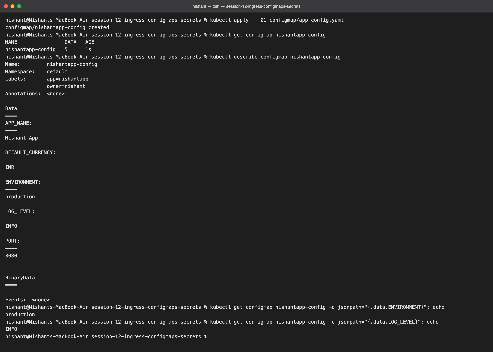

---

## Task 2: Changing a ConfigMap does not change running pods

With the backend from Task 6 running, I patched `ENVIRONMENT` from `production` to `staging`:

```bash
kubectl patch configmap vanshapp-config --type merge -p '{"data":{"ENVIRONMENT":"staging"}}'
kubectl exec deploy/vanshapp-backend -- env | grep ENVIRONMENT     # still production
kubectl rollout restart deployment/vanshapp-backend
kubectl rollout status deployment/vanshapp-backend
kubectl exec deploy/vanshapp-backend -- env | grep ENVIRONMENT     # now staging
kubectl patch configmap vanshapp-config --type merge -p '{"data":{"ENVIRONMENT":"production"}}'
kubectl rollout restart deployment/vanshapp-backend
```

The ConfigMap said `staging` immediately, but the running pod still printed `ENVIRONMENT=production`. Only after `rollout restart` replaced the pods did the new value show up. Environment variables from `envFrom` or `valueFrom` are read once, when the container starts; Kubernetes does not reach into a running process to change them. (A ConfigMap mounted as a volume does get updated in place, with a delay, but env vars never do.) The rolling restart is zero-downtime because the Deployment brings up new pods before removing old ones.

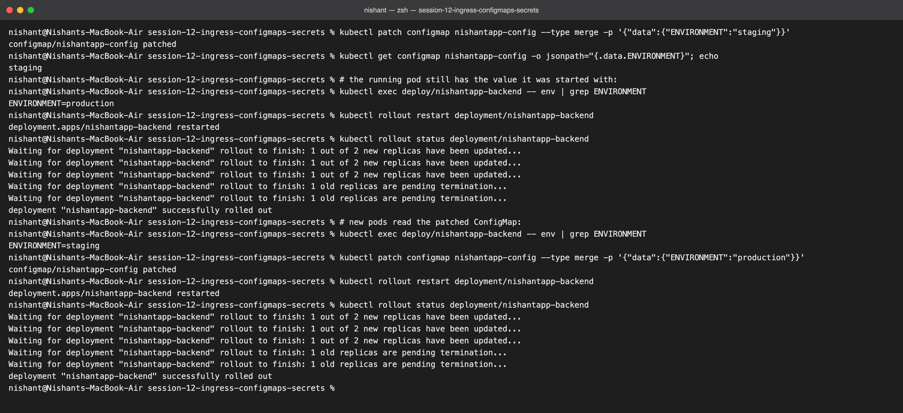

---

## Task 3: Secret

`vanshapp-db-secret` is an `Opaque` Secret with `POSTGRES_USER` and `POSTGRES_PASSWORD`.

```bash
kubectl apply -f 02-secret/db-secret.yaml
kubectl get secret vanshapp-db-secret                    # Opaque, DATA 2
kubectl describe secret vanshapp-db-secret               # shows only byte counts
kubectl get secret vanshapp-db-secret -o jsonpath='{.data.POSTGRES_USER}' | base64 --decode      # vansh_admin
kubectl get secret vanshapp-db-secret -o jsonpath='{.data.POSTGRES_PASSWORD}' | base64 --decode  # Vansh@Secret1
```

`describe` hides the values (`POSTGRES_PASSWORD: 15 bytes`), which is nice in a terminal but is not security: anyone allowed to `get` the Secret can decode it in one command, as the last two lines show. Base64 is an encoding so that binary data fits in YAML and JSON. It is not encryption.

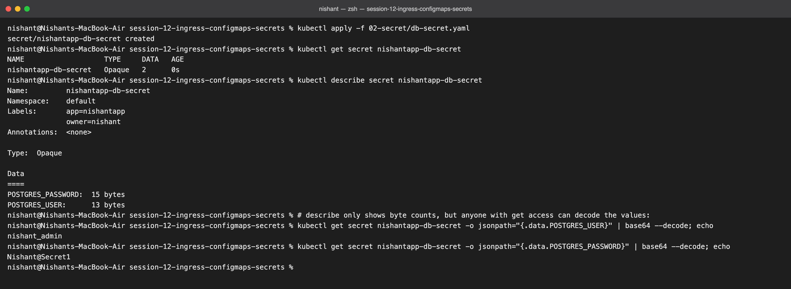

---

## Task 4: The trailing-newline gotcha

The most common Secret bug I know of: `echo "value" | base64` encodes the newline that `echo` adds.

```bash
echo "Vansh@Secret1" | xxd        # ends in 0a
echo "Vansh@Secret1" | base64     # VmFuc2hAU2VjcmV0MQo=
echo -n "Vansh@Secret1" | xxd     # no 0a
echo -n "Vansh@Secret1" | base64  # VmFuc2hAU2VjcmV0MQ==
```

| | Bytes | Base64 | Decodes to |
| --- | --- | --- | --- |
| `echo "..."` | 14, ends in `0a` | `VmFuc2hAU2VjcmV0MQo=` | `Vansh@Secret1\n` |
| `echo -n "..."` | 13 | `VmFuc2hAU2VjcmV0MQ==` | `Vansh@Secret1` |

The newline is invisible in the terminal, in `describe`, and in most editors, so the manifest looks fine. The database compares bytes, and `Vansh@Secret1\n` is not the password, so you get "password authentication failed" and no obvious reason. A trailing `Cg==`, `o=` or `K` (depending on length) of a base64 string is the tell.

My `db-secret.yaml` was generated with `printf '%s' ... | base64`, which never adds a newline; the last command in the screenshot confirms the stored value is the 13-byte one. Safer still is `kubectl create secret generic ... --from-literal=KEY=value`, which does the encoding for you.

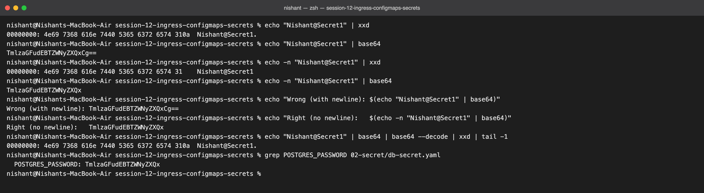

---

## Task 5: How secrets are handled properly

```bash
kubectl get crds | grep -i secret || echo "No external secret operator installed"
kubectl get secret vanshapp-db-secret -o yaml | grep -A 3 "^data:"
```

My cluster has no secret operator, so it is plain native Secrets, and the second command shows why committing that YAML to Git would be a problem: the "secret" is right there, one `base64 --decode` away. Git also never forgets; a leaked value stays in history even after the file is deleted, which means rotating it everywhere, not just removing it.

What teams do instead:

```
 External store (AWS Secrets Manager, Azure Key Vault, HashiCorp Vault)
        |   rotated, audited, access-controlled: the source of truth
        v
 External Secrets Operator / Vault Agent Injector      <- runs in the cluster
        |   reads a non-sensitive ExternalSecret object that only names the key
        v
 Kubernetes Secret (created and refreshed by the operator, never in Git)
        |
        v
 Pod (env var or mounted file, exactly like Task 6)
```

- **External Secrets Operator.** I commit an `ExternalSecret` that says "POSTGRES_PASSWORD comes from Vault path `prod/vanshapp/db`". The operator fetches the value and writes the real Secret. Git holds the reference, never the value.
- **Vault Agent Injector.** A sidecar pulls the secret from Vault into a memory-backed volume in the pod; there is no Secret object in etcd at all.
- **CI/CD.** In GitHub Actions the values live in encrypted repository secrets (or come from the cloud provider through OIDC at run time) and the pipeline creates the Secret at deploy time:

  ```yaml
  - run: |
      kubectl create secret generic vanshapp-db-secret \
        --from-literal=POSTGRES_USER="${{ secrets.DB_USER }}" \
        --from-literal=POSTGRES_PASSWORD="${{ secrets.DB_PASSWORD }}" \
        --dry-run=client -o yaml | kubectl apply -f -
  ```

  Azure DevOps does the same with a variable group linked to Key Vault.

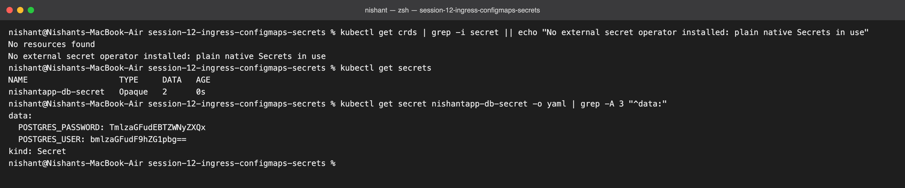

---

## Task 6: ConfigMap and Secret injected into one pod

`04-full-demo/backend.yaml` takes the whole ConfigMap in bulk with `envFrom.configMapRef`, and the two credentials one by one with `env[].valueFrom.secretKeyRef`.

```bash
kubectl apply -f 04-full-demo/configmap.yaml -f 04-full-demo/secret.yaml -f 04-full-demo/backend.yaml
kubectl rollout status deployment/vanshapp-backend
kubectl exec deploy/vanshapp-backend -- env | grep -E "APP_NAME|ENVIRONMENT|LOG_LEVEL|PORT|DEFAULT_CURRENCY|POSTGRES"
```

Inside the container both sets are ordinary environment variables:

```
APP_NAME=Vansh App
ENVIRONMENT=production
LOG_LEVEL=INFO
PORT=8080
DEFAULT_CURRENCY=INR
POSTGRES_USER=vansh_admin
POSTGRES_PASSWORD=Vansh@Secret1
```

The backend itself is a few lines of Python `http.server` inline in the manifest; it answers any GET with those values (password excluded) and the path it was asked for, which makes the routing tasks easy to verify.

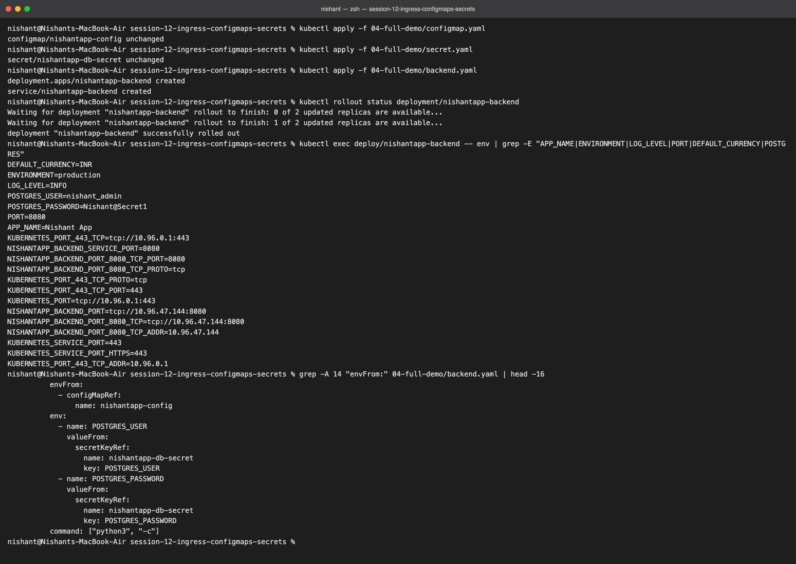

---

## Task 7: Ingress resource versus Ingress controller

```bash
kubectl api-resources | grep -i ingress
kubectl get ingressclass
kubectl get deploy -n ingress-nginx
```

| | Ingress resource | Ingress controller |
| --- | --- | --- |
| What it is | A Kubernetes object (`kind: Ingress`) stored in etcd | A running reverse proxy pod (nginx here) |
| Job | Describes the routing: hosts, paths, TLS, target Services | Watches Ingress objects, writes `nginx.conf`, reloads, serves traffic |
| Does anything alone? | No. Without a controller it is inert | No. Without Ingress objects it has nothing to route |
| Where | My namespace (`default`) | `ingress-nginx` namespace |
| Analogy | The delivery instructions on a parcel | The courier who reads them and drives |

The `ingresses` API type exists in every cluster, but until Task 8 there was nothing implementing it. After enabling the addon, `kubectl get ingressclass` shows `nginx (default)` backed by `k8s.io/ingress-nginx`, and the controller Deployment is `1/1`.

```
 curl / browser --> ingress-nginx-controller pod (reads Ingress objects) --> vanshapp-frontend:80
                                                                        \-> vanshapp-backend:8080
```

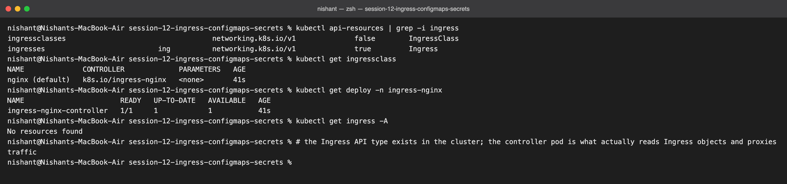

---

## Task 8: Enabling the NGINX Ingress Controller

```bash
minikube addons enable ingress
kubectl get pods -n ingress-nginx
kubectl wait --namespace ingress-nginx --for=condition=ready pod --selector=app.kubernetes.io/component=controller --timeout=180s
kubectl get service -n ingress-nginx
kubectl get ingressclass
```

The addon pulled `ingress-nginx/controller:v1.15.1`, ran two short admission jobs (`Completed`), and the controller pod went `Running 1/1` within about 40 seconds. Its Service is a NodePort on `80:32514` and `443:32450`; on minikube the controller also binds ports 80 and 443 on the node itself, which is what the in-node curls use.

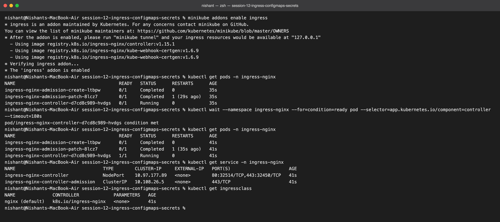

---

## Task 9: Hosts mapping

```bash
minikube ip                                                     # 192.168.49.2
sudo -n true                                                    # sudo: a password is required
minikube ssh -- "echo '192.168.49.2  vanshapp.local portal.vansh.local api.vansh.local' | sudo tee -a /etc/hosts"
minikube ssh -- grep vansh /etc/hosts
minikube service -n ingress-nginx ingress-nginx-controller --url   # http://127.0.0.1:52405 and :52406
```

On a Linux host, or with `minikube tunnel` running, this line would go into the Mac's own `/etc/hosts`. I had no sudo in this session and the Docker driver does not route to `192.168.49.2` anyway, so I added the mapping inside the minikube node, where the node IP is local and the ingress controller listens on 80 and 443. For requests from the Mac, `minikube service --url` gave me two loopback ports (HTTP and HTTPS) forwarded to the controller.

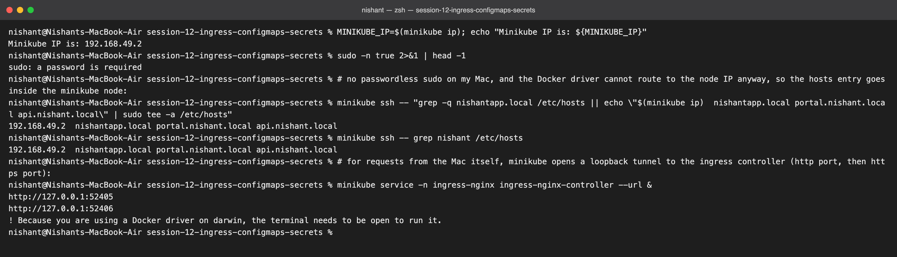

---

## Task 10: Path-based routing

`04-full-demo/ingress.yaml` routes one host, `vanshapp.local`: `/api(/|$)(.*)` goes to the backend with `rewrite-target: /$2` so the backend sees the path without the `/api` prefix, and everything else goes to the frontend.

```bash
kubectl apply -f 04-full-demo/frontend.yaml -f 04-full-demo/backend.yaml -f 04-full-demo/ingress.yaml
kubectl get ingress vanshapp-ingress
kubectl describe ingress vanshapp-ingress | grep -A 6 "Rules:"
minikube ssh -- curl -s http://vanshapp.local/ | grep -i "<title>"         # Vansh App Frontend
minikube ssh -- curl -s http://vanshapp.local/api/                           # backend config dump
minikube ssh -- curl -s http://vanshapp.local/api/bookings/42 | tail -1     # served path: /bookings/42
curl -s -H 'Host: vanshapp.local' http://127.0.0.1:52405/api/ | head -2     # same from the Mac
```

The describe output lists both rules with the live pod IPs behind each Service. The `/api/bookings/42` request reaching the backend as `/bookings/42` proves the rewrite.

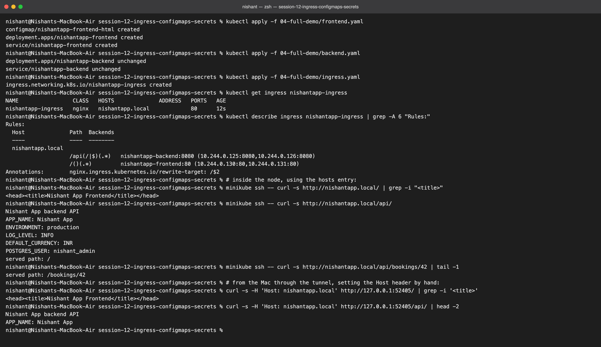

---

## Task 11: Virtual-host routing

`03-ingress/ingress-vhost.yaml` uses two hostnames on the same IP: `portal.vansh.local` to the frontend, `api.vansh.local` to the backend. The controller picks the Service from the HTTP `Host` header.

```bash
kubectl apply -f 03-ingress/ingress-vhost.yaml
minikube ssh -- curl -s http://portal.vansh.local/ | grep -i "<title>"
minikube ssh -- curl -s http://api.vansh.local/ | head -3
curl -s -H 'Host: portal.vansh.local' http://127.0.0.1:52405/ | grep -i '<title>'
curl -s -H 'Host: api.vansh.local'    http://127.0.0.1:52405/ | head -2
curl -s -o /dev/null -w 'HTTP %{http_code}\n' -H 'Host: nobody.vansh.local' http://127.0.0.1:52405/   # 404
```

Same IP and port every time; only the Host header changes, and the answer switches between the frontend page and the backend dump. A hostname no Ingress claims gets a 404 from the controller's default backend.

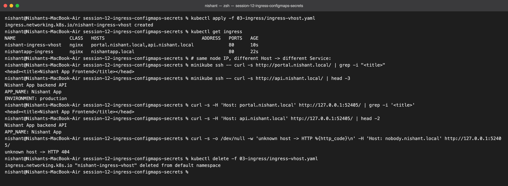

---

## Task 12: Hybrid routing (host and path together)

`03-ingress/ingress-tls.yaml` combines both styles in one object: `portal.vansh.local/` goes to the frontend, and under `api.vansh.local` both `/api` and `/` go to the backend. It also references the TLS secret from Task 13.

```bash
kubectl apply -f 03-ingress/ingress-tls.yaml
kubectl get ingress vansh-ingress-tls              # HOSTS portal.vansh.local,api.vansh.local  PORTS 80, 443
kubectl describe ingress vansh-ingress-tls
minikube ssh -- curl -s http://portal.vansh.local/ | grep -i "<title>"
```

The describe output shows the TLS block (`vansh-tls-cert terminates portal.vansh.local,api.vansh.local`) and the three rules. One thing I did not expect: the plain-HTTP requests now return `308 Permanent Redirect`. Because the Ingress has a `tls` section, ingress-nginx turns on `ssl-redirect` by default and sends HTTP clients to HTTPS. Task 13 follows the redirect.

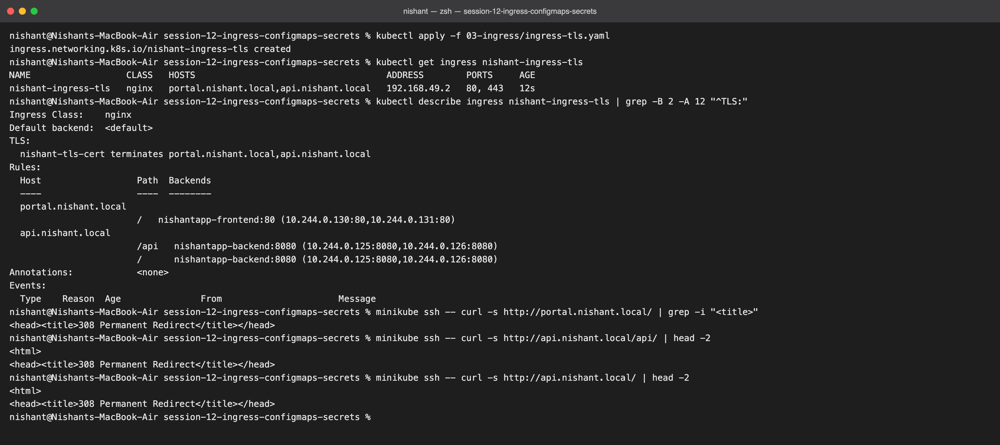

---

## Task 13: TLS termination

```bash
cd 03-ingress
openssl req -x509 -nodes -days 365 -newkey rsa:2048 -keyout tls.key -out tls.crt \
  -subj "/CN=vansh.local/O=Vansh DevOps" \
  -addext "subjectAltName=DNS:vansh.local,DNS:portal.vansh.local,DNS:api.vansh.local"
openssl x509 -in tls.crt -noout -subject -ext subjectAltName
kubectl create secret tls vansh-tls-cert --cert=tls.crt --key=tls.key
kubectl get secret vansh-tls-cert                  # kubernetes.io/tls, DATA 2

minikube ssh -- "curl -k -v https://portal.vansh.local/ 2>&1 | grep -E 'subject:|issuer:|SSL connection|HTTP/'"
minikube ssh -- "curl -k -s https://api.vansh.local/api/ | head -2"
curl -k -v --resolve portal.vansh.local:52406:127.0.0.1 https://portal.vansh.local:52406/ 2>&1 | grep -E 'subject:|SSL connection|HTTP/|<title>'
```

The certificate carries a Subject Alternative Name for each ingress host; without the SAN, ingress-nginx ignores the secret and serves its own "Kubernetes Ingress Controller Fake Certificate". The handshake output confirms my cert is the one served: `subject: CN=vansh.local; O=Vansh DevOps`, TLS 1.3, and `HTTP/2 200` with the frontend title. From the Mac, `--resolve` makes curl send the right SNI name through the tunnel port. `-k` is needed only because the cert is self-signed.

The key and certificate stay on my laptop; `03-ingress/.gitignore` keeps them out of the repository.

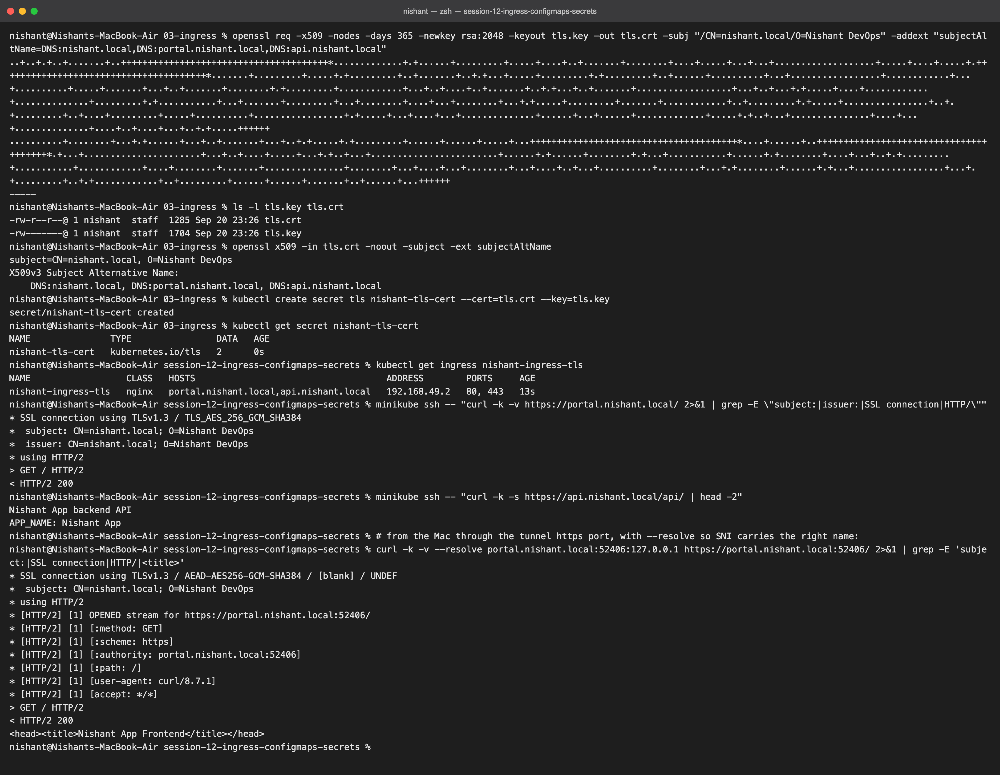

---

## Task 14: The whole stack with scripts

`run-demo.sh` applies ConfigMap, Secret, backend, frontend and Ingress in that order and waits for both rollouts; `cleanup.sh` removes them in reverse. Each of `backend.yaml` and `frontend.yaml` is a multi-document file (`---`) holding a Deployment and its Service (frontend also carries the html ConfigMap), so one `kubectl apply -f` creates the pair.

```bash
bash 04-full-demo/cleanup.sh
bash 04-full-demo/run-demo.sh
kubectl get configmap,secret,ingress,deploy,svc,pods -l app=vanshapp
minikube ssh -- curl -s http://vanshapp.local/api/ | head -3
bash 04-full-demo/cleanup.sh
kubectl get ingress vanshapp-ingress || echo "Ingress deleted"
kubectl get deployment vanshapp-backend vanshapp-frontend || echo "Deployments deleted"
```

The audit shows every object carrying the `app=vanshapp` label: two ConfigMaps, the Secret, the Ingresses, both Deployments at `2/2`, both Services and the pods. The two `Terminating` backend pods in that listing are the previous stack still shutting down from the cleanup I ran seconds earlier. After the final cleanup, both lookups return `NotFound`.

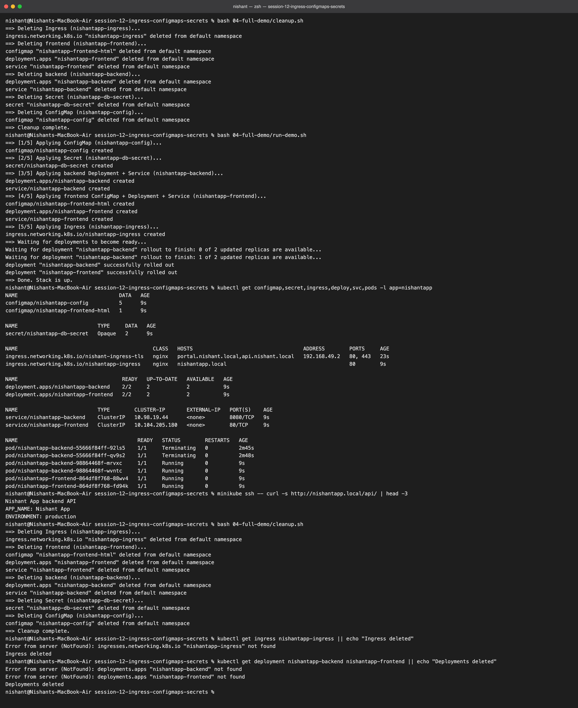
