# Terraform S3 demo

**Name:** Vansh Chitransh
**Session:** 18

One private, versioned S3 bucket, created and removed with Terraform. The point is the workflow, not the bucket.

## Files

```
terraform-s3-demo/
├── provider.tf          # Terraform and AWS provider versions, region, default tags, LocalStack switch
├── variables.tf         # aws_region, bucket_name (validated), environment, use_localstack
├── main.tf              # the bucket, its public access block and versioning
├── outputs.tf           # bucket name, ARN and region
├── terraform.tfvars     # my values (loaded automatically)
├── localstack.tfvars    # use_localstack = true, passed with -var-file when targeting LocalStack
├── .terraform.lock.hcl  # exact provider version, committed
├── .gitignore           # keeps .terraform/ and state files out of Git
├── screenshots/
└── README.md
```

Three resources: `aws_s3_bucket.demo`, `aws_s3_bucket_public_access_block.demo` and `aws_s3_bucket_versioning.demo`. The last two reference `aws_s3_bucket.demo.id`, which is how Terraform knows to create the bucket first and delete it last.

## Where the API calls go

There is no AWS account on this Mac, so I ran everything against **LocalStack 3.8** in Docker. `provider.tf` has a `use_localstack` variable: when it is true the provider uses dummy keys, skips credential validation and points the S3 and STS endpoints at `http://localhost:4566`. When it is false (the default) all of those settings are off and the provider behaves like any normal AWS configuration.

```bash
docker run -d --name localstack -p 4566:4566 -e SERVICES=s3,ec2,iam,sts localstack/localstack:3.8
export AWS_ACCESS_KEY_ID=test AWS_SECRET_ACCESS_KEY=test AWS_DEFAULT_REGION=ap-south-1
aws --endpoint-url=http://localhost:4566 sts get-caller-identity
```

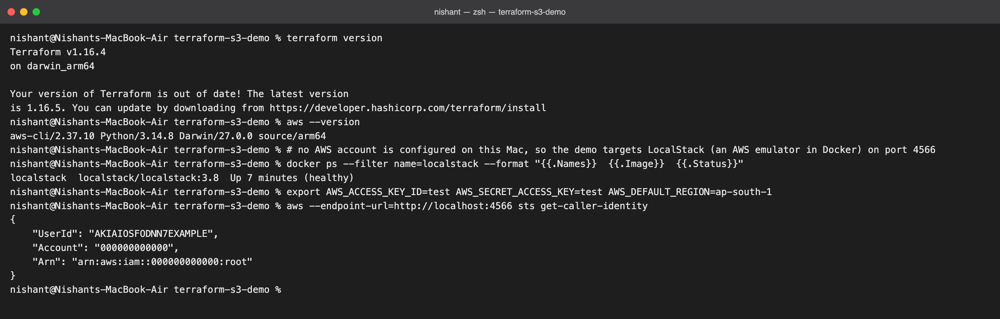

To run it on real AWS: `aws configure`, then run the same commands below **without** `-var-file=localstack.tfvars`.

## Workflow

Run everything from inside this folder.

### 1. terraform init

Downloads the AWS provider (v6.67.0 on my run) and writes `.terraform.lock.hcl`.

```bash
terraform init
```

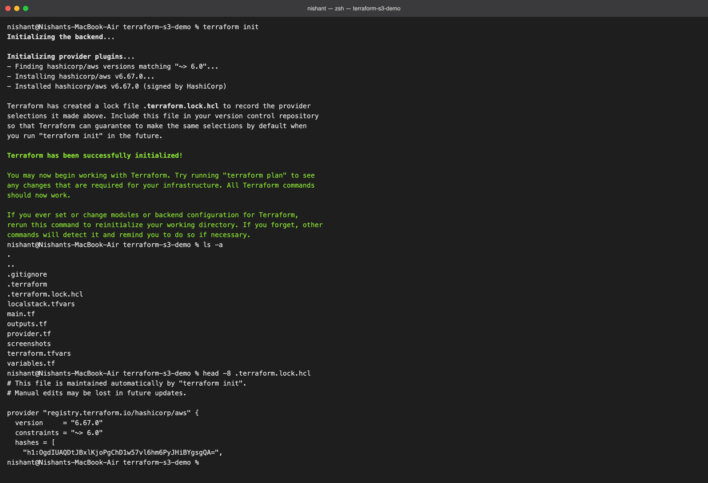

### 2. terraform fmt

Rewrites files into canonical style. Mine were already formatted, so it printed nothing.

```bash
terraform fmt
```

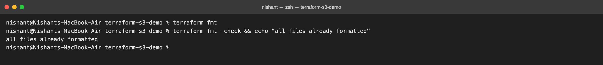

### 3. terraform validate

Syntax and reference check, no API calls.

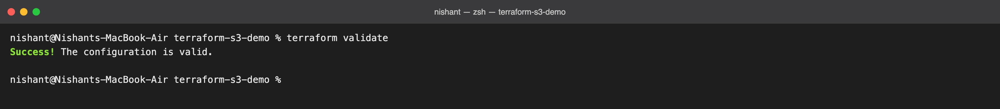

### 4. terraform plan

Preview only. `3 to add, 0 to change, 0 to destroy`; attributes marked `(known after apply)` are decided by the service at creation time.

```bash
terraform plan -var-file=localstack.tfvars
```

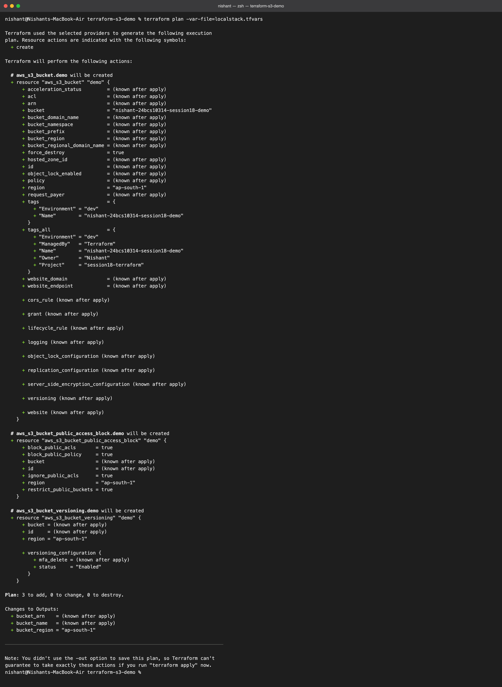

### 5. terraform apply

```bash
terraform apply -var-file=localstack.tfvars
```

I used `-auto-approve` in the recording; interactively Terraform asks for `yes` first.

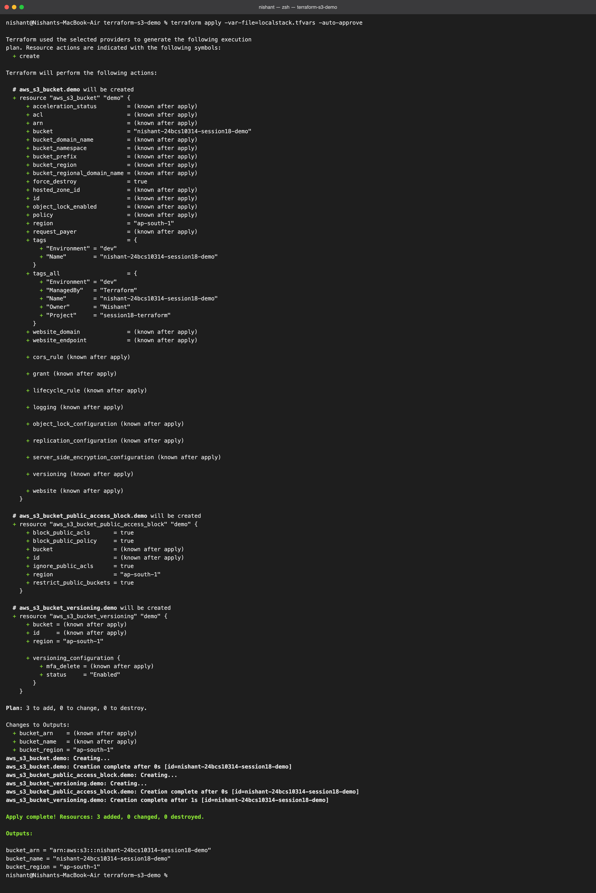

### 6. Look at the state

```bash
terraform state list
terraform show
```

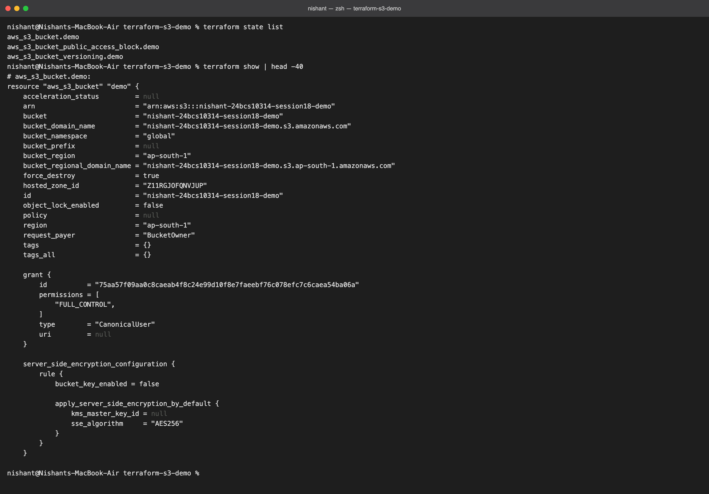

### 7. Outputs

```bash
terraform output
terraform output -raw bucket_name
```

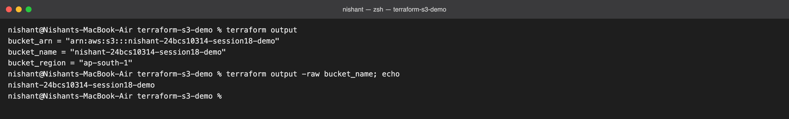

### 8. Verify with the AWS CLI, not Terraform

```bash
aws --endpoint-url=http://localhost:4566 s3 ls | grep session18
aws --endpoint-url=http://localhost:4566 s3api get-bucket-location --bucket vansh-24bcs10015-session18-demo
aws --endpoint-url=http://localhost:4566 s3api get-public-access-block --bucket vansh-24bcs10015-session18-demo
aws --endpoint-url=http://localhost:4566 s3api get-bucket-versioning --bucket vansh-24bcs10015-session18-demo
```

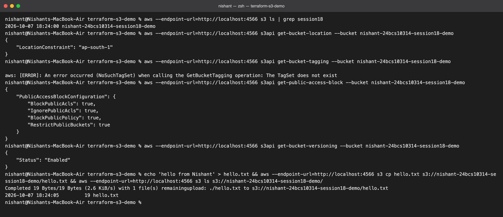

The bucket exists in `ap-south-1`, all four public-access blocks are `true`, versioning is `Enabled`, and I could upload and list a file. One LocalStack gap shows here: `get-bucket-tagging` returned `NoSuchTagSet`, because LocalStack 3.8 does not store bucket tags on create. On real AWS the `Name`, `Environment`, `Owner`, `Project` and `ManagedBy` tags from the plan would be there.

### 9. Destroy

Preview the destroy first, then run it.

```bash
terraform plan -destroy -var-file=localstack.tfvars
terraform destroy -var-file=localstack.tfvars
```

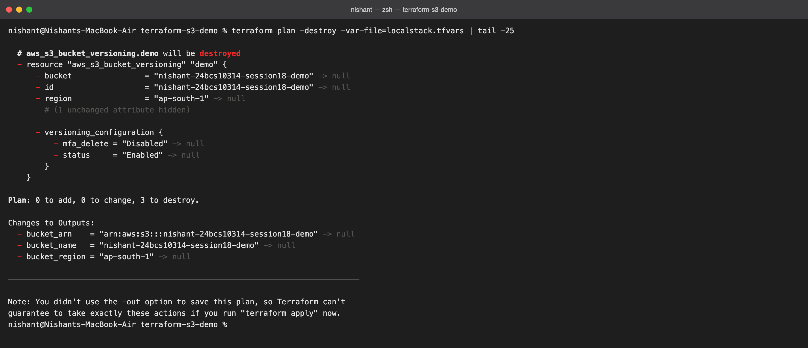

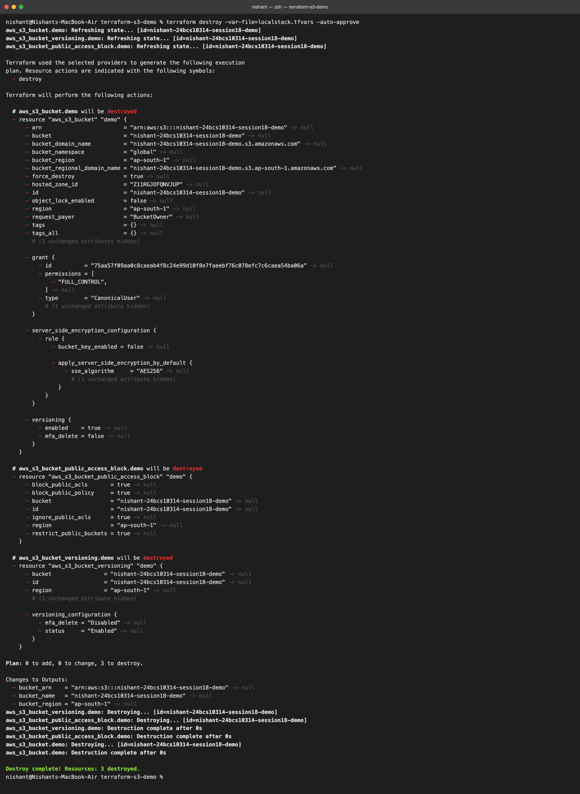

Afterwards the bucket is gone from `s3 ls` and `terraform state list` prints nothing. `force_destroy = true` is what let Terraform remove a bucket that still held `hello.txt` and its versions.

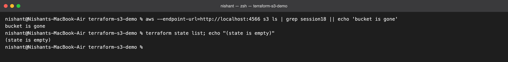

## Command summary

| Command | Does | Touches the cloud? |
| --- | --- | --- |
| `terraform init` | Downloads providers | No |
| `terraform fmt` | Formats code | No |
| `terraform validate` | Checks syntax and references | No |
| `terraform plan` | Previews changes | Reads only |
| `terraform apply` | Creates or updates | Yes |
| `terraform show`, `state list` | Displays the state | No |
| `terraform output` | Prints outputs | No |
| `terraform destroy` | Deletes everything in the state | Yes |

## What I took away

- Plan before apply, and plan with `-destroy` before destroy. The preview is the whole safety net.
- The state file is the link between code and reality. It is git-ignored here; a team would keep it in a remote backend with locking.
- Credentials never go in `.tf` files. The provider gets them from the environment, which is also what let me swap in LocalStack with one variable.
- References such as `aws_s3_bucket.demo.id` are dependencies. I never told Terraform the order; it worked it out.
- S3 bucket names are global, so I prefixed mine with my name and enrollment number.
