# Session 10: Kubernetes Core Objects — Pods, Controllers & Deployment Strategies

**Author:** Vansh Chitransh
**Course:** SST DevOps & Cloud [SWE]
**Session:** 10

Covers the Pod lifecycle, the controller objects (ReplicaSet, StatefulSet, DaemonSet), Deployment
upgrades and rollbacks, the four deployment strategies (RollingUpdate, Blue-Green, Canary, Recreate),
and two real troubleshooting drills.

> Every manifest here was **actually applied to a live cluster** — single-node Minikube v1.39.0,
> Kubernetes v1.37.0, containerd 2.3.4, `docker` driver on macOS/arm64. All outputs and screenshots
> below are real terminal captures from that cluster, not dry runs.

## Folder Structure

```
session10-k8s-core-objects/
├── pod.yml                     # Task 2: nginx-pod
├── hello.yml                   # Task 4: hello-pod (batch busybox)
├── replicaset.yml              # Task 6: nginx-rs
├── pod-lifecycle/              # Task 5: 12 lifecycle manifests
├── k8s-core-objects/
│   ├── statefulset.yml         # Task 6: mysql StatefulSet + headless Service
│   └── deamonset.yml           # Task 7: node-exporter DaemonSet
├── daemonset/
│   └── node-agent-ds.yaml      # Task 7: node-agent DaemonSet
├── deployment/                 # Task 8: web v1/v2
├── 01-rolling-update/          # Task 8: app-rolling v1/v2 + service
├── 02-blue-green/              # Task 11: app-blue/app-green + service cutover
├── 03-canary/                  # Task 12: app-stable/app-canary + shared service
├── 04-recreate/                # Task 13: app-recreate v1/v2 + service
├── troubleshooting/            # Task 9: broken-image + selector-mismatch
└── screenshots/                # Terminal screenshots for every task
```

---

### Task 1: Cluster Health Verification & Baseline Environment Checks

Confirm the control plane, CoreDNS and node are operational before deploying anything.

**Commands:**

```bash
kubectl cluster-info
kubectl get nodes -o wide
kubectl get pods -n kube-system
```

**Output:**

```
Kubernetes control plane is running at https://127.0.0.1:57170
CoreDNS is running at https://127.0.0.1:57170/api/v1/namespaces/kube-system/services/kube-dns:dns/proxy

NAME       STATUS   ROLES           AGE   VERSION   INTERNAL-IP    EXTERNAL-IP   OS-IMAGE                         KERNEL-VERSION             CONTAINER-RUNTIME
minikube   Ready    control-plane   95s   v1.37.0   192.168.49.2   <none>        Debian GNU/Linux 12 (bookworm)   6.12.76-linuxkit (arm64)   containerd://2.3.4

NAME                               READY   STATUS    RESTARTS      AGE
coredns-559f6c778d-jn8ss           1/1     Running   1 (45s ago)   86s
etcd-minikube                      1/1     Running   1 (45s ago)   93s
kindnet-xvclh                      1/1     Running   1 (45s ago)   86s
kube-apiserver-minikube            1/1     Running   1 (45s ago)   93s
kube-controller-manager-minikube   1/1     Running   1 (45s ago)   93s
kube-proxy-8v46x                   1/1     Running   1 (45s ago)   86s
kube-scheduler-minikube            1/1     Running   1 (45s ago)   93s
storage-provisioner                0/1     Error     1 (45s ago)   92s
```

The `kube-system` listing is the architecture from Session 9 made concrete: `etcd`, `kube-apiserver`,
`kube-scheduler` and `kube-controller-manager` are the control plane; `kube-proxy` and `kindnet` are
the dataplane; `coredns` is cluster DNS. `storage-provisioner` shows `Error` here because it was
caught mid-restart right after the cluster booted — it settles to `Running` within a few seconds and
is `1/1 Running` by Task 6, where it successfully provisions the StatefulSet's PersistentVolumes.

**Screenshot:**

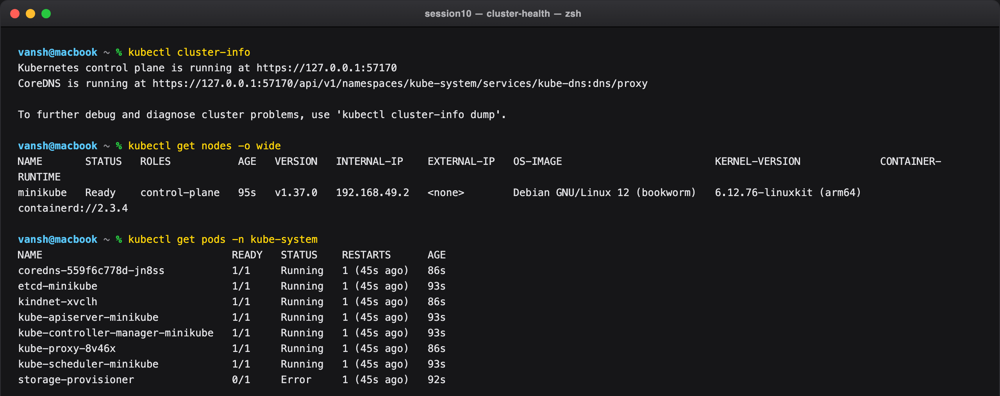

---

### Task 2: Standard Pod Deployment, Inspection & Teardown (`pod.yml`)

Create a standalone Nginx Pod declaring the 4 mandatory top-level fields (`apiVersion`, `kind`,
`metadata`, `spec`); inspect readiness, IP and node placement; read its logs; delete it cleanly.

**Commands:**

```bash
kubectl apply -f pod.yml
kubectl get pods
kubectl get pods -o wide
kubectl logs nginx-pod
kubectl delete -f pod.yml
kubectl get pods
```

**Output:**

```
pod/nginx-pod created

NAME        READY   STATUS    RESTARTS   AGE
nginx-pod   1/1     Running   0          11s

NAME        READY   STATUS    RESTARTS   AGE   IP           NODE       NOMINATED NODE   READINESS GATES
nginx-pod   1/1     Running   0          11s   10.244.0.3   minikube   <none>           <none>

/docker-entrypoint.sh: /docker-entrypoint.d/ is not empty, will attempt to perform configuration
/docker-entrypoint.sh: Looking for shell scripts in /docker-entrypoint.d/
/docker-entrypoint.sh: Launching /docker-entrypoint.d/10-listen-on-ipv6-by-default.sh
10-listen-on-ipv6-by-default.sh: info: Getting the checksum of /etc/nginx/conf.d/default.conf

pod "nginx-pod" deleted from default namespace

No resources found in default namespace.
```

`10.244.0.3` is a **Pod IP from the CNI range**, not a Service IP. It is ephemeral — delete the pod
and the address is gone. That impermanence is precisely the problem Services solve (Session 11).

**Screenshot:**

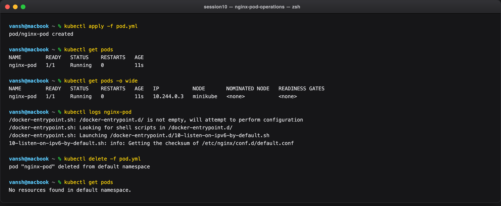

---

### Task 3: Error State Simulation — `ErrImagePull` & `ImagePullBackOff`

Reference a non-existent image tag and watch the container state go from `ErrImagePull` to
`ImagePullBackOff`. The API object is admitted and stored in etcd successfully; the failure happens
later, in the container runtime, at pull time.

**Commands:**

```bash
kubectl apply -f pod-lifecycle/06-imagepullbackoff.yaml
kubectl get pods lifecycle-image-error
kubectl describe pod lifecycle-image-error | grep -A 10 Events:
kubectl delete -f pod-lifecycle/06-imagepullbackoff.yaml
```

**Output:**

```
pod/lifecycle-image-error created

NAME                    READY   STATUS             RESTARTS   AGE
lifecycle-image-error   0/1     ImagePullBackOff   0          45s

Events:
  Type     Reason     Age                From               Message
  ----     ------     ----               ----               -------
  Normal   Scheduled  45s                default-scheduler  Successfully assigned default/lifecycle-image-error to minikube
  Normal   BackOff    15s (x2 over 43s)  kubelet            spec.containers{nginx}: Back-off pulling image "nginx:this-tag-does-not-exist-123"
  Warning  Failed     15s (x2 over 43s)  kubelet            spec.containers{nginx}: Error: ImagePullBackOff
  Normal   Pulling    2s (x3 over 45s)   kubelet            spec.containers{nginx}: Pulling image "nginx:this-tag-does-not-exist-123"
  Warning  Failed     0s (x3 over 44s)   kubelet            spec.containers{nginx}: Failed to pull image "nginx:this-tag-does-not-exist-123": rpc error: code = NotFound desc = failed to pull and unpack image "docker.io/library/nginx:this-tag-does-not-exist-123": failed to resolve reference "docker.io/library/nginx:this-tag-does-not-exist-123": docker.io/library/nginx:this-tag-does-not-exist-123: not found
  Warning  Failed     0s (x3 over 44s)   kubelet            spec.containers{nginx}: Error: ErrImagePull
```

Note the `(x2)`, `(x3)` counters and the alternation between `Pulling` and `BackOff`: the kubelet is
retrying with **exponential backoff**, which is exactly what `ImagePullBackOff` means. `Scheduled`
succeeded — scheduling and image pulling are separate phases.

**Screenshot:**

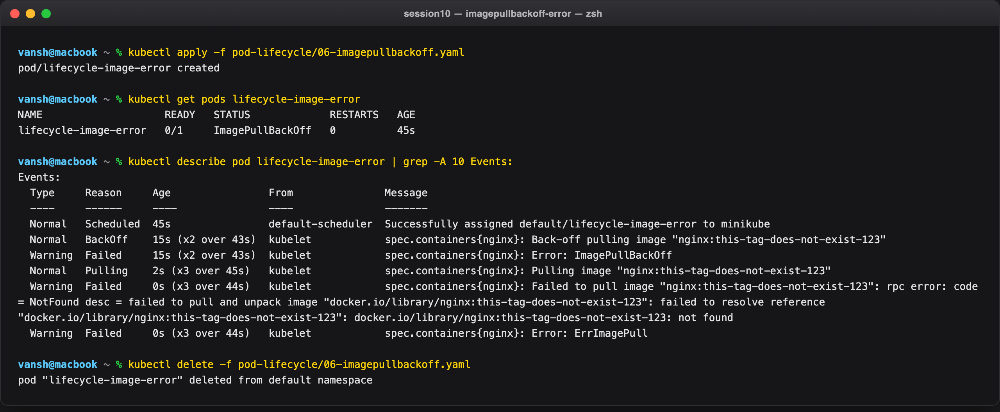

---

### Task 4: Capturing Transient Pod Lifecycle Stages (`hello.yml`)

Deploy a `busybox` batch container with `restartPolicy: Never` and catch every transient phase live.
The watch is started **before** the pod exists (using a label selector, so it does not error on a
missing resource), then the pod is applied from a second terminal.

**Commands:**

```bash
# Terminal 1 — start watching first
kubectl get pods -l app=hello -w

# Terminal 2 — apply while the watch is live
kubectl apply -f hello.yml

kubectl get pod hello-pod
kubectl logs hello-pod
kubectl get pod hello-pod -o jsonpath='{.status.phase} exitCode={.status.containerStatuses[0].state.terminated.exitCode}'
kubectl delete -f hello.yml
```

**Output:**

```
NAME        READY   STATUS    RESTARTS   AGE
hello-pod   0/1     Pending   0          0s
hello-pod   0/1     Pending   0          0s
hello-pod   0/1     ContainerCreating   0          0s
hello-pod   0/1     ContainerCreating   0          0s
hello-pod   1/1     Running             0          6s
hello-pod   0/1     Completed           0          9s
hello-pod   0/1     Completed           0          10s

NAME        READY   STATUS      RESTARTS   AGE
hello-pod   0/1     Completed   0          32s

Hello from busybox

Succeeded exitCode=0
```

All four phases captured in order: **Pending** (accepted, awaiting scheduling) → **ContainerCreating**
(image pull + network namespace setup) → **Running** (process executing) → **Completed / Succeeded**
(exit 0, and with `restartPolicy: Never` it stays dead). `READY` drops back to `0/1` on completion
because a terminated container is not ready to serve.

**Screenshot:**

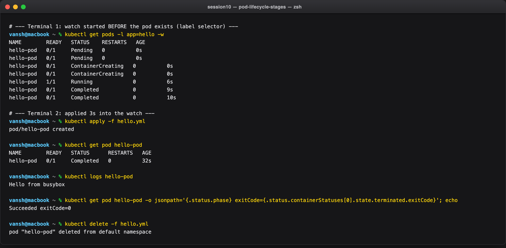

---

### Task 5: Exhaustive Pod Lifecycle States & Probes Lab (`pod-lifecycle/`)

The 12 lifecycle manifests, covering core states, the three probe types, init/multi-container pods,
and graceful termination.

| File | Pod | Demonstrates |
| --- | --- | --- |
| `01-running.yaml` | `lifecycle-running` | Active Running state |
| `02-pending.yaml` | `lifecycle-pending` | Unschedulable (900Gi memory request → FailedScheduling) |
| `03-succeeded.yaml` | `lifecycle-succeeded` | Exit 0 + restartPolicy Never → Succeeded |
| `04-failed.yaml` | `lifecycle-failed` | Exit 1 + restartPolicy Never → Failed |
| `05-crashloopbackoff.yaml` | `lifecycle-crashloop` | Repeated crash + restartPolicy Always → CrashLoopBackOff |
| `06-imagepullbackoff.yaml` | `lifecycle-image-error` | Invalid image tag → ImagePullBackOff |
| `07-readiness.yaml` | `lifecycle-readiness` | Running != Ready (0/1, probe file missing) |
| `08-liveness.yaml` | `lifecycle-liveness` | Self-healing restart on probe failure (RESTARTS → 1) |
| `09-startup.yaml` | `lifecycle-startup` | Slow-start protection before liveness |
| `10-init-container.yaml` | `lifecycle-init` | Sequential init container (`init-setup`) |
| `11-multi-container.yaml` | `lifecycle-multi-container` | App + logging sidecar → 2/2 Ready |
| `12-termination.yaml` | `lifecycle-termination` | SIGTERM trap + terminationGracePeriodSeconds |

#### Part A — Pending, CrashLoopBackOff, Readiness, Liveness

**Commands:**

```bash
cd pod-lifecycle/

kubectl apply -f 02-pending.yaml
kubectl get pod lifecycle-pending
kubectl describe pod lifecycle-pending | grep -A 4 Events:

kubectl apply -f 05-crashloopbackoff.yaml
kubectl get pod lifecycle-crashloop      # polled until STATUS == CrashLoopBackOff
kubectl logs lifecycle-crashloop

kubectl apply -f 07-readiness.yaml
kubectl get pod lifecycle-readiness
kubectl describe pod lifecycle-readiness | grep -A 3 'Warning  Unhealthy'

kubectl apply -f 08-liveness.yaml
kubectl get pod lifecycle-liveness       # polled until restartCount >= 1
kubectl describe pod lifecycle-liveness | grep -A 3 'Liveness probe failed'
```

**Output:**

```
# 1. PENDING — unschedulable
NAME                READY   STATUS    RESTARTS   AGE
lifecycle-pending   0/1     Pending   0          12s

Events:
  Type     Reason            Age   From               Message
  Warning  FailedScheduling  12s   default-scheduler  0/1 nodes are available: 1 Insufficient memory. preemption: 0/1 nodes are available: 1 Preemption is not helpful for scheduling.

# 2. CRASHLOOPBACKOFF — exit 1 + restartPolicy Always
NAME                  READY   STATUS             RESTARTS     AGE
lifecycle-crashloop   0/1     CrashLoopBackOff   1 (6s ago)   10s

starting

# 3. READINESS — Running but NOT Ready
NAME                  READY   STATUS    RESTARTS   AGE
lifecycle-readiness   0/1     Running   0          25s

  Warning  Unhealthy  5s (x4 over 20s)  kubelet  spec.containers{nginx}: Readiness probe failed: cat: can't open '/tmp/ready': No such file or directory

# 4. LIVENESS — kubelet self-heals by restarting
NAME                 READY   STATUS    RESTARTS     AGE
lifecycle-liveness   1/1     Running   1 (6s ago)   71s

  Warning  Unhealthy  36s (x3 over 46s)  kubelet  spec.containers{busybox}: Liveness probe failed: cat: can't open '/tmp/healthy': No such file or directory
  Normal   Killing    36s                kubelet  spec.containers{busybox}: Container busybox failed liveness probe, will be restarted
```

The two probes are doing genuinely different jobs, and the output proves it:

- **Readiness failing** → `0/1` but `STATUS: Running`, `RESTARTS: 0`. The container is alive; Kubernetes just refuses to send it traffic. Nothing is killed.
- **Liveness failing** → `Killing ... will be restarted`, and `RESTARTS` increments to `1`. The kubelet decided the container was unrecoverable and restarted it.

Note the liveness probe needed 3 consecutive failures (`x3 over 46s`) before acting — that is the
default `failureThreshold: 3`, which prevents one slow response from killing a healthy container.

**Screenshot:**

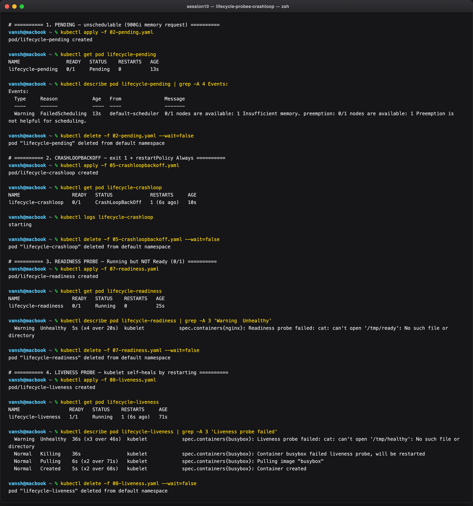

#### Part B — Startup probe, Init container, Sidecar, Graceful termination

**Commands:**

```bash
kubectl apply -f 09-startup.yaml
kubectl describe pod lifecycle-startup | grep -E 'Startup:|Liveness:'

kubectl apply -f 10-init-container.yaml
kubectl get pod lifecycle-init           # caught at Init:0/1
kubectl logs lifecycle-init -c init-setup

kubectl apply -f 11-multi-container.yaml
kubectl get pod lifecycle-multi-container
kubectl logs lifecycle-multi-container -c sidecar --tail=3

kubectl apply -f 12-termination.yaml
time kubectl delete -f 12-termination.yaml
```

**Output:**

```
# 5. STARTUP PROBE
    Liveness:       http-get http://:80/ delay=0s timeout=1s period=5s successThreshold=1 failureThreshold=3
    Startup:        http-get http://:80/ delay=0s timeout=1s period=2s successThreshold=1 failureThreshold=30

# 6. INIT CONTAINER — caught mid-init, then Running
NAME             READY   STATUS     RESTARTS   AGE
lifecycle-init   0/1     Init:0/1   0          4s

NAME             READY   STATUS    RESTARTS   AGE
lifecycle-init   1/1     Running   0          9s

initializing

# 7. MULTI-CONTAINER — 2/2 Ready
NAME                        READY   STATUS    RESTARTS   AGE
lifecycle-multi-container   2/2     Running   0          10s

sidecar log Sun Sep 20 17:50:49 UTC 2026
sidecar log Sun Sep 20 17:50:54 UTC 2026

# 8. GRACEFUL TERMINATION
pod "lifecycle-termination" deleted from default namespace
  0.03s user 0.01s system 0% cpu 12.965 total
```

Three things worth reading closely:

- **Startup vs liveness budget.** Startup allows `30 × 2s = 60s` to boot; liveness only tolerates `3 × 5s = 15s`. The startup probe suspends liveness until the app is up, so a slow boot is not mistaken for a hang.
- **`Init:0/1`** is a real status, caught at 4s. The app container had not started at all — init containers run strictly to completion first.
- **12.965 seconds** to delete. The container traps SIGTERM and sleeps 10s before exiting; `kubectl delete` blocked for that whole window instead of killing it. That is `terminationGracePeriodSeconds: 30` doing its job — had the trap slept longer than 30s, the kubelet would have sent SIGKILL.

**Screenshot:**

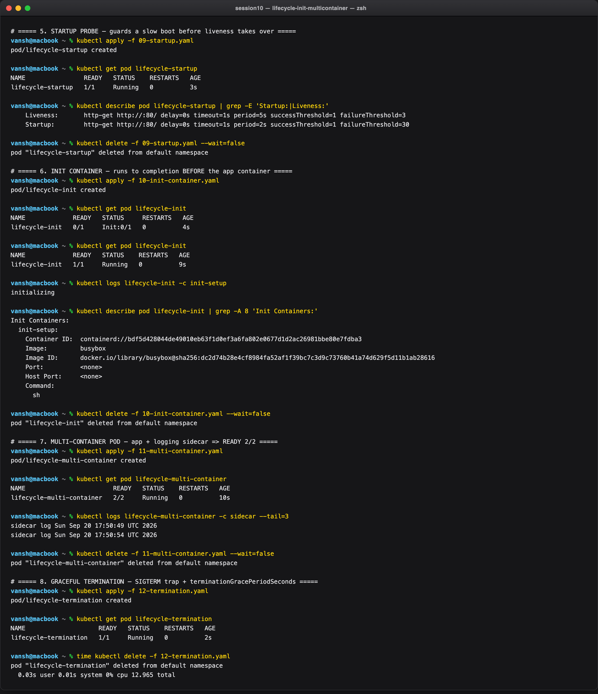

---

### Task 6: Core Controller Objects (ReplicaSet & StatefulSet)

Self-healing stateless replication via a **ReplicaSet** (`nginx-rs`, 3 replicas), and ordered stateful
storage via a **StatefulSet** (`mysql`, 3 replicas with per-pod PersistentVolumeClaims behind a
headless Service).

**Commands:**

```bash
# --- Part A: ReplicaSet self-healing ---
kubectl apply -f replicaset.yml
kubectl get rs nginx-rs
kubectl get pods -l app=nginx

POD=$(kubectl get pods -l app=nginx -o jsonpath='{.items[0].metadata.name}')
kubectl delete pod $POD --wait=false
kubectl get pods -l app=nginx

# --- Part B: StatefulSet ordinals + PVCs ---
kubectl apply -f k8s-core-objects/statefulset.yml
kubectl get statefulset mysql
kubectl get pods -l app=mysql -o wide
kubectl get pvc -l app=mysql
```

**Output:**

```
NAME       DESIRED   CURRENT   READY   AGE
nginx-rs   3         3         3       0s

NAME             READY   STATUS    RESTARTS   AGE
nginx-rs-m4lxm   1/1     Running   0          0s
nginx-rs-nczrl   1/1     Running   0          0s
nginx-rs-qgwxn   1/1     Running   0          0s

pod "nginx-rs-m4lxm" deleted from default namespace

NAME             READY   STATUS        RESTARTS   AGE
nginx-rs-fbl6t   1/1     Running       0          4s   <-- new replacement
nginx-rs-m4lxm   1/1     Terminating   0          4s   <-- the one just deleted
nginx-rs-nczrl   1/1     Running       0          4s
nginx-rs-qgwxn   1/1     Running       0          4s

# StatefulSet: ordinal, ordered creation
NAME    READY   AGE
mysql   3/3     38s

NAME      READY   STATUS    RESTARTS   AGE   IP            NODE       NOMINATED NODE   READINESS GATES
mysql-0   1/1     Running   0          38s   10.244.0.20   minikube   <none>           <none>
mysql-1   1/1     Running   0          2s    10.244.0.21   minikube   <none>           <none>
mysql-2   1/1     Running   0          1s    10.244.0.22   minikube   <none>           <none>

NAME           STATUS   VOLUME                                     CAPACITY   ACCESS MODES   STORAGECLASS   AGE
data-mysql-0   Bound    pvc-03ede1ee-66d4-4468-9e04-f259e10df80a   1Gi        RWO            standard       38s
data-mysql-1   Bound    pvc-d9e1735d-d04e-4e17-8c6e-86890963a3a7   1Gi        RWO            standard       2s
data-mysql-2   Bound    pvc-ec758306-3f3e-4586-93dd-f5b11dd72e4d   1Gi        RWO            standard       1s
```

Two contrasts the output makes obvious:

- **Replacement identity.** The ReplicaSet did not resurrect `nginx-rs-m4lxm`; it created `nginx-rs-fbl6t`. The controller only guarantees a *count*, never an identity.
- **Ordered startup.** The `AGE` column tells the story: `mysql-0` is 38s old, `mysql-1` is 2s, `mysql-2` is 1s. The StatefulSet waited for each pod to become Ready before starting the next. Each got its own PVC (`data-mysql-0/1/2`), bound by the `standard` hostpath StorageClass.

**Screenshot:**

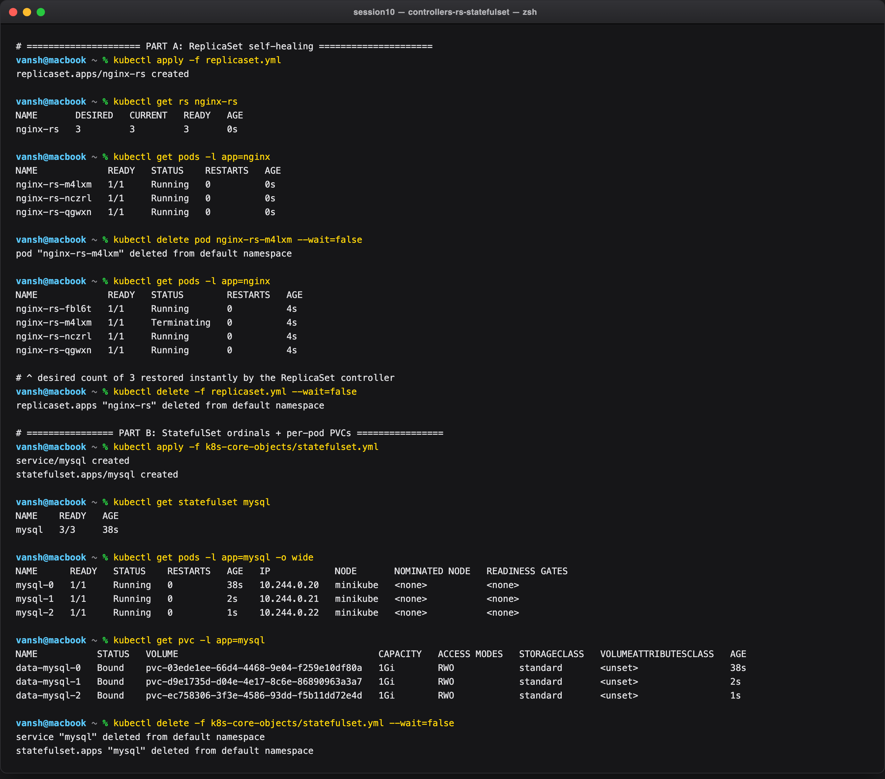

---

### Task 7: DaemonSet Architecture & Host Agent Deployment

Deploy a host-agent DaemonSet and verify exactly one pod is scheduled per eligible node.

> This is a **single-node** Minikube cluster, so `DESIRED = 1`. On a 3-worker cluster the same manifest
> would report `DESIRED = 3` with no edit — that is the whole point of a DaemonSet: the replica count
> is derived from the node inventory rather than declared.

**Commands:**

```bash
kubectl get nodes

kubectl apply -f k8s-core-objects/deamonset.yml
kubectl get ds node-exporter
kubectl get pods -l app=node-exporter -o wide

kubectl apply -f daemonset/node-agent-ds.yaml
kubectl get ds node-agent
kubectl get pods -l app=node-agent -o wide
```

**Output:**

```
NAME       STATUS   ROLES           AGE   VERSION
minikube   Ready    control-plane   12m   v1.37.0

NAME            DESIRED   CURRENT   READY   UP-TO-DATE   AVAILABLE   NODE SELECTOR   AGE
node-exporter   1         1         1       1            1           <none>          7s

NAME                  READY   STATUS    RESTARTS   AGE   IP            NODE       NOMINATED NODE   READINESS GATES
node-exporter-xj5fk   1/1     Running   0          7s    10.244.0.23   minikube   <none>           <none>

NAME         DESIRED   CURRENT   READY   UP-TO-DATE   AVAILABLE   NODE SELECTOR   AGE
node-agent   1         1         1       1            1           <none>          0s

NAME               READY   STATUS    RESTARTS   AGE   IP            NODE       NOMINATED NODE   READINESS GATES
node-agent-9mhj8   1/1     Running   0          0s    10.244.0.24   minikube   <none>           <none>
```

Notice there is no `replicas:` field anywhere in the DaemonSet manifest, yet `DESIRED` is populated.
`NODE SELECTOR: <none>` means every node is eligible.

**Screenshot:**

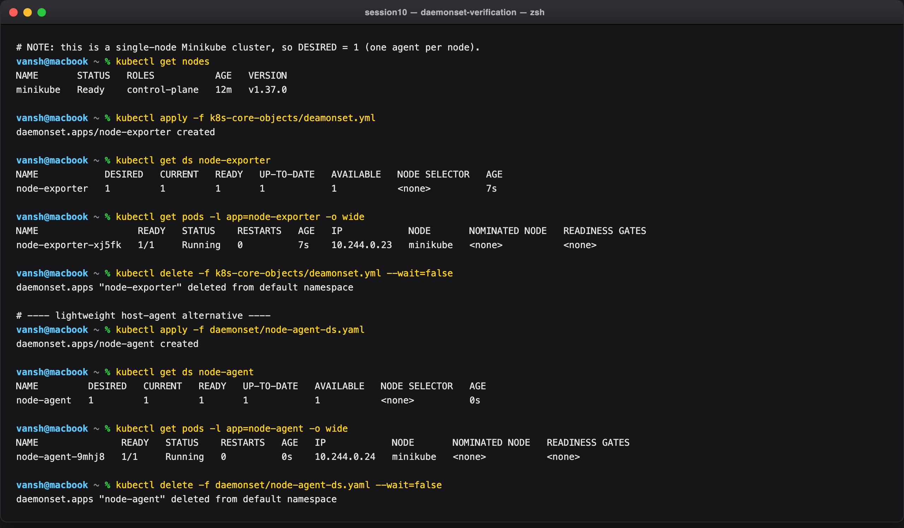

---

### Task 8: Deployment Upgrades, Rolling Updates & Instant Rollbacks (`01-rolling-update/`)

Zero-downtime rolling update with `replicas: 4`, `maxSurge: 1`, `maxUnavailable: 0`, then an immediate
rollback with `kubectl rollout undo`.

**Commands:**

```bash
cd 01-rolling-update/

kubectl apply -f deployment-v1.yaml -f service.yaml
kubectl rollout status deployment/app-rolling

kubectl apply -f deployment-v2.yaml
kubectl rollout status deployment/app-rolling
kubectl exec deploy/app-rolling -- cat /usr/share/nginx/html/index.html

kubectl rollout history deployment/app-rolling
kubectl rollout undo deployment/app-rolling
kubectl rollout status deployment/app-rolling
kubectl exec deploy/app-rolling -- cat /usr/share/nginx/html/index.html
```

**Output:**

```
deployment.apps/app-rolling created
service/app-rolling created

Waiting for deployment "app-rolling" rollout to finish: 0 of 4 updated replicas are available...
Waiting for deployment "app-rolling" rollout to finish: 1 of 4 updated replicas are available...
Waiting for deployment "app-rolling" rollout to finish: 2 of 4 updated replicas are available...
Waiting for deployment "app-rolling" rollout to finish: 3 of 4 updated replicas are available...
deployment "app-rolling" successfully rolled out

# --- rolling update to v2 ---
deployment.apps/app-rolling configured

Waiting for deployment "app-rolling" rollout to finish: 1 out of 4 new replicas have been updated...
Waiting for deployment "app-rolling" rollout to finish: 2 out of 4 new replicas have been updated...
Waiting for deployment "app-rolling" rollout to finish: 3 out of 4 new replicas have been updated...
Waiting for deployment "app-rolling" rollout to finish: 1 old replicas are pending termination...
deployment "app-rolling" successfully rolled out

APP v2

deployment.apps/app-rolling
REVISION  CHANGE-CAUSE
1         <none>
2         <none>

# --- rollback ---
deployment.apps/app-rolling rolled back
deployment "app-rolling" successfully rolled out

APP v1
```

The `exec ... cat index.html` pair is the actual proof: the served content really went `APP v2` and
then back to `APP v1`. The rollout log shows the surge pattern — new replicas are added **one at a
time** (`maxSurge: 1`) and old pods are only terminated after the replacement is available
(`maxUnavailable: 0`), which is why capacity never drops below 4.

**Screenshot:**

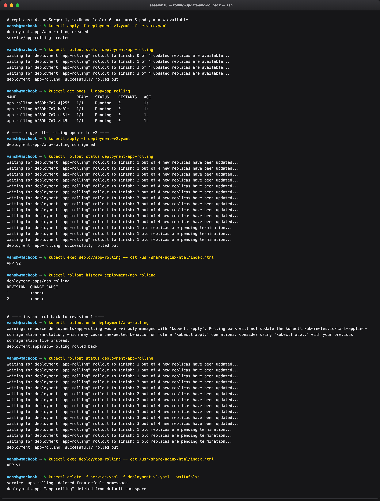

---

### Task 9: Real-World Troubleshooting Drills (`troubleshooting/`)

**Drill 1 (`broken-image.yaml`)** — a rollout stalled by an unresolvable image tag. A healthy
revision 1 is established first (same manifest, only the tag swapped) so the broken apply is a
genuine upgrade rather than a cold start.

**Drill 2 (`selector-mismatch.yaml`)** — a Deployment whose `spec.selector.matchLabels` (`app=foo`)
does not match `spec.template.metadata.labels` (`app=bar`).

**Commands:**

```bash
cd troubleshooting/

# --- Drill 1 ---
sed 's/nginx:broken-tag-999/nginx:alpine/' broken-image.yaml | kubectl apply -f -
kubectl get pods -l app=yatri-backend

kubectl apply -f broken-image.yaml
kubectl rollout status deployment/yatri-backend --timeout=45s
kubectl get pods -l app=yatri-backend
kubectl rollout undo deployment/yatri-backend

# --- Drill 2 ---
kubectl apply -f selector-mismatch.yaml
kubectl apply --dry-run=client -f selector-mismatch.yaml
sed 's/app: bar.*/app: foo/' selector-mismatch.yaml | kubectl apply -f -
```

**Output:**

```
# Drill 1 — healthy revision 1
NAME                             READY   STATUS    RESTARTS   AGE
yatri-backend-5b84c79d5d-97nn5   1/1     Running   0          1s
yatri-backend-5b84c79d5d-dk7mt   1/1     Running   0          1s
yatri-backend-5b84c79d5d-p8m2b   1/1     Running   0          1s

# broken revision 2 applied
Waiting for deployment "yatri-backend" rollout to finish: 1 out of 3 new replicas have been updated...
error: timed out waiting for the condition

NAME                             READY   STATUS             RESTARTS   AGE
yatri-backend-59b85bb9fc-j55sl   0/1     ImagePullBackOff   0          45s   <-- the surged pod
yatri-backend-5b84c79d5d-97nn5   1/1     Running            0          46s
yatri-backend-5b84c79d5d-dk7mt   1/1     Running            0          46s
yatri-backend-5b84c79d5d-p8m2b   1/1     Running            0          46s

deployment.apps/yatri-backend rolled back
deployment "yatri-backend" successfully rolled out

# Drill 2 — server-side rejection
The Deployment "selector-error-demo" is invalid: spec.template.metadata.labels: Invalid value: {"app":"bar"}: `selector` does not match template `labels`

# but the CLIENT-side dry run passes:
deployment.apps/selector-error-demo created (dry run)

# after the fix:
deployment.apps/selector-error-demo created
```

The important lesson in Drill 1 is what *didn't* break: all three v1 pods stayed `1/1 Running` for the
whole stalled rollout. A bad image is a non-event for live traffic because the Deployment refuses to
retire healthy pods until replacements are available. The rollout "fails" loudly while the service
stays up.

Drill 2 shows a genuine gap in client-side validation: `--dry-run=client` **passes** because the
selector/template consistency rule lives in the API server's validation webhook, not in the local
schema. Only a server-side apply (or `--dry-run=server`) catches it.

**Screenshot:**

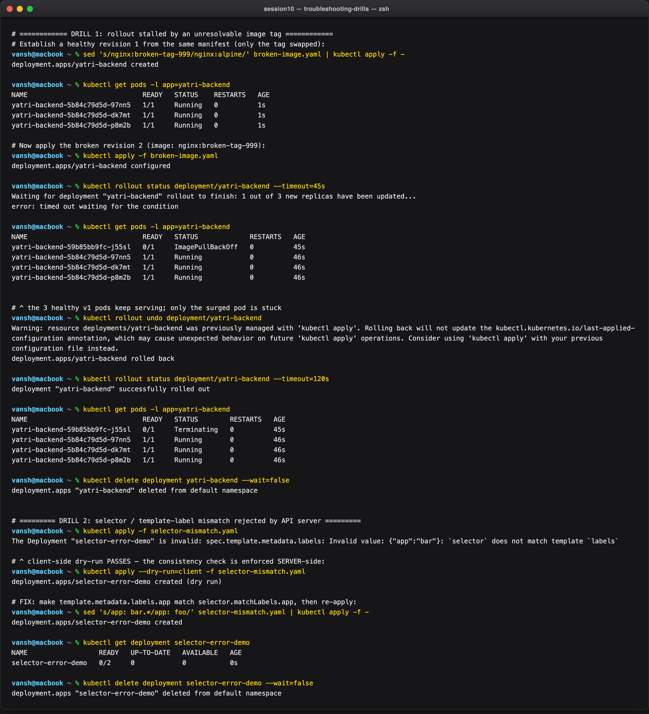

---

### Task 10: Theoretical & Architectural Writeup

**1. The 4 Ports Clarified**

| Port | Meaning |
| --- | --- |
| `containerPort` | Port the application process listens on inside the container (informational in the PodSpec). |
| `targetPort` | Port on the backend pod the Service forwards to; must match `containerPort`. |
| `port` | Port the Service exposes on its ClusterIP for in-cluster consumers. |
| `nodePort` | Static high port (`30000–32767`) opened on every node's IP. |

Traffic path for a NodePort Service:
`client → <nodeIP>:nodePort → service:port → pod:targetPort → containerPort`.

**2. Labels vs. Selectors**

- **Labels** are key-value pairs attached to objects (`app: nginx`, `slot: blue`) for identification and grouping.
- **Selectors** are the query filters controllers and Services use to find matching pods. A Service's selector decides which pods become its endpoints — Task 11 exploits exactly this by flipping one selector value.

**3. The 4 Deployment Strategies**

- **RollingUpdate** — progressively replaces old pods with new ones; zero downtime; the Deployment default.
- **Recreate** — kills all v1 pods before starting any v2 pods; brief downtime, but never two versions at once.
- **Blue-Green** — two complete environments; cutover and rollback are instant via a Service selector flip; needs ~2x capacity.
- **Canary** — a small fraction of v2 pods runs alongside v1 to validate real production traffic before committing.

**4. `maxSurge` vs. `maxUnavailable` Math**

For `replicas: 4`, `maxSurge: 1`, `maxUnavailable: 0`:

- **Max pods during rollout:** `4 + 1 = 5`
- **Min available pods:** `4 - 0 = 4` (100% capacity held throughout)

`maxSurge` caps how many *extra* pods may exist above the desired count; `maxUnavailable` caps how many
may be *missing* below it. Both accept an absolute number or a percentage (surge rounds up,
unavailable rounds down). This is the exact configuration whose one-at-a-time behaviour is visible in
the Task 8 rollout log.

**5. Resource Requests vs. Limits & Units**

- **Requests** — the guaranteed minimum the scheduler reserves when placing the pod. The `900Gi` request in Task 5 could not be reserved anywhere, so the pod never left `Pending`.
- **Limits** — the ceiling enforced by cgroups. Exceeding a CPU limit causes throttling; exceeding a memory limit gets the container OOM-killed.
- **Units** — `1 GB = 10^9` bytes (decimal, SI); `1 GiB = 2^30 = 1,073,741,824` bytes (binary, IEC). Kubernetes uses mebibytes (`Mi`) and gibibytes (`Gi`).

---

### Task 11: Blue-Green Deployment & Instant Selector Cutover (`02-blue-green/`)

Blue (`app-blue`, 3 replicas) and Green (`app-green`, 3 replicas) run side by side. The single Service
`myapp-service` selects `slot=blue`; applying `service-green.yaml` flips the selector and moves 100%
of traffic with no mixed-version window.

**Commands:**

```bash
cd 02-blue-green/

kubectl apply -f deployment-blue.yaml -f deployment-green.yaml -f service-blue.yaml
kubectl get pods -l app=myapp --show-labels

# macOS + Docker driver: reach NodePort 30020 through a tunnel
minikube service myapp-service --url

kubectl describe svc myapp-service | grep Selector
kubectl get endpoints myapp-service
curl -s http://127.0.0.1:58160

# THE SWITCH
kubectl apply -f service-green.yaml
kubectl get endpoints myapp-service
curl -s http://127.0.0.1:58160

# INSTANT ROLLBACK
kubectl apply -f service-blue.yaml
curl -s http://127.0.0.1:58160
```

**Output:**

```
NAME                         READY   STATUS    RESTARTS   AGE   LABELS
app-blue-6f4f4f5749-dvnln    1/1     Running   0          18s   app=myapp,pod-template-hash=6f4f4f5749,slot=blue
app-blue-6f4f4f5749-g7gjs    1/1     Running   0          18s   app=myapp,pod-template-hash=6f4f4f5749,slot=blue
app-blue-6f4f4f5749-sjc9z    1/1     Running   0          18s   app=myapp,pod-template-hash=6f4f4f5749,slot=blue
app-green-64b57c9797-7vjkw   1/1     Running   0          18s   app=myapp,pod-template-hash=64b57c9797,slot=green
app-green-64b57c9797-hr44h   1/1     Running   0          18s   app=myapp,pod-template-hash=64b57c9797,slot=green
app-green-64b57c9797-x7h5h   1/1     Running   0          18s   app=myapp,pod-template-hash=64b57c9797,slot=green

# BEFORE THE SWITCH
Selector:                 app=myapp,slot=blue
NAME            ENDPOINTS                                      AGE
myapp-service   10.244.0.45:80,10.244.0.46:80,10.244.0.47:80   18s
<p>BLUE ENVIRONMENT</p>

# THE SWITCH
service/myapp-service configured
Selector:                 app=myapp,slot=green
NAME            ENDPOINTS                                      AGE
myapp-service   10.244.0.48:80,10.244.0.49:80,10.244.0.50:80   22s
<p>GREEN ENVIRONMENT</p>

# INSTANT ROLLBACK
service/myapp-service configured
Selector:                 app=myapp,slot=blue
<p>BLUE ENVIRONMENT</p>
```

The endpoint IPs are the receipt: `.45/.46/.47` (blue) are replaced wholesale by `.48/.49/.50` (green)
and then restored. **No pod was created, deleted or restarted during the cutover** — the `AGE` column
barely moves. The only thing that changed was one label value in the Service selector, which is why
blue-green rollback is effectively instantaneous.

**Screenshot:**

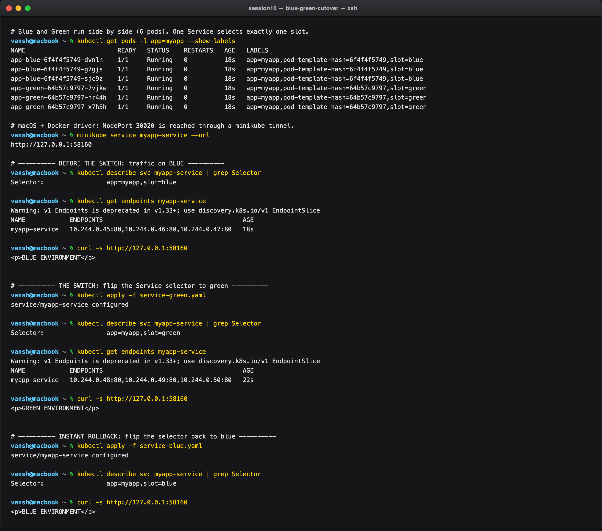

---

### Task 12: Canary Deployment & Pod-Ratio Traffic Splitting (`03-canary/`)

A 9-replica `app-stable` and a 1-replica `app-canary` sit behind one Service
(`myapp-canary-service`, selector `app=myapp-canary`) that matches both. The traffic split is an
emergent property of the pod ratio, load balanced per-connection by kube-proxy.

**Commands:**

```bash
cd 03-canary/

kubectl apply -f deployment-stable.yaml -f deployment-canary.yaml -f service.yaml
kubectl get pods -l app=myapp-canary -o custom-columns='NAME:.metadata.name,VERSION:.metadata.labels.version,STATUS:.status.phase'
kubectl get endpointslice -l kubernetes.io/service-name=myapp-canary-service -o jsonpath='...' | grep -c .

minikube service myapp-canary-service --url

for i in $(seq 1 20);  do curl -s http://127.0.0.1:58181; done
for i in $(seq 1 100); do curl -s http://127.0.0.1:58181; done | sort | uniq -c

# shift to 30%
kubectl scale deployment app-canary --replicas=3
kubectl scale deployment app-stable --replicas=7
for i in $(seq 1 100); do curl -s http://127.0.0.1:58181; done | sort | uniq -c

# abort the release
kubectl scale deployment app-canary --replicas=0
kubectl scale deployment app-stable --replicas=9
for i in $(seq 1 20); do curl -s http://127.0.0.1:58181; done | sort | uniq -c
```

**Output:**

```
NAME                          VERSION   STATUS
app-canary-865cb8874b-p5xbw   canary    Running
app-stable-6859fd9fd7-2dwqg   stable    Running
app-stable-6859fd9fd7-6csp2   stable    Running
app-stable-6859fd9fd7-cv598   stable    Running
app-stable-6859fd9fd7-h4t26   stable    Running
app-stable-6859fd9fd7-r22zc   stable    Running
app-stable-6859fd9fd7-smbsb   stable    Running
app-stable-6859fd9fd7-vnflv   stable    Running
app-stable-6859fd9fd7-w8gc7   stable    Running
app-stable-6859fd9fd7-zr77w   stable    Running

10      <-- all 10 pod IPs registered as endpoints of the one Service

# 20 sequential requests (raw) — 1 canary hit
STABLE v1
STABLE v1
STABLE v1
STABLE v1
STABLE v1
CANARY v2
STABLE v1
... (14 more STABLE v1)

# 100-request tally at 9:1
  11 CANARY v2
  89 STABLE v1

# after scaling to canary=3 / stable=7
  30 CANARY v2
  70 STABLE v1

# after aborting (canary=0)
  20 STABLE v1
```

The measured ratios track the pod ratios almost exactly — **11% observed vs 10% expected**, then
**30% vs 30%**. The 20-request sample is deliberately shown raw as well, to make the point that at
small n the split looks noisy (1 hit, not 2); you need ~100 requests before the ratio is legible.

The rollback is the cheapest of all four strategies: `kubectl scale app-canary --replicas=0` removes
the canary endpoints and traffic returns to 100% stable. The stable pods were never touched — no
redeploy, no restart, no image pull.

**Limitation worth stating:** this is traffic splitting by *pod count*, so the granularity is bounded
by replica count. You cannot express a 1% canary with 10 pods. Real percentage-based routing needs a
Layer 7 proxy (an Ingress controller with canary annotations, or a service mesh).

**Screenshot:**

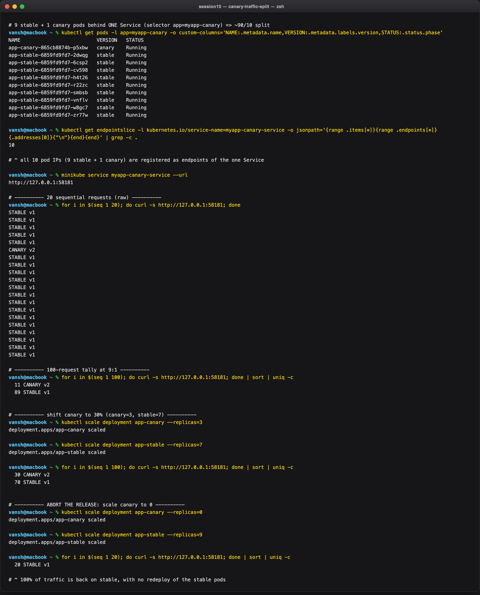

---

### Task 13: Recreate Strategy & Deliberate Downtime Demonstration (`04-recreate/`)

`app-recreate` (3 replicas) with `strategy.type: Recreate` behind a NodePort Service. During the
update **all** v1 pods are terminated before any v2 pod starts, producing a measurable outage window
captured by a continuous polling loop.

**Commands:**

```bash
cd 04-recreate/

kubectl apply -f deployment-v1.yaml -f service.yaml
kubectl rollout status deployment/app-recreate
minikube service app-recreate --url

# Terminal 2 — continuous availability probe
while true; do
  curl -s --connect-timeout 1 http://127.0.0.1:<port> || echo "[OUTAGE] connection refused / 0 pods alive"
  sleep 0.4
done

# Terminal 3 — watch pod churn
kubectl get pods -l app=app-recreate -w

# Terminal 1 — trigger the Recreate update
kubectl apply -f deployment-v2.yaml
```

**Output:**

```
# ---- availability probe, collapsed with uniq -c (50 polls @ 0.4s) ----
  12 VERSION: v1
   1 [OUTAGE] connection refused / 0 pods alive
  37 VERSION: v2 (UPGRADED)

# ---- pod churn during the rollout ----
NAME                            READY   STATUS    RESTARTS   AGE
app-recreate-7555469f74-gvl2m   1/1     Running   0          2s
app-recreate-7555469f74-n6s5h   1/1     Running   0          2s
app-recreate-7555469f74-s2988   1/1     Running   0          2s
app-recreate-7555469f74-n6s5h   1/1     Terminating   0          7s
app-recreate-7555469f74-s2988   1/1     Terminating   0          7s
app-recreate-7555469f74-gvl2m   1/1     Terminating   0          7s
app-recreate-7555469f74-n6s5h   0/1     Completed     0          7s
app-recreate-7555469f74-s2988   0/1     Completed     0          7s
app-recreate-7555469f74-gvl2m   0/1     Completed     0          7s
                                  <-- only NOW does the first v2 pod appear
app-recreate-557784d6db-p2z9p   0/1     Pending             0          0s
app-recreate-557784d6db-sqkc4   0/1     Pending             0          0s
app-recreate-557784d6db-kn757   0/1     Pending             0          0s
app-recreate-557784d6db-p2z9p   0/1     ContainerCreating   0          0s
app-recreate-557784d6db-kn757   1/1     Running             0          1s
app-recreate-557784d6db-sqkc4   1/1     Running             0          1s
app-recreate-557784d6db-p2z9p   1/1     Running             0          1s
```

The ordering in the watch is the whole point: **all three** v1 pods reach `Completed` before the first
v2 pod is even `Pending`. There is no overlap window, by design.

The outage itself is short here — a single failed poll, so roughly 0.4–1s — because these are
`nginx:alpine` containers on a warm local node with the image already cached. On a real service with a
JVM warm-up, connection-pool setup or a schema migration between the two phases, that same gap is
seconds to minutes. The mechanism is identical; only the constant differs. What matters is that the
loop recorded a genuine `[OUTAGE]` line, which the RollingUpdate in Task 8 never did.

This is the trade-off Recreate makes explicit: it guarantees the two versions never run
simultaneously — essential when v2 applies a backwards-incompatible database migration — and pays for
that guarantee with real downtime. It is also the only strategy of the four that needs no spare
capacity.

**Screenshot:**

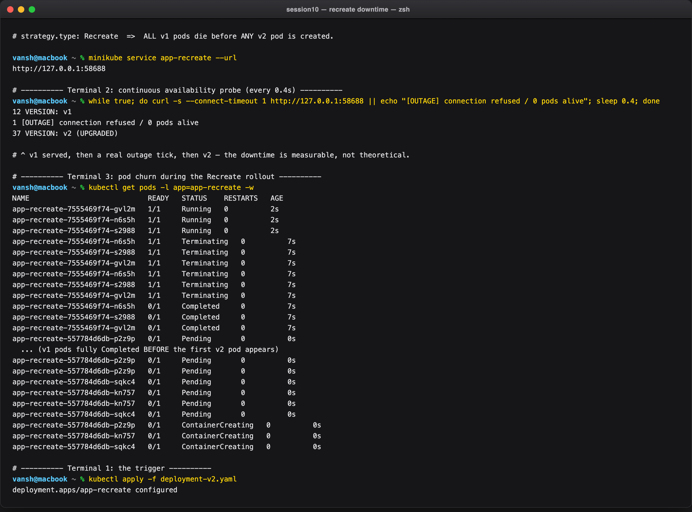

---

## Strategy Comparison Summary

| | RollingUpdate | Recreate | Blue-Green | Canary |
| --- | --- | --- | --- | --- |
| Downtime | None | **Yes** | None | None |
| Extra capacity needed | `maxSurge` only | None | **2x** | ~10% |
| Two versions live at once | Briefly | Never | Never (instant flip) | **By design** |
| Rollback speed | One rollout cycle | One rollout cycle | **Instant** (selector flip) | **Instant** (scale to 0) |
| Verified in this submission | Task 8 | Task 13 | Task 11 | Task 12 |
