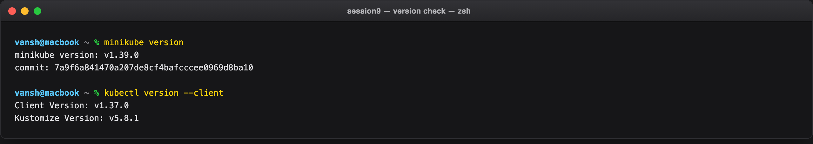
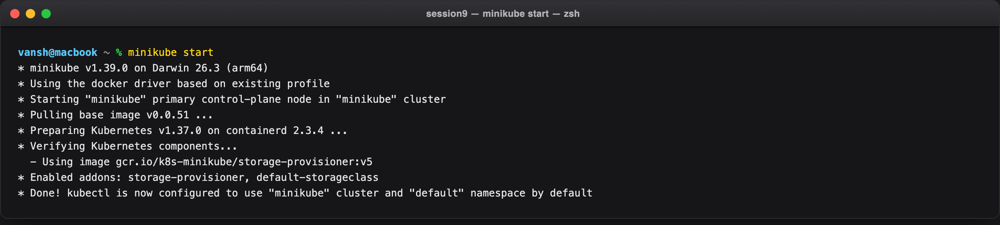
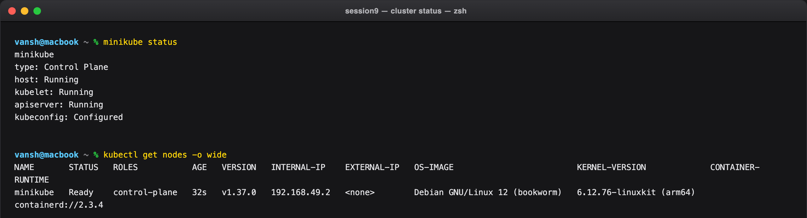
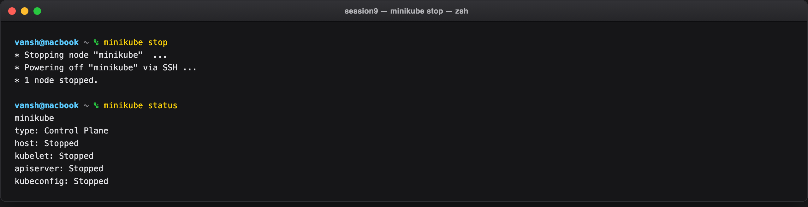

# Session 9: Kubernetes Fundamentals & Cluster Architecture

**Author:** Vansh Chitransh
**Course:** SST DevOps & Cloud [SWE]
**Session:** 09 — Kubernetes Fundamentals

**Environment used for every screenshot in this folder**

| | |
| --- | --- |
| Host | macOS (Darwin 26.3, Apple Silicon / arm64) |
| Minikube | v1.39.0 |
| kubectl | v1.37.0 |
| Driver | `docker` (Docker Desktop 29.5.3) |
| Kubernetes | v1.34.0 → cluster reports **v1.37.0** |
| Runtime | containerd 2.3.4 |

---

## Task 1: Minikube & CLI Installation Verification

Verify that Minikube and the Kubernetes CLI (`kubectl`) are installed and can talk to the local system before any cluster exists.

**Commands:**

```bash
minikube version
kubectl version --client
```

**Output:**

```
minikube version: v1.39.0
commit: 7a9f6a841470a207de8cf4bafcccee0969d8ba10

Client Version: v1.37.0
Kustomize Version: v5.8.1
```

**Screenshot:**



---

## Task 2: Starting the Minikube Cluster

Initialise the local single-node Kubernetes cluster. Minikube provisions a Docker container that acts as the control-plane node, generates certificates, boots the control plane, and wires up the CNI.

**Commands:**

```bash
minikube start
```

**Output:**

```
* minikube v1.39.0 on Darwin 26.3 (arm64)
* Using the docker driver based on existing profile
* Starting "minikube" primary control-plane node in "minikube" cluster
* Pulling base image v0.0.51 ...
* Preparing Kubernetes v1.37.0 on containerd 2.3.4 ...
* Verifying Kubernetes components...
  - Using image gcr.io/k8s-minikube/storage-provisioner:v5
* Enabled addons: storage-provisioner, default-storageclass
* Done! kubectl is now configured to use "minikube" cluster and "default" namespace by default
```

> On the very first run this step also downloads the ~470 MB `kicbase` image. The screenshot above is a
> subsequent start, where the image is already cached — which is why no download progress bar appears.

**Screenshot:**



---

## Task 3: Verifying Cluster Status & Node Health

Inspect the control plane, kubelet, and API server, then confirm the node reaches `Ready`.

**Commands:**

```bash
minikube status
kubectl get nodes -o wide
```

**Output:**

```
minikube
type: Control Plane
host: Running
kubelet: Running
apiserver: Running
kubeconfig: Configured

NAME       STATUS   ROLES           AGE   VERSION   INTERNAL-IP    EXTERNAL-IP   OS-IMAGE                         KERNEL-VERSION             CONTAINER-RUNTIME
minikube   Ready    control-plane   32s   v1.37.0   192.168.49.2   <none>        Debian GNU/Linux 12 (bookworm)   6.12.76-linuxkit (arm64)   containerd://2.3.4
```

Reading the node line:

- `192.168.49.2` is the node IP **on the Docker bridge network**, not on the macOS host network. This single fact is the root cause of the NodePort gotcha documented in Session 11, Task 12.
- `containerd://2.3.4` confirms the CRI runtime — Kubernetes talks to containerd directly, not to the Docker daemon.
- `ROLES: control-plane` with no worker node: this is a single-node cluster, so the control plane is also the only place pods can be scheduled.

**Screenshot:**



---

## Task 4: Stopping the Minikube Cluster

Gracefully power down the cluster to release CPU and memory.

**Commands:**

```bash
minikube stop
minikube status
```

**Output:**

```
* Stopping node "minikube"  ...
* Powering off "minikube" via SSH ...
* 1 node stopped.

minikube
type: Control Plane
host: Stopped
kubelet: Stopped
apiserver: Stopped
kubeconfig: Stopped
```

Note that `minikube stop` **halts** the node but preserves it — the container, its disk, and all cluster
state survive. `minikube delete` is the destructive one. That is why the restart in Task 2 was fast.

**Screenshot:**



---

## Task 5: Kubernetes Cluster Architecture & Component Analysis

Breakdown of the core components powering a Kubernetes cluster, based on the
[official Kubernetes Architecture documentation](https://kubernetes.io/docs/concepts/architecture/)
and classroom discussion.

```
+-------------------------------------------------------------------------------+
|                               CONTROL PLANE (MASTER)                          |
|                                                                               |
|   +-------------------+       +--------------------+       +--------------+   |
|   |       etcd        |<----->|  kube-apiserver    |<----->|kube-scheduler|   |
|   | (State Database)  |       |    (Front Door)    |       +--------------+   |
|   +-------------------+       +---------+----------+                          |
|                                         |                                     |
|                                         v                                     |
|                             +------------------------+                        |
|                             | kube-controller-manager|                        |
|                             +------------------------+                        |
+-----------------------------------------+-------------------------------------+
                                          |
                        +-----------------+-----------------+
                        |                                   |
                        v                                   v
+------------------------------------+ +------------------------------------+
|          WORKER NODE 1             | |          WORKER NODE 2             |
|                                    | |                                    |
|   +------------+  +------------+   | |   +------------+  +------------+   |
|   |  kubelet   |  | kube-proxy |   | |   |  kubelet   |  | kube-proxy |   |
|   +-----+------+  +-----+------+   | |   +-----+------+  +-----+------+   |
|         |               |          | |         |               |          |
|         v               v          | |         v               v          |
|   +----------------------------+   | |   +----------------------------+   |
|   | CRI (containerd runtime)   |   | |   | CRI (containerd runtime)   |   |
|   +----------------------------+   | |   +----------------------------+   |
|         |                          | |         |                          |
|         v                          | |         v                          |
|   +------------+  +------------+   | |   +------------+  +------------+   |
|   |   Pod 1    |  |   Pod 2    |   | |   |   Pod 3    |  |   Pod 4    |   |
|   | [Container]|  | [Container]|   | |   | [Container]|  | [Container]|   |
|   +------------+  +------------+   | |   +------------+  +------------+   |
+------------------------------------+ +------------------------------------+
```

> In this single-node Minikube cluster all of the above collapses onto one Docker container: the
> `kubectl get pods -n kube-system` output in Session 10, Task 1 shows `etcd-minikube`,
> `kube-apiserver-minikube`, `kube-scheduler-minikube`, `kube-controller-manager-minikube`,
> `kube-proxy`, `coredns` and `storage-provisioner` all co-located on the node named `minikube`.

### 1. Control Plane (Master Node) Components

- **`kube-apiserver` (The Front Door)**
  - Single entry point for all administrative tasks and internal communication.
  - Exposes the Kubernetes HTTP/JSON REST API.
  - Every command (`kubectl`, dashboard, internal controllers) authenticates and communicates through the API server. No component touches `etcd` directly except the API server.
- **`etcd` (The Brain & State Storage)**
  - A distributed, highly available, strongly consistent key-value store.
  - Holds the entire cluster state, specs, secrets and metadata.
  - Everything is an API object whose declarative *desired* state is persisted here.
- **`kube-scheduler` (The Placement Engine)**
  - Watches for newly created Pods that have no assigned node.
  - Scores nodes on resource requests (CPU, memory, storage), affinity/anti-affinity, taints and tolerations, then binds the Pod to the best fit.
  - When no node can satisfy the request the Pod simply stays `Pending` — demonstrated live in Session 10, Task 5 with a 900Gi memory request.
- **`kube-controller-manager` (The Enforcer / Reconciliation Loop)**
  - Runs continuous control loops comparing **current state vs. desired state**.
  - Bundles sub-controllers: the *Node Controller* (detects unreachable nodes, handles eviction), the *ReplicaSet Controller* (holds the replica count), and the *EndpointSlice/Service Controller* (binds Services to live Pod IPs).

### 2. Worker Node (Data Plane) Components

- **`kubelet` (The Node Captain)**
  - Primary agent on every node.
  - Receives `PodSpec` objects from the API server and instructs the container runtime to pull images and start containers.
  - Runs the liveness/readiness/startup probes and reports status back — the restart in Session 10, Task 5 is the kubelet acting on a failed liveness probe.
- **`kube-proxy` (The Network Router)**
  - Maintains network rules (`iptables` / `IPVS`) on each node.
  - Implements Service routing and the per-connection load balancing that produces the canary traffic split in Session 10, Task 12.
- **`Container Runtime Interface (CRI)`**
  - The software that actually runs containers.
  - Modern Kubernetes uses `containerd` or `CRI-O` rather than the legacy Docker daemon — this cluster reports `containerd://2.3.4`.
- **`Pod` (The Smallest Deployable Unit)**
  - The fundamental unit of execution.
  - Wraps one or more tightly coupled containers sharing a network namespace (one IP and port space) and storage volumes.
  - Usually one primary application container plus optional init/sidecar helpers.

### How the Components Interact

1. A user submits a manifest via `kubectl`, which hits the **kube-apiserver**.
2. The API server validates the request and persists the desired state in **etcd**.
3. The **kube-scheduler** notices the unscheduled Pod and binds it to a suitable node.
4. The **kube-controller-manager** reconciles actual vs. desired state, creating or replacing objects as needed.
5. The target node's **kubelet** reads the assigned `PodSpec` and asks the **CRI** runtime to start the containers.
6. **kube-proxy** programs the dataplane rules so the Pod is reachable through its Service.
